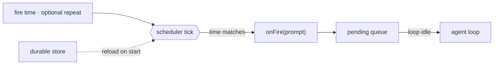

# 14 · Scheduling

[English](README.md) · [繁體中文](README.zh-TW.md) · **简体中文**

> 让 agent 的 turn 由时钟启动，而不只是由 user 输入启动。

后台工作仍然需要有人或有东西来启动它。很多 task 应该稍后才跑或重复跑：一份报告、一则提醒，或一个轮询 task。

调度存储一个未来的触发。当它 fire 时，就把一个 prompt 放进 queue。正常的 loop 会把那个 prompt 当成一个新的 turn 来处理。

调度必须：

1. 把 schedule 存储在单个 turn 之外。
2. 独立于 loop 之外地监视时间。
3. 当 schedule fire 时把一个 prompt 放进 queue。
4. 可选地让 schedule 跨重启后仍存活。

少了这一层，agent 就只能对 user 输入做出反应。

---

## 机制

把时钟和 loop 分开。scheduler 监视时间。它不会直接调用 model。

在 fire 的时刻，它把一个 prompt 放进 queue。当 loop 准备好时，queue 处理器就把那个 prompt 排空进正常的 loop。



- 一个 schedule 就是数据：一个 fire 时间，以及可选的重复间隔。
- 一次性（one-shot）的 schedule fire 一次后就把自己删掉。
- 周期性（recurring）的 schedule 会重新装填到下一个间隔。
- 一个 durable 的 schedule 能在重启后存活，但在 host 关机时它不会 fire。

### New：scheduler 与 fire queue

`tick` 检查到期的 task。fire 就是把一个 prompt 放进 queue：

```python
def tick(self):                                       # src/scheduler.py; called by a daemon thread
    now = self._clock()
    for tid, t in list(self._tasks.items()):
        if now >= t["due"]:
            self._pending.put(t["prompt"])            # enqueue, do not run the model here
            if t["every"]:
                t["due"] = now + t["every"]
            else:
                self._tasks.pop(tid, None)
    self._save()                                      # durable tasks only
```

- 时钟是可注入的，所以测试会用一个假时钟。
- `run()` 在一个 daemon thread 上调用 `tick`。
- `_save` 把 durable task 持久化成 JSON。
- 在相同路径上创建一个新的 `Scheduler`，会重新加载 durable task 并接续 id。

### 如何整合

调度从 loop 之外启动 turn：

```python
for prompt in sched.drain():                          # src/demo.py · between turns
    messages = [{"role": "user", "content": prompt}]
    run_turn(messages, model, reg, session)
```

一个 fire 出来的 prompt 会变成一个新的、类似 user 的 turn。它用的是同一套 loop、权限、hook、记忆、context 管理和恢复路径。

---

## 各系统做法

各个 agent 如何决定何时执行调度工作。

| System | 触发 | 持久性 | 唤醒 |
| --- | --- | --- | --- |
| **Claude Code** | Cron、sleep，以及 remote trigger。 | session 或 durable 的本地 schedule。 | fire 出来的 prompt 进入 queue。 |

### Claude Code

- `CronCreate`、`CronList` 和 `CronDelete` 管理 cron 条目。
- 一个 cron 条目存储 `id`、`cron`、`prompt`、`recurring` 和 `durable`。
- `cronScheduler.ts` 以固定间隔 tick，并调用 `onFire(prompt)`。
- `useScheduledTasks.ts` 以 `priority: 'later'` 把 fire 出来的 prompt 放进 queue。
- 当没有 turn 正在进行时，queue 就排空。
- `durable: true` 会写入 `.claude/scheduled_tasks.json`。
- 一把锁避免多个打开中的 session 对同一个以文件为后盾的 schedule 重复 fire。
- `RemoteTriggerTool` 使用一个托管的 trigger，让工作不需本地 process 就能 fire。

> **取舍：** 本地 schedule 简单又私密，但它们只在 process 运行时才会 tick。remote trigger 可以在无人看管下 fire，但它们需要一个托管服务和 auth。

---

## 失效模式

- **重复 fire（Double fire）。** 一次很快的 tick 可能在同一个 cron 分钟内匹配到不止一次。追踪上一次 fire 的分钟。
- **许多 schedule 一起 fire。** 对周期性 task 加上具确定性的 jitter。
- **durable 不等于永远开机。** 本地 durable schedule 只能在重启后存活。要离线 fire，改用 remote trigger 或 OS timer。
- **cron 表达式有误（Bad cron expression）。** 在 create 时验证，并跳过无效的已加载条目。
- **loop 正忙。** 把 prompt 放进 queue，并在 turn 之间排空它。

---

## 可执行程序

[`src/`](src/) 把 13 带了过来，并加上：

- [`scheduler.py`](src/scheduler.py)：一个 scheduler、fire queue、周期性重新装填、一次性删除，以及 durable 的 JSON store。
- [`test.py`](src/test.py)：用一个假时钟测试一次性、周期性和重新加载的行为。
- [`demo.py`](src/demo.py)：把一个 prompt 排在一秒后，并以一个新 turn 执行它。

loop 没有改变。调度从 loop 之外启动 turn。

```bash
python sections/14-scheduling/src/test.py         # offline checks, no key
uv run python sections/14-scheduling/src/demo.py  # live demo, needs a key
```

---

## 出处

- Claude Code source：`tools/ScheduleCronTool/`、`tools/RemoteTriggerTool/`、`tools/SleepTool/`、`utils/cronScheduler.ts`、`hooks/useScheduledTasks.ts`、`utils/queueProcessor.ts`。
- learn-claude-code · s14_cron_scheduler：章节框架。
