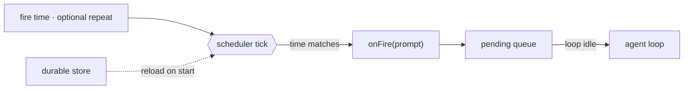

# 14 · Scheduling

[English](README.md) · **繁體中文** · [简体中文](README.zh-CN.md)

> 讓 agent 的 turn 由時鐘啟動，而不只是由 user 輸入啟動。

背景工作仍然需要有人或有東西來啟動它。很多 task 應該稍後才跑或重複跑：一份報告、一則提醒，或一個輪詢 task。

排程儲存一個未來的觸發。當它 fire 時，就把一個 prompt 放進 queue。正常的 loop 會把那個 prompt 當成一個新的 turn 來處理。

排程必須：

1. 把 schedule 儲存在單一 turn 之外。
2. 獨立於 loop 之外地監看時間。
3. 當 schedule fire 時把一個 prompt 放進 queue。
4. 選擇性地讓 schedule 跨重啟後仍存活。

少了這一層，agent 就只能對 user 輸入做出反應。

---

## 機制

把時鐘和 loop 分開。scheduler 監看時間。它不會直接呼叫 model。

在 fire 的時刻，scheduler 只把一個 prompt 放進 queue。driver 會等到沒有 turn 正在跑的時候（也就是兩個 turn 之間）才排空 queue，把每個 prompt 交給處理 user 輸入的同一個 agent loop，當成新的一輪跑。



- 一個 schedule 就是資料：要跑的 prompt、一個 fire 時間，以及選擇性的重複間隔。scheduler 把每一筆存成一個 task。
- 一次性（one-shot）的 schedule fire 一次後就把自己刪掉。
- 週期性（recurring）的 schedule 會重新裝填到下一個間隔。
- 一個 durable 的 schedule 能在重啟後存活，但在 host 關機時它不會 fire。

### New：scheduler 與 fire queue

`tick` 檢查哪些 task 已經到了預定時間。fire 就是把一個 prompt 放進 queue：

```python
def tick(self):                                       # src/scheduler.py; called by a daemon thread
    now = self._clock()
    for tid, t in list(self._tasks.items()):
        if now >= t["due"]:
            self._pending.put({"prompt": t["prompt"], "channel": t.get("channel")})
            if t["every"]:                            # enqueue, do not run the model here
                t["due"] = now + t["every"]
            else:
                self._tasks.pop(tid, None)
    self._save()                                      # durable tasks only
```

- 時鐘是可注入的，所以測試會用一個假時鐘。
- `run()` 在一個 daemon thread 上呼叫 `tick`。
- `_save` 把 durable task 持久化成 JSON。
- 在相同路徑上建立一個新的 `Scheduler`，會重新載入 durable task 並接續 id。

### New：投遞答案

排程觸發的 turn 跑起來時，螢幕前沒有使用者，跑完的答案不主動送出去就沒人看到。所以每個 task 可以指定一個 channel。
channel 就存在 task 裡，是那筆排程資料的一個欄位：`create(..., channel="console")` 存進去，`tick` fire 時再把它和 prompt 一起放進 queue。
所以 driver 排空 queue 時，拿到的每個項目已經是 `{"prompt": ..., "channel": ...}`，不用再去別處查這個答案要送哪。

`deliver` 負責把這個 turn 的答案送到 channel（Hermes 會把 cron 輸出投遞到該 job 的聊天平台）：

```python
SILENT = "[SILENT]"                              # a fired run may decide nothing is worth sending

def deliver(channels, fired, text) -> bool:      # src/scheduler.py
    if not fired.get("channel") or text.lstrip().startswith(SILENT):
        return False
    channels[fired["channel"]](text)
    return True
```

- `channels` 把 channel 名稱對應到一個送信的 callable（這裡是 print；真正的 adapter 是第 19 章的事）。
  task 指定 channel；driver 擁有這張對照表。兩邊互不知道對方的細節。
- 答案以 `[SILENT]` 開頭時，`deliver` 直接跳過，不把它送進 channel。這是給排程任務的約定：模型跑完發現沒有新東西值得通知使用者（例如巡檢一切正常），就用這個開頭。driver 手上仍有完整文字，要留檔照樣可以。
- 沒有 channel 表示答案留在本地，也就是加入投遞之前的行為。
- `bool` 回傳值讓 driver 可以改走別條路（demo 會印出未投遞的答案），而不是無聲地丟掉答案。

### 如何整合

排程分成兩半。`tick` 在自己的 daemon thread 上跑（第 13 章的背景執行），它不碰 model，fire 時只把 prompt 放進 queue：

```python
def run(self):                                        # src/scheduler.py; started by sched.run()
    def loop():
        while not self._stop.wait(self.CHECK_INTERVAL):   # wakes once per second
            self.tick()
    threading.Thread(target=loop, daemon=True).start()    # daemon: never keeps the process alive
```

真正執行 turn 的是前景的 driver：它在兩個 turn 之間排空 queue，替每個 fire 出來的 task 呼叫一次 `run_turn`：

```python
for task in sched.drain():                            # src/demo.py · between turns
    messages = [{"role": "user", "content": task["prompt"]}]
    deliver(channels, task, run_turn(messages, model, reg, session))
```

一個 fire 出來的 prompt 會變成一個新的、類似 user 的 turn。它用的是同一套 loop、權限、hook、記憶、context 管理和復原路徑。它的答案會送到該 task 的 channel。

---

## 各系統做法

各個 agent 如何決定何時執行排程工作。

| System                 | 觸發                               | 持久性                               | 喚醒                            |
| ---------------------- | ---------------------------------- | ------------------------------------ | ------------------------------- |
| **Claude Code**  | Cron、sleep，以及 remote trigger。 | session 或 durable 的本地 schedule。 | fire 出來的 prompt 進入 queue。 |
| **Hermes Agent** | gateway tick 上的 cron 表達式。    | 帶跨 process 鎖的 JSON job store。   | job 輸出投遞到聊天平台。        |

### Claude Code

- `CronCreate`、`CronList` 和 `CronDelete` 管理 cron 項目。
- 一個 cron 項目儲存 `id`、`cron`、`prompt`、`recurring` 和 `durable`。
- `cronScheduler.ts` 以固定間隔 tick，並呼叫 `onFire(prompt)`。
- `useScheduledTasks.ts` 以 `priority: 'later'` 把 fire 出來的 prompt 放進 queue。
- 當沒有 turn 正在進行時，queue 就排空。
- `durable: true` 會寫入 `.claude/scheduled_tasks.json`。
- 一把鎖避免多個開啟中的 session 對同一個以檔案為後盾的 schedule 重複 fire。
- `RemoteTriggerTool` 使用一個託管的 trigger，讓工作不需本地 process 就能 fire。

### Hermes Agent

- gateway 是一個 server process，所以 durable schedule 能在無人看管下 fire，不需要託管 trigger。
- `cron/scheduler.py` 的 `tick()` 在一個 gateway thread 上執行。到了預定時間的 job 會在平行的 thread 上啟動 agent 執行。
- job 持久化在 `~/.hermes/cron/jobs.json`。`_jobs_lock()` 結合 thread 鎖與 fcntl 或 msvcrt 檔案鎖，讓 CLI 和 gateway 不會互相覆寫。
- `claim_dispatch` 原子性地認領到了預定時間的 job，避免跨 process 重複 fire。
- cron 執行使用受限的 toolset：`_resolve_cron_disabled_toolsets` 一律停用 `cronjob`、`messaging` 和 `clarify`，再疊上使用者設定。
- 輸出存到 `~/.hermes/cron/output/<job_id>/`，並投遞到該 job 指定的平台與 channel。
- 輸出裡的 `[SILENT]` token 會抑制聊天投遞。輸出檔案照樣儲存。
- heartbeat 與 last-success 檔案讓 `hermes cron status` 分得出 ticker 是死了，還是活著但一直失敗。
- `hermes_time.now()` 解析設定好的 IANA 時區，所以 schedule 跟著使用者的時鐘走，而不是伺服器的。

> **取捨：** 本地 schedule 簡單又私密，但它們只在 process 運行時才會 tick。remote trigger 可以在無人看管下 fire，但它們需要一個託管服務和 auth。

---

## 失效模式

- **重複 fire（Double fire）。** 一次很快的 tick 可能在同一個 cron 分鐘內比對到不只一次。追蹤上一次 fire 的分鐘。
- **許多 schedule 一起 fire。** 對週期性 task 加上具決定性的 jitter。
- **durable 不等於永遠開機。** 本地 durable schedule 只能在重啟後存活。要離線 fire，改用 remote trigger 或 OS timer。
- **cron 表達式有誤（Bad cron expression）。** 在 create 時驗證，並跳過無效的已載入項目。
- **loop 正忙。** 把 prompt 放進 queue，並在 turn 之間排空它。

---

## 可執行程式

[`src/`](src/) 把 13 帶了過來，並加上：

- [`scheduler.py`](src/scheduler.py)：一個 scheduler、fire queue、週期性重新裝填、一次性刪除、durable 的 JSON store，以及 channel 投遞（`deliver`、`SILENT`）。
- [`test.py`](src/test.py)：用一個假時鐘測試一次性、週期性、重新載入和投遞的行為。
- [`demo.py`](src/demo.py)：把一個 prompt 排在一秒後、以一個新 turn 執行它，並把答案投遞到 console channel。

loop 沒有改變。排程從 loop 之外啟動 turn。

```bash
python sections/14-scheduling/src/test.py         # offline checks, no key
uv run python sections/14-scheduling/src/demo.py  # live demo, needs a key
```

---

## 出處

- Claude Code source：`tools/ScheduleCronTool/`、`tools/RemoteTriggerTool/`、`tools/SleepTool/`、`utils/cronScheduler.ts`、`hooks/useScheduledTasks.ts`、`utils/queueProcessor.ts`。
- Hermes Agent 原始碼：`cron/scheduler.py`（`tick`、`_resolve_cron_disabled_toolsets`）、`cron/jobs.py`（`_jobs_lock`、`claim_dispatch`）、`hermes_time.py`。
- learn-claude-code · s14_cron_scheduler：章節框架。
