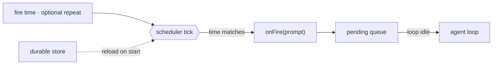

# 14 · Scheduling

[English](README.md) · **繁體中文**

> 讓 agent 的 turn 由時鐘啟動，而不只是由 user 輸入啟動。

背景工作仍然需要有人或有東西來啟動它。很多 task 應該稍後才跑或重複跑：一份報告、一則提醒，或一個輪詢 task。

排程儲存一個未來的觸發。當它 fire 時，就把一個 prompt 放進 queue。正常的 loop 會把那個 prompt 當成一個新的 turn 來處理。

排程必須：

1. 把 schedule 儲存在單一 turn 之外。
2. 獨立於 loop 之外地監看時間。
3. 當 schedule fire 時把一個 prompt 放進 queue。
4. 選擇性地讓 schedule 跨重啟後仍存活。

少了這一層，agent 就只能對 user 輸入做出反應。

---

## 機制

把時鐘和 loop 分開。scheduler 監看時間。它不會直接呼叫 model。

在 fire 的時刻，它把一個 prompt 放進 queue。當 loop 準備好時，queue 處理器就把那個 prompt 排空進正常的 loop。



- 一個 schedule 就是資料：一個 fire 時間，以及選擇性的重複間隔。
- 一次性（one-shot）的 schedule fire 一次後就把自己刪掉。
- 週期性（recurring）的 schedule 會重新裝填到下一個間隔。
- 一個 durable 的 schedule 能在重啟後存活，但在 host 關機時它不會 fire。

### New：scheduler 與 fire queue

`tick` 檢查到期的 task。fire 就是把一個 prompt 放進 queue：

```python
def tick(self):                                       # src/scheduler.py; called by a daemon thread
    now = self._clock()
    for tid, t in list(self._tasks.items()):
        if now >= t["due"]:
            self._pending.put(t["prompt"])            # enqueue, do not run the model here
            if t["every"]:
                t["due"] = now + t["every"]
            else:
                self._tasks.pop(tid, None)
    self._save()                                      # durable tasks only
```

- 時鐘是可注入的，所以測試會用一個假時鐘。
- `run()` 在一個 daemon thread 上呼叫 `tick`。
- `_save` 把 durable task 持久化成 JSON。
- 在相同路徑上建立一個新的 `Scheduler`，會重新載入 durable task 並接續 id。

### 如何整合

排程從 loop 之外啟動 turn：

```python
for prompt in sched.drain():                          # src/demo.py · between turns
    messages = [{"role": "user", "content": prompt}]
    run_turn(messages, model, reg, session)
```

一個 fire 出來的 prompt 會變成一個新的、類似 user 的 turn。它用的是同一套 loop、權限、hook、記憶、context 管理和復原路徑。

---

## 各系統做法

各個 agent 如何決定何時執行排程工作。

| System | 觸發 | 持久性 | 喚醒 |
| --- | --- | --- | --- |
| **Claude Code** | Cron、sleep，以及 remote trigger。 | session 或 durable 的本地 schedule。 | fire 出來的 prompt 進入 queue。 |

### Claude Code

- `CronCreate`、`CronList` 和 `CronDelete` 管理 cron 項目。
- 一個 cron 項目儲存 `id`、`cron`、`prompt`、`recurring` 和 `durable`。
- `cronScheduler.ts` 以固定間隔 tick，並呼叫 `onFire(prompt)`。
- `useScheduledTasks.ts` 以 `priority: 'later'` 把 fire 出來的 prompt 放進 queue。
- 當沒有 turn 正在進行時，queue 就排空。
- `durable: true` 會寫入 `.claude/scheduled_tasks.json`。
- 一把鎖避免多個開啟中的 session 對同一個以檔案為後盾的 schedule 重複 fire。
- `RemoteTriggerTool` 使用一個託管的 trigger，讓工作不需本地 process 就能 fire。

> **取捨：** 本地 schedule 簡單又私密，但它們只在 process 運行時才會 tick。remote trigger 可以在無人看管下 fire，但它們需要一個託管服務和 auth。

---

## 失效模式

- **重複 fire（Double fire）。** 一次很快的 tick 可能在同一個 cron 分鐘內比對到不只一次。追蹤上一次 fire 的分鐘。
- **許多 schedule 一起 fire。** 對週期性 task 加上具決定性的 jitter。
- **durable 不等於永遠開機。** 本地 durable schedule 只能在重啟後存活。要離線 fire，改用 remote trigger 或 OS timer。
- **cron 表達式有誤（Bad cron expression）。** 在 create 時驗證，並跳過無效的已載入項目。
- **loop 正忙。** 把 prompt 放進 queue，並在 turn 之間排空它。

---

## 可執行程式

[`src/`](src/) 把 13 帶了過來，並加上：

- [`scheduler.py`](src/scheduler.py)：一個 scheduler、fire queue、週期性重新裝填、一次性刪除，以及 durable 的 JSON store。
- [`test.py`](src/test.py)：用一個假時鐘測試一次性、週期性和重新載入的行為。
- [`demo.py`](src/demo.py)：把一個 prompt 排在一秒後，並以一個新 turn 執行它。

loop 沒有改變。排程從 loop 之外啟動 turn。

```bash
python sections/14-scheduling/src/test.py         # offline checks, no key
uv run python sections/14-scheduling/src/demo.py  # live demo, needs a key
```

---

## 出處

- Claude Code source：`tools/ScheduleCronTool/`、`tools/RemoteTriggerTool/`、`tools/SleepTool/`、`utils/cronScheduler.ts`、`hooks/useScheduledTasks.ts`、`utils/queueProcessor.ts`。
- learn-claude-code · s14_cron_scheduler：章節框架。
