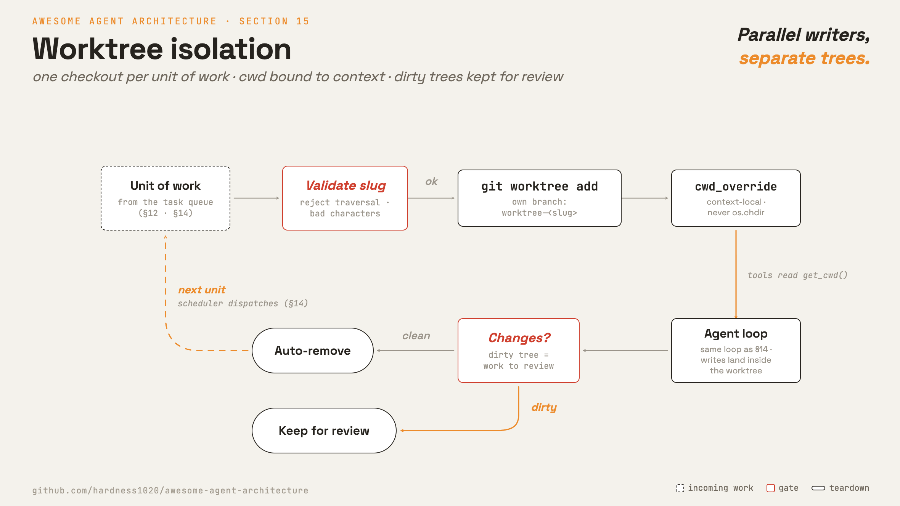

# 15 · Worktree isolation

**English** · [繁體中文](README.zh-TW.md) · [简体中文](README.zh-CN.md)

> Give parallel agents separate working directories.

A single working directory is shared mutable state. If two agents write the same file at the same time, one can overwrite the other's work.

The task system decides what work exists. Subagents decide how work is split. Worktree isolation keeps the writes separate: each agent writes in its own directory, so they do not interfere.

Each unit of work gets its own checkout and branch. The agent's file and shell tools resolve paths inside that checkout.

The isolation layer must:

1. Create a private checkout for each unit of work.
2. Bind tools to that checkout.
3. Reject names that would escape the worktree root.
4. Remove clean worktrees and keep dirty ones for review.

Without this layer, agents editing the same directory at once can corrupt each other's files.

---

## Mechanism



There are two pieces:

1. A private git worktree per unit of work.
2. A per-context working-directory binding.

The binding must be scoped to the agent context. A global `chdir` would affect other agents in the same process.

- Each worktree is a checkout of the same repo on its own branch.
- The slug becomes a path, so validate it before any path join.
- Tools read `get_cwd()` from context, not from a global process cwd.
- Teardown removes only clean worktrees. Dirty worktrees stay for review.

### New: the worktree and cwd binding

`worktree.py` validates a slug, creates a worktree, and binds cwd through a context variable:

```python
_cwd = contextvars.ContextVar("cwd", default=None)   # per-context cwd

@contextlib.contextmanager
def cwd_override(path):
    token = _cwd.set(str(path))                       # bind, never os.chdir
    try:
        yield
    finally:
        _cwd.reset(token)

def remove(repo_root, slug, force=False):
    path = _path(repo_root, slug)                     # _path validates the slug first
    if not force and changes(path):
        return False                                  # keep for review
    _git(repo_root, "worktree", "remove", "--force", str(path))
    _git(repo_root, "branch", "-D", f"worktree-{slug}")
    return True
```

- `cwd_override` affects only the current context.
- Tools pass `get_cwd()` to subprocesses and file operations.
- `create` runs `git worktree add -B worktree-<slug>`.
- `validate_slug` rejects traversal and disallowed characters.
- `remove` refuses to remove a dirty worktree unless forced.

### How it integrates

Isolation wraps a turn from outside the loop:

```python
wt = worktree.create(repo, "agent-1")                 # src/demo.py
with worktree.cwd_override(wt):
    run_turn([{"role": "user", "content": prompt}], model, reg, session)
worktree.remove(repo, "agent-1")                       # clean -> remove, dirty -> keep
```

The loop and subagent path do not need special logic. Only the working directory seen by tools changes.

To make this model-selectable, add an `isolation` option to the `Agent` tool schema and branch in `spawn`.

---

## Per system

How each system isolates parallel work and cleans it up.

| | Claude Code |
| --- | --- |
| **Pros** | Real filesystem isolation and clean diffs. Dirty worktrees stay for review, so no work is lost silently. |
| **Cons** | Worktrees cost disk, setup time, and a later merge step. |
| **Why** | Several agents cannot safely write to one shared directory, so each unit of work writes in its own checkout. |
| **How: isolation unit** | Git worktree per task or session, each on its own branch. The model can request one when it spawns a subagent. |
| **How: binding** | Scoped cwd for subagents, so concurrent agents do not affect each other. Session mode changes the process cwd. Task records never store the binding. |
| **How: cleanup** | Remove clean worktrees. Keep dirty ones unless the user explicitly discards changes. A periodic sweep removes old ephemeral worktrees. |

---

## Failure modes

- **Path traversal in slug.** Validate before path joins or git commands.
- **Silent loss on remove.** Keep dirty worktrees unless the user explicitly discards changes.
- **cwd leak across agents.** Use context-local cwd for concurrent subagents.
- **Stale worktree buildup.** Sweep only known ephemeral worktrees.
- **Stale reads after fork.** Tell forked children to re-read files inside the worktree.

---

## Runnable

[`src/`](src/) carries 14 forward and adds:

- [`worktree.py`](src/worktree.py): slug validation, worktree creation, context-local cwd, and safe removal.
- [`test.py`](src/test.py): checks two agents writing in separate worktrees and the clean/dirty removal gate.
- [`demo.py`](src/demo.py): runs a live turn inside a worktree.

The loop and subagent path are unchanged. Isolation wraps the turn by binding cwd.

```bash
python sections/15-worktree-isolation/src/test.py         # offline checks, real git, no key
uv run python sections/15-worktree-isolation/src/demo.py  # live demo, needs a key
```

---

## Sources

- [Claude Code source](https://github.com/yasasbanukaofficial/claude-code):
  `tools/EnterWorktreeTool/`, `tools/ExitWorktreeTool/`, `utils/worktree.ts`, `utils/cwd.ts`, `tools/AgentTool/AgentTool.tsx`.
- [learn-claude-code · s18_worktree_isolation](https://github.com/shareAI-lab/learn-claude-code): section framing.
