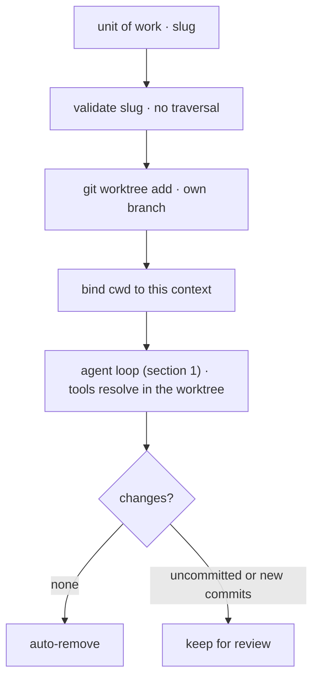

# 15 · Worktree isolation

> Each agent works in its own directory, so parallel work cannot clobber a shared tree.

When two agents (or one session and its subagents) touch the same files at once, their edits collide and you cannot tell whose change is whose. Worktree isolation hands each unit of work its own checkout of the same repo on its own branch. They diverge in private and merge (or get discarded) at the end.

---

## Problem

A single working directory is one shared mutable surface. Run two agents against it and they race: Alice writes `config.py`, Bob writes `config.py`, one overwrites the other, and the diff is now a tangle nobody can untangle or roll back cleanly. The task system (section 12) decides *who does what* and subagents (section 6) decide *how the work fans out*, but neither answers *where* the writes land.

So something must:

1. Give each unit of work a private checkout, separate from the shared tree.
2. Bind that unit's file and shell tools to its own directory, even while siblings run at the same time.
3. Reject a name that would escape the worktree root before it becomes a path.
4. Tear down safely: drop an empty worktree, keep one that holds real work.

Leave isolation out and parallelism is unsafe: concurrent agents corrupt each other's files, and a failed run leaves half-applied edits smeared across the only copy you have.

---

## Mechanism

Two ingredients: a private checkout per unit of work, and a per-context working-directory binding so each agent's file and shell tools resolve paths inside its own checkout. The binding is scoped to a context, not the process, so agents running at once never share a cwd.



- **A worktree per unit of work.** Each unit gets a second checkout of the same repo on its own branch, so its edits live in a private directory, not the shared tree.
- **Bind cwd by context, not by chdir.** Each agent's tools resolve paths against a working directory scoped to its context; a global process chdir would corrupt siblings running at the same time.
- **Validate the name at the boundary.** The slug becomes a path, so reject traversal (`.`, `..`, stray separators) before any path join or git command runs.
- **Clean removes, dirty keeps.** On teardown a change count decides: zero changes auto-removes the worktree; any uncommitted edit or new commit keeps it for review, so work is never silently discarded.

### New: the worktree and its cwd binding

`worktree.py` is the primitive: validate a slug, `git worktree add` a checkout, and scope cwd through a contextvar so a tool resolves paths inside it. The two non-obvious bits are the binding and the teardown gate:

```python
_cwd = contextvars.ContextVar("cwd", default=None)   # per-context cwd; sync analog of AsyncLocalStorage

@contextlib.contextmanager
def cwd_override(path):
    token = _cwd.set(str(path))                       # bind, never os.chdir: siblings stay isolated
    try:
        yield
    finally:
        _cwd.reset(token)

def remove(repo_root, slug, force=False):
    path = _path(repo_root, slug)                     # _path validates the slug first (boundary)
    if not force and changes(path):                   # uncommitted edits in the worktree?
        return False                                  # keep-for-review: never silently lose work
    _git(repo_root, "worktree", "remove", "--force", str(path))
    _git(repo_root, "branch", "-D", f"worktree-{slug}")
    return True
```

- `cwd_override` binds `get_cwd()` for the current context via a contextvar (not `os.chdir`), so two agents running at once never corrupt a shared process cwd; a tool passes `get_cwd()` to its subprocess.
- `create` runs `git worktree add -B worktree-<slug>` after `validate_slug` rejects `.`, `..`, and out-of-allowlist characters at the trust boundary.
- `remove` counts uncommitted changes: zero auto-removes, any keeps the worktree for review, so parallel work is never silently lost.

### How it integrates

The loop and the subagent path are unchanged (section 14 kept the loop too). Isolation wraps a unit of work from outside: create a worktree, run the turn inside `cwd_override`, tear down by the change gate.

```python
wt = worktree.create(repo, "agent-1")                 # src/demo.py · isolated checkout, own branch
with worktree.cwd_override(wt):                        # every get_cwd() in here resolves in the worktree
    run_turn([{"role": "user", "content": prompt}], model, reg, session)
worktree.remove(repo, "agent-1")                       # clean -> remove, dirty -> keep for review
```

- The turn runs the normal loop (permissions, hooks, memory, retry); only the working directory its tools see has moved, so isolation needs no special path through the loop.
- Binding by context rather than `chdir` is what lets many agents (section 6) run concurrently, each in its own worktree, without one's cwd leaking into another's.
- To make isolation model-selectable, add an `isolation` enum to the Agent tool's schema (section 2) and branch in `spawn`; Claude Code does exactly this (`AgentTool isolation: 'worktree'`). The strip-down keeps `worktree.py` independent of the spawner, mirroring how worktrees and tasks stay separate systems (Per system).

---

## Per system

How each system isolates a unit of parallel work, binds it to a directory, and tears it down.

| System                | Isolation unit                                                                                       | Binding                                                                                                 | Cleanup                                                                                       |
| --------------------- | ---------------------------------------------------------------------------------------------------- | ------------------------------------------------------------------------------------------------------- | --------------------------------------------------------------------------------------------- |
| **Claude Code** | `git worktree` at `.claude/worktrees/<slug>`, branch `worktree-<slug>` (`utils/worktree.ts`) | subagent`runWithCwdOverride` (`AsyncLocalStorage`); session `process.chdir` + `WorktreeSession` | auto-remove when no changes; else keep-for-review (`ExitWorktreeTool`, `discard_changes`) |
| *(more soon)*       |                                                                                                      |                                                                                                         |                                                                                               |

### Claude Code

- **One module, two binding styles.** `utils/worktree.ts` backs both paths: `validateWorktreeSlug`, `worktreeBranchName`, `createAgentWorktree`, `removeAgentWorktree`.
- **Subagent: scoped cwd, concurrent.** `AgentTool.tsx` `isolation: 'worktree'` calls `createAgentWorktree(agent-<id>)`, then `runWithCwdOverride` (`utils/cwd.ts`) wraps the child in an `AsyncLocalStorage` so every `getCwd()` in that async context returns the override, with no global `chdir`, so many agents run at once.
- **Session: real chdir, one-at-a-time.** `EnterWorktreeTool` calls `process.chdir` plus `setCwd`/`setOriginalCwd` and persists a `WorktreeSession`; the whole process moves into the worktree until `ExitWorktreeTool` restores the original cwd.
- **Teardown by change count.** No uncommitted files and no new commits auto-removes; otherwise kept for review (`ExitWorktreeTool` refuses a dirty worktree unless `discard_changes: true`), and a periodic sweep removes only ephemeral `agent-*` worktrees past a cutoff.
- **Tasks stay independent.** A `LocalAgentTask` (section 12) carries no worktree field; the binding lives in the async cwd scope, not the persisted task record, so worktrees and tasks stay separate systems.

> **Trade-off:** a real per-task worktree buys true filesystem isolation and clean per-branch diffs, but it costs disk (extra checkouts, mitigated by symlinking `node_modules`), an eventual merge step, and stale-directory bookkeeping. A single shared directory is free and needs no merge, but cannot run writers in parallel.

---

## Failure modes

- **Path traversal in the slug.** A name like `../target` escapes the worktree root once `path.join` normalizes it. Mitigation: `validate_slug` rejects `.`/`..` and out-of-allowlist characters before any git command or path join.
- **Silent loss of work on remove.** Tearing down a worktree with uncommitted edits destroys them. Mitigation: a change-count gate keeps a dirty worktree for review and only auto-removes a clean one (`ExitWorktreeTool`, `discard_changes`).
- **cwd bleeding across concurrent agents.** A global `process.chdir` corrupts siblings running at once. Mitigation: scope cwd through `AsyncLocalStorage`/contextvar (`runWithCwdOverride`), never a process chdir (section 6).
- **Stale worktree buildup.** Crashed or abandoned runs leak directories and branches. Mitigation: a periodic sweep targets only ephemeral `agent-*` slugs past a cutoff, so user-named worktrees are never auto-deleted.
- **Stale reads after a fork.** A forked child running in a worktree may hold paths and contents from before the split. Mitigation: notify the child to translate paths and re-read possibly stale files (section 11).

---

## Runnable

[`src/`](src/) carries 14 forward and adds:

- [`worktree.py`](src/worktree.py): validate a slug, `git worktree add` a per-branch checkout, bind cwd through a contextvar so tools resolve inside it, and remove only when the worktree is clean.
- [`test.py`](src/test.py): in a temp git repo, two threads each bound to their own worktree write `config.py` without clobbering, and the change gate keeps a dirty worktree but removes a clean one.
- [`demo.py`](src/demo.py): a live turn bound to a worktree; the model's shell writes a file that lands in the worktree, not the main tree.

The loop and the subagent path are unchanged: isolation wraps a unit of work from outside by binding its cwd (section 14 kept the loop too).

```bash
python sections/15-worktree-isolation/src/test.py         # offline checks, real git, no key
uv run python sections/15-worktree-isolation/src/demo.py  # live demo, needs a key
```

---

## Sources

- Claude Code source: `tools/EnterWorktreeTool/`, `tools/ExitWorktreeTool/`, `utils/worktree.ts` (`validateWorktreeSlug`, `createAgentWorktree`), `utils/cwd.ts` (`runWithCwdOverride`), `tools/AgentTool/AgentTool.tsx` (`isolation: 'worktree'`).
- learn-claude-code · s18_worktree_isolation: section framing.
