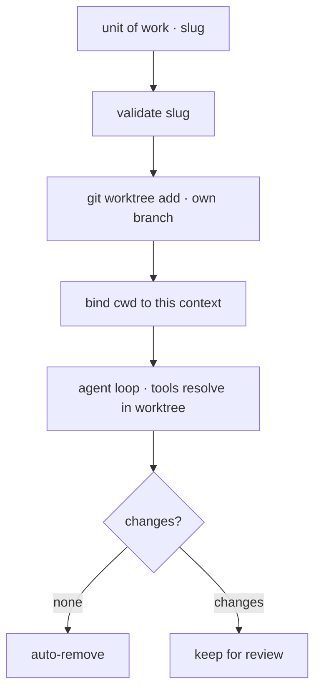

# 15 · Worktree isolation

[English](README.md) · [繁體中文](README.zh-TW.md) · **简体中文**

> 给并行运作的 agent 各自独立的工作目录。

单一工作目录是共享的可变状态。如果两个 agent 同时写入同一个文件，其中一个可能覆盖掉另一个的成果。

task 系统决定有哪些工作要做。subagent 决定工作怎么拆分。worktree isolation 决定文件写入发生在哪里。

每个工作单元都有自己的 checkout 和 branch。agent 的文件工具与 shell 工具会在那个 checkout 里解析路径。

隔离层必须：

1. 为每个工作单元创建一份私有 checkout。
2. 把工具绑定到那份 checkout。
3. 拒绝会逃出 worktree 根目录的名称。
4. 移除干净的 worktree，保留有变更的以供审查。

没有这一层，并行的写入者可能破坏共享的树。

---

## 机制

有两个部分：

1. 每个工作单元一个私有的 git worktree。
2. 每个 context 各自的工作目录绑定。

这个绑定必须限定在 agent context 的范围内。全局的 `chdir` 会影响同一个 process 里的其他 agent。



- 每个 worktree 都是同一个 repo 在自己 branch 上的 checkout。
- slug 会变成路径，所以在任何路径组合之前先验证它。
- 工具从 context 读取 `get_cwd()`，而不是从全局 process cwd 读取。
- 拆除时只移除干净的 worktree。有变更的 worktree 会保留下来供审查。

### New: worktree 与 cwd 绑定

`worktree.py` 验证一个 slug、创建一个 worktree，并通过 context variable 绑定 cwd：

```python
_cwd = contextvars.ContextVar("cwd", default=None)   # per-context cwd

@contextlib.contextmanager
def cwd_override(path):
    token = _cwd.set(str(path))                       # bind, never os.chdir
    try:
        yield
    finally:
        _cwd.reset(token)

def remove(repo_root, slug, force=False):
    path = _path(repo_root, slug)                     # _path validates the slug first
    if not force and changes(path):
        return False                                  # keep for review
    _git(repo_root, "worktree", "remove", "--force", str(path))
    _git(repo_root, "branch", "-D", f"worktree-{slug}")
    return True
```

- `cwd_override` 只影响当前的 context。
- 工具把 `get_cwd()` 传给子进程与文件操作。
- `create` 执行 `git worktree add -B worktree-<slug>`。
- `validate_slug` 拒绝路径穿越与不允许的字符。
- `remove` 除非强制，否则拒绝移除有变更的 worktree。

### How it integrates

隔离从 loop 外面包住一个 turn：

```python
wt = worktree.create(repo, "agent-1")                 # src/demo.py
with worktree.cwd_override(wt):
    run_turn([{"role": "user", "content": prompt}], model, reg, session)
worktree.remove(repo, "agent-1")                       # clean -> remove, dirty -> keep
```

loop 与 subagent 路径不需要特殊逻辑。只有工具看到的工作目录改变了。

若要让模型能自行选择这个模式，在 `Agent` 工具的 schema 加上 `isolation` 选项，并在 `spawn` 里分支处理。

---

## 各系统做法

各系统如何隔离并行工作并在事后清理。

| System | Isolation unit | Binding | Cleanup |
| --- | --- | --- | --- |
| **Claude Code** | 每个 task 或 session 一个 git worktree。 | subagent 用限定范围的 cwd；session 模式用 process cwd。 | 移除干净的 worktree，保留有变更的。 |

### Claude Code

- `utils/worktree.ts` 验证 slug 并创建或移除 worktree。
- worktree 位于 `.claude/worktrees/<slug>` 底下。
- branch 命名为 `worktree-<slug>`。
- `AgentTool` 可以使用 `isolation: 'worktree'`。
- subagent 使用 `runWithCwdOverride` 与 `AsyncLocalStorage`。
- session 级别的 worktree 模式使用 `process.chdir`。
- `ExitWorktreeTool` 除非 `discard_changes` 为 true，否则拒绝在有变更时拆除。
- 周期性的清扫会移除旧的临时 `agent-*` worktree。
- task 记录不存储 worktree 绑定。绑定存在于 cwd 范围里。

> **取舍：** worktree 提供真正的文件系统隔离与干净的 diff。
> 代价是磁盘空间、构建时间，以及之后的 merge 步骤。
> 共享目录比较简单，但无法安全地支持并行的写入者。

---

## 失效模式

- **slug 里的路径穿越：**在路径组合或 git 指令之前先验证。
- **移除时默默丢失：**除非用户明确舍弃变更，否则保留有变更的 worktree。
- **cwd 在 agent 之间泄漏：**对并行的 subagent 使用 context-local 的 cwd。
- **陈旧 worktree 堆积：**只清扫已知的临时 worktree。
- **fork 后读到陈旧内容：**告诉 fork 出来的子进程重新读取 worktree 里的文件。

---

## 可执行程序

[`src/`](src/) 承接第 14 章并加上：

- [`worktree.py`](src/worktree.py)：slug 验证、worktree 创建、context-local 的 cwd，以及安全移除。
- [`test.py`](src/test.py)：检查两个隔离的写入者，以及干净/有变更的移除闸门。
- [`demo.py`](src/demo.py)：在 worktree 里跑一个 live turn。

loop 与 subagent 路径不变。隔离通过绑定 cwd 来包住 turn。

```bash
python sections/15-worktree-isolation/src/test.py         # offline checks, real git, no key
uv run python sections/15-worktree-isolation/src/demo.py  # live demo, needs a key
```

---

## 出处

- Claude Code 源代码：`tools/EnterWorktreeTool/`、`tools/ExitWorktreeTool/`、`utils/worktree.ts`、`utils/cwd.ts`、`tools/AgentTool/AgentTool.tsx`。
- learn-claude-code · s18_worktree_isolation：章节框架。
