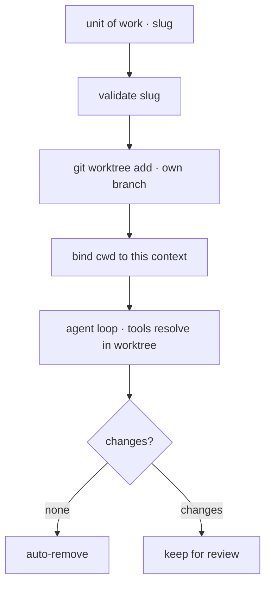

# 15 · Worktree isolation

[English](README.md) · **繁體中文**

> 給平行運作的 agent 各自獨立的工作目錄。

單一工作目錄是共用的可變狀態。如果兩個 agent 同時寫入同一個檔案，其中一個可能覆蓋掉另一個的成果。

task 系統決定有哪些工作要做。subagent 決定工作怎麼拆分。worktree isolation 決定檔案寫入發生在哪裡。

每個工作單元都有自己的 checkout 和 branch。agent 的檔案工具與 shell 工具會在那個 checkout 裡解析路徑。

隔離層必須：

1. 為每個工作單元建立一份私有 checkout。
2. 把工具綁定到那份 checkout。
3. 拒絕會逃出 worktree 根目錄的名稱。
4. 移除乾淨的 worktree，保留有變更的以供審查。

沒有這一層，平行的寫入者可能破壞共用的樹。

---

## 機制

有兩個部分：

1. 每個工作單元一個私有的 git worktree。
2. 每個 context 各自的工作目錄綁定。

這個綁定必須限定在 agent context 的範圍內。全域的 `chdir` 會影響同一個 process 裡的其他 agent。



- 每個 worktree 都是同一個 repo 在自己 branch 上的 checkout。
- slug 會變成路徑，所以在任何路徑組合之前先驗證它。
- 工具從 context 讀取 `get_cwd()`，而不是從全域 process cwd 讀取。
- 拆除時只移除乾淨的 worktree。有變更的 worktree 會保留下來供審查。

### New: worktree 與 cwd 綁定

`worktree.py` 驗證一個 slug、建立一個 worktree，並透過 context variable 綁定 cwd：

```python
_cwd = contextvars.ContextVar("cwd", default=None)   # per-context cwd

@contextlib.contextmanager
def cwd_override(path):
    token = _cwd.set(str(path))                       # bind, never os.chdir
    try:
        yield
    finally:
        _cwd.reset(token)

def remove(repo_root, slug, force=False):
    path = _path(repo_root, slug)                     # _path validates the slug first
    if not force and changes(path):
        return False                                  # keep for review
    _git(repo_root, "worktree", "remove", "--force", str(path))
    _git(repo_root, "branch", "-D", f"worktree-{slug}")
    return True
```

- `cwd_override` 只影響當前的 context。
- 工具把 `get_cwd()` 傳給子行程與檔案操作。
- `create` 執行 `git worktree add -B worktree-<slug>`。
- `validate_slug` 拒絕路徑穿越與不允許的字元。
- `remove` 除非強制，否則拒絕移除有變更的 worktree。

### How it integrates

隔離從 loop 外面包住一個 turn：

```python
wt = worktree.create(repo, "agent-1")                 # src/demo.py
with worktree.cwd_override(wt):
    run_turn([{"role": "user", "content": prompt}], model, reg, session)
worktree.remove(repo, "agent-1")                       # clean -> remove, dirty -> keep
```

loop 與 subagent 路徑不需要特殊邏輯。只有工具看到的工作目錄改變了。

若要讓模型能自行選擇這個模式，在 `Agent` 工具的 schema 加上 `isolation` 選項，並在 `spawn` 裡分支處理。

---

## 各系統做法

各系統如何隔離平行工作並在事後清理。

| System | Isolation unit | Binding | Cleanup |
| --- | --- | --- | --- |
| **Claude Code** | 每個 task 或 session 一個 git worktree。 | subagent 用限定範圍的 cwd；session 模式用 process cwd。 | 移除乾淨的 worktree，保留有變更的。 |

### Claude Code

- `utils/worktree.ts` 驗證 slug 並建立或移除 worktree。
- worktree 位於 `.claude/worktrees/<slug>` 底下。
- branch 命名為 `worktree-<slug>`。
- `AgentTool` 可以使用 `isolation: 'worktree'`。
- subagent 使用 `runWithCwdOverride` 與 `AsyncLocalStorage`。
- session 層級的 worktree 模式使用 `process.chdir`。
- `ExitWorktreeTool` 除非 `discard_changes` 為 true，否則拒絕在有變更時拆除。
- 週期性的清掃會移除舊的臨時 `agent-*` worktree。
- task 記錄不儲存 worktree 綁定。綁定存在於 cwd 範圍裡。

> **取捨：** worktree 提供真正的檔案系統隔離與乾淨的 diff。
> 代價是磁碟空間、建置時間，以及之後的 merge 步驟。
> 共用目錄比較簡單，但無法安全地支援平行的寫入者。

---

## 失效模式

- **slug 裡的路徑穿越。** 在路徑組合或 git 指令之前先驗證。
- **移除時默默遺失。** 除非使用者明確捨棄變更，否則保留有變更的 worktree。
- **cwd 在 agent 之間外洩。** 對並行的 subagent 使用 context-local 的 cwd。
- **陳舊 worktree 堆積。** 只清掃已知的臨時 worktree。
- **fork 後讀到陳舊內容。** 告訴 fork 出來的子行程重新讀取 worktree 裡的檔案。

---

## 可執行程式

[`src/`](src/) 承接第 14 章並加上：

- [`worktree.py`](src/worktree.py)：slug 驗證、worktree 建立、context-local 的 cwd，以及安全移除。
- [`test.py`](src/test.py)：檢查兩個隔離的寫入者，以及乾淨/有變更的移除閘門。
- [`demo.py`](src/demo.py)：在 worktree 裡跑一個 live turn。

loop 與 subagent 路徑不變。隔離透過綁定 cwd 來包住 turn。

```bash
python sections/15-worktree-isolation/src/test.py         # offline checks, real git, no key
uv run python sections/15-worktree-isolation/src/demo.py  # live demo, needs a key
```

---

## 出處

- Claude Code 原始碼：`tools/EnterWorktreeTool/`、`tools/ExitWorktreeTool/`、`utils/worktree.ts`、`utils/cwd.ts`、`tools/AgentTool/AgentTool.tsx`。
- learn-claude-code · s18_worktree_isolation：章節框架。
