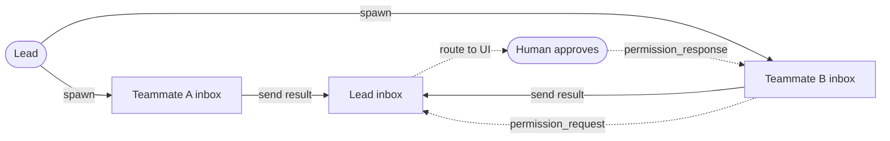

# 16 · Coordination

> Let multiple agents send messages and escalate decisions.

One agent has one context window and one active line of work. Large jobs often need several agents working at once.

A subagent can handle a focused task, but a one-shot subagent is hard to steer after it starts.

Coordinated agents need names, inboxes, and a way to send permission requests back to a human.

Coordination must:

1. Give agents stable addresses.
2. Deliver messages across process boundaries.
3. Let teammates report progress and receive new instructions.
4. Bubble gated actions to a human approver.

Without this layer, large work either stays serial or splits into workers that cannot collaborate.

---

## Mechanism

Each agent owns an inbox. Sending a message means writing to the recipient's inbox. Delivery happens when the recipient drains its inbox.

There is no central broker in the demo. There is a shared convention for names, inbox paths, and message shape.



- Each agent owns one inbox.
- A message has a sender, recipient, and content.
- `to="*"` broadcasts to every teammate except the sender.
- Senders write and return. They do not block waiting for a reply.
- Recipients drain their inbox before a turn and fold messages into context.
- Permission requests use the same channel.

### New: the team inbox and permission channel

`mailbox.py` implements a `Team` of named inboxes:

```python
def send(self, frm, to, content):                      # src/mailbox.py
    targets = [m for m in self.members if m != frm] if to == "*" else [self._check(to)]
    with self._lock():                                 # serialize concurrent senders
        for t in targets:
            inbox = self._read(t)
            inbox.append({"from": frm, "to": t, "content": content})
            self._path(t).write_text(json.dumps(inbox))
```

- `_check` rejects unknown names before they become paths.
- The lock serializes read-modify-write, so concurrent senders do not drop messages.
- `drain` reads and clears one inbox.

Permission bubbling is an approver implementation:

```python
def bubbling_approver(team, me, lead, human):           # approver for an agent with no human UI
    def approve(name, args):
        team.send(me, lead, {"kind": "permission_request", "tool": name, "args": args})
        team.send(lead, me, {"kind": "permission_response", "ok": human(name, args)})
        resp = [m["content"] for m in team.drain(me)
                if m["content"].get("kind") == "permission_response"]
        return bool(resp and resp[-1]["ok"])
    return approve
```

Bubbling moves a gated call to a human over the same channel:

1. A teammate hits a gated tool call, but its own loop has no human at the keyboard.
2. The approver sends a `permission_request` to the lead's inbox.
3. The lead routes it to its approval UI (the `human` callback here).
4. The verdict returns as a `permission_response` in the teammate's inbox.
5. The teammate reads that response and returns allow or deny to the gate.

The gate still calls `approver(name, args)` and does not change. The answer arrives as an inbox message, not a direct call, so escalation reuses the same channel.

### How it integrates

Coordination wraps a turn from outside:

```python
mailbox.fold_inbox(messages, team, "worker")           # peers' messages surface on this turn
run_turn(messages, model, reg, session,
         approver=mailbox.bubbling_approver(team, "worker", "lead", human=lead_ui))
team.send("worker", "lead", out)                        # report back over the same channel
```

- `fold_inbox` prepends peer messages to the next user turn.
- The loop does not change.
- The permission gate does not change.
- Durable shared facts should go to team memory, not chat history.

---

## Per system

How one design spreads work across cooperating agents.

| System | Teammates | Channel | Shared memory | Permission bubbling |
| --- | --- | --- | --- | --- |
| **Claude Code** | In-process and remote teammates. | Inbox messages, in memory or on disk. | Team task list and team memory dir. | Remote requests route to local approval UI. |

### Claude Code

- `TeamCreateTool` creates a team. `TeamDeleteTool` removes it.
- Teammates can be `InProcessTeammateTask` or `RemoteAgentTask`.
- `SendMessageTool` writes to an inbox.
- In-process teammates use `utils/mailbox.ts`.
- Cross-process teammates use file inboxes under `~/.claude/teams/{team}/inboxes/`.
- File inboxes use `proper-lockfile`.
- `to: "*"` broadcasts.
- A team owns a task list.
- Team memory lives under `memdir/teamMemPaths.ts`.
- `remotePermissionBridge.ts` turns remote permission requests into local approval prompts.
- Coordinator mode drains inboxes and folds messages between turns.

> **Trade-off:** File inboxes are durable and can cross process or machine boundaries. They add polling and lock cost. In-memory inboxes are fast, but they die with the process.

---

## Failure modes

- **Lost message race.** Two senders write one inbox at once. Lock read-modify-write.
- **Peer deadlock.** Agents wait on each other. Queue messages and drain between turns instead of blocking sends.
- **Permission stalls.** A teammate has no human UI. Bubble the request to the lead.
- **Vague cross-agent message.** A teammate cannot see the lead's chat. Make messages self-contained.
- **Chat used as memory.** Durable shared facts belong in team memory.

---

## Runnable

[`src/`](src/) carries 15 forward and adds:

- [`mailbox.py`](src/mailbox.py): named inboxes, broadcast, locking, draining, folding, and permission bubbling.
- [`test.py`](src/test.py): checks unknown names, direct send, broadcast, concurrent send, and permission bubbling.
- [`demo.py`](src/demo.py): runs a two-agent team with approval routed through the lead.

The loop and subagent path are unchanged. Coordination wraps a turn by draining inboxes and passing an approver.

```bash
python sections/16-coordination/src/test.py         # offline checks, no key
uv run python sections/16-coordination/src/demo.py  # live demo, needs a key
```

---

## Sources

- Claude Code tools and inboxes: `tools/SendMessageTool/`, `tools/TeamCreateTool/`, `utils/mailbox.ts`, `utils/teammateMailbox.ts`.
- Claude Code remote and memory sources: `tasks/RemoteAgentTask/`, `remote/remotePermissionBridge.ts`, `memdir/teamMemPaths.ts`.
- learn-claude-code · s15_agent_teams: section framing.
