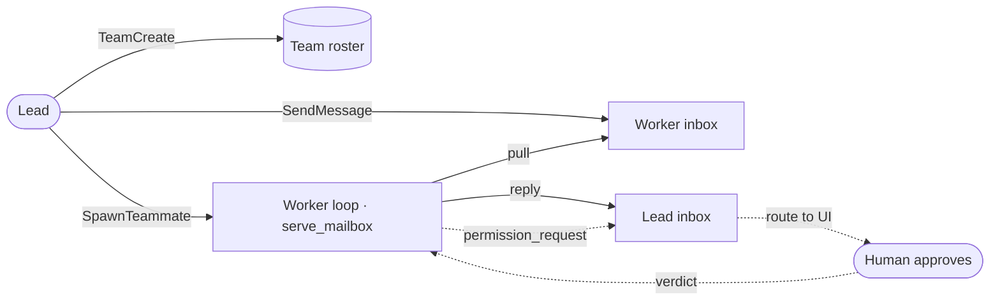

# 16 · Coordination

**English** · [繁體中文](README.zh-TW.md)

> A lead forms a team sized to the task, spawns teammates on their own threads, and they talk over a shared inbox.

One agent has one context window and one active line of work. Large jobs often need several agents working at once.

A subagent can handle a focused task, but a one-shot subagent is hard to steer after it starts.

Coordinated agents need a way to spawn each other, stable names, inboxes to talk, and a way to send permission requests back to a human.

Coordination must:

1. Give agents stable addresses.
2. Let the lead size and form the team for the task.
3. Let the lead spawn each teammate onto its own thread.
4. Let each teammate pull its inbox and act without the script driving it.
5. Bubble gated actions to a human approver.

Without this layer, large work either stays serial or splits into workers that cannot collaborate.

---

## Mechanism

Each agent owns an inbox. Sending a message means writing to the recipient's inbox. Delivery happens when the recipient drains its inbox.

The roster is the lead's choice, not the script's. The lead calls `TeamCreate` to size and form the team for the task, then spawns each member.

The lead does not hand-start teammates. It calls `SpawnTeammate`, and the harness runs the teammate's loop on a background thread (section 13).
The teammate then pulls its own inbox and acts, so the script drives no one.

There is no central broker in the demo. There is a shared convention for names, inbox paths, and message shape.



- Each agent owns one inbox.
- A message has a sender, recipient, and content.
- The lead calls `TeamCreate` to size and form the roster; `SpawnTeammate` then starts each member.
- The lead spawns a teammate with `SpawnTeammate`; that teammate runs on its own thread.
- `to="*"` broadcasts to every teammate except the sender.
- Senders write and return. They do not block waiting for a reply.
- A teammate pulls its inbox each poll and folds new messages into its next turn.
- Permission requests use the same channel.

### New: forming the team

`TeamCreate` is a tool the lead calls to size and form the roster. It fills a one-slot holder the harness reads back when it spawns each member:

```python
def team_tools(root, me, formed):                      # src/mailbox.py
    def create(a):
        members = list(dict.fromkeys([me, *a["members"]]))   # the lead joins its own team
        formed["team"] = Team(root, members)                 # the tool call sizes and forms the team
        return f"team created: {', '.join(members)}"
    ...                                                # SendMessage stays inert until the team exists
```

- The script fixes neither the size nor the names; the lead picks both from the task.
- `SendMessage` is inert until `TeamCreate` runs, so the lead forms the team before it can talk to it.
- `formed` is a one-slot holder (ponytail: an in-process stand-in for a team registry; back it with a roster file to let a teammate in another process join).

### New: spawning a teammate

`SpawnTeammate` is a tool the lead's model calls. The harness starts the teammate's loop on the section-13 runtime, on its own thread:

```python
def teammate_tools(runtime, spawn_worker):             # src/mailbox.py
    def spawn(a):
        runtime.start(lambda: spawn_worker(a["name"]))  # section-13 thread runs the teammate's loop
        return f"spawned teammate {a['name']}; it runs on its own thread and pulls its own work"
    return [Tool("SpawnTeammate", spawn, is_read_only=True, ...)]
```

The teammate's loop is `serve_mailbox`: pull the inbox, act, repeat. It runs on the spawned thread, so the teammate reacts on its own, not on a script:

```python
def serve_mailbox(team, me, work, *, poll=0.05, max_idle_polls=None):   # src/mailbox.py
    while True:
        chat = [m for m in team.drain(me) if isinstance(m["content"], str)]
        if chat:                                        # a message to act on
            folded = "\n".join(f"<message from={m['from']!r}>{m['content']}</message>" for m in chat)
            work(folded)                                # one inner loop (section 1) on the message
            continue
        time.sleep(poll)                                # empty: poll again
```

- `spawn_worker(name)` is the app's thunk; it runs one `serve_mailbox` loop for that teammate.
- The teammate consumes messages as it drains, so a message is delivered once.
- There is no graceful stop yet. The thread is a daemon that dies with the process. Section 17 adds the shutdown handshake.
- `max_idle_polls` bounds the idle wait so a demo or test ends; a real teammate polls until the process stops.

### The inbox and the permission channel

`mailbox.py` implements a `Team` of named inboxes:

```python
def send(self, frm, to, content):                      # src/mailbox.py
    targets = [m for m in self.members if m != frm] if to == "*" else [self._check(to)]
    with self._lock():                                 # serialize concurrent senders
        for t in targets:
            inbox = self._read(t)
            inbox.append({"from": frm, "to": t, "content": content})
            self._path(t).write_text(json.dumps(inbox))
```

- `_check` rejects unknown names before they become paths.
- The lock serializes read-modify-write, so concurrent senders do not drop messages.
- `drain` reads and clears one inbox.

Permission bubbling is an approver implementation. It moves a gated call to a human over the same channel:

```python
def bubbling_approver(team, me, lead, human):           # approver for an agent with no human UI
    def approve(name, args):
        team.send(me, lead, {"kind": "permission_request", "tool": name, "args": args})
        verdict = human(name, args)                     # the lead routes it to its approval UI
        team.send(lead, me, {"kind": "permission_response", "tool": name, "ok": verdict})
        resp = [m["content"] for m in team.drain(me)
                if isinstance(m["content"], dict) and m["content"].get("kind") == "permission_response"]
        return bool(resp and resp[-1]["ok"])
    return approve
```

1. A teammate hits a gated tool call, but its own loop has no human at the keyboard.
2. The approver sends a `permission_request` to the lead's inbox.
3. The lead routes it to its approval UI (the `human` callback here).
4. The verdict returns as a `permission_response` in the teammate's inbox.
5. The teammate reads that response and returns allow or deny to the gate.

The gate still calls `approver(name, args)` and does not change. The answer arrives as an inbox message, not a direct call, so escalation reuses the same channel.

### How it integrates

The demo runs one main agent. The lead takes one step, and the teammate runs itself:

```python
def spawn_worker(name, formed, model):                 # src/demo.py, module level
    team = formed["team"]                              # whatever the lead formed with TeamCreate
    ...                                                 # build the teammate's tools
    return mailbox.serve_mailbox(team, name, work)      # the teammate pulls its own inbox

run_turn([...goal...], model, lead_reg, session)        # the one agent call in demo(): the lead
```

- The only scripted input is the lead's goal. The lead sizes the team with `TeamCreate`, spawns each with `SpawnTeammate`, and delegates with `SendMessage`.
- `demo()` runs one `run_turn`, the lead's. The teammate's own `run_turn` lives in `spawn_worker`, reached only through the spawn tool.
- Each teammate runs `serve_mailbox` on a section-13 thread: it pulls its inbox, works, and replies. The number of replies is the lead's choice; the main process only waits.
- `loop.py` stays generic. Folding and the pull loop are coordination, done in this wrapper, not inside `run_turn`.
- The permission gate does not change; a gated call still bubbles to the lead.

> **Next:** A teammate here is a daemon with no graceful stop, and it only reacts to messages.
> Section 17 adds the shutdown handshake so the lead can end a teammate cleanly.
> Section 18 adds a shared task board, so an idle teammate claims its own work instead of waiting to be messaged.

---

## Per system

How one design spawns cooperating agents and spreads work across them.

| System | Teammates | Channel | Shared memory | Permission bubbling |
| --- | --- | --- | --- | --- |
| **Claude Code** | In-process or remote; each on its own loop. | Inbox messages, memory or disk. | Team task list and memory dir. | Remote requests route to local UI. |

### Claude Code

- `TeamCreateTool` creates a team. `TeamDeleteTool` removes it.
- The lead spawns an `InProcessTeammateTask` or a `RemoteAgentTask`; each teammate runs its own loop.
- In-process teammates poll their inbox (`utils/mailbox.ts`) and fold messages between turns.
- `SendMessageTool` writes to an inbox.
- Cross-process teammates use file inboxes under `~/.claude/teams/{team}/inboxes/`, with `proper-lockfile`.
- `to: "*"` broadcasts.
- A team owns a task list. Team memory lives under `memdir/teamMemPaths.ts`.
- `remotePermissionBridge.ts` turns remote permission requests into local approval prompts.
- Coordinator mode drains inboxes and folds messages between turns.

> **Trade-off:** File inboxes are durable and can cross process or machine boundaries. They add polling and lock cost. In-memory inboxes are fast, but they die with the process.

---

## Failure modes

- **Lost message race.** Two senders write one inbox at once. Lock read-modify-write.
- **Peer deadlock.** Agents wait on each other. Queue messages and drain between turns instead of blocking sends.
- **Permission stalls.** A teammate has no human UI. Bubble the request to the lead.
- **Spawn before create.** The lead spawns or messages before `TeamCreate`, so there is no roster. Keep both inert until the team exists.
- **Orphaned teammate.** A spawned teammate keeps polling after its work is done. Bound the idle wait, or stop it with the section-17 handshake.
- **Vague cross-agent message.** A teammate cannot see the lead's chat. Make messages self-contained.
- **Chat used as memory.** Durable shared facts belong in team memory.

---

## Runnable

[`src/`](src/) carries 15 forward and adds:

- [`mailbox.py`](src/mailbox.py): named inboxes with locking, folding, the `serve_mailbox` loop, bubbling, and the `TeamCreate`, `SendMessage`, `SpawnTeammate` tools.
- [`test.py`](src/test.py): checks addressing, broadcast, concurrent send, folding, bubbling, the mailbox loop, and the `TeamCreate`, `SendMessage`, and `SpawnTeammate` tools.
- [`demo.py`](src/demo.py): the lead takes one step (`TeamCreate`, `SpawnTeammate`, `SendMessage`); each teammate pulls its inbox, runs a gated shell task, and reports back.

The loop and subagent path are unchanged. Coordination wraps a turn by spawning teammates, draining inboxes, and passing an approver.

```bash
python sections/16-coordination/src/test.py         # offline checks, no key
uv run python sections/16-coordination/src/demo.py  # live demo, needs a key
```

---

## Sources

- Claude Code tools and inboxes: `tools/SendMessageTool/`, `tools/TeamCreateTool/`, `utils/mailbox.ts`, `utils/teammateMailbox.ts`.
- Claude Code teammates: `tasks/InProcessTeammateTask/`, `tasks/RemoteAgentTask/`, `remote/remotePermissionBridge.ts`, `memdir/teamMemPaths.ts`.
- learn-claude-code · s15_agent_teams: section framing.
