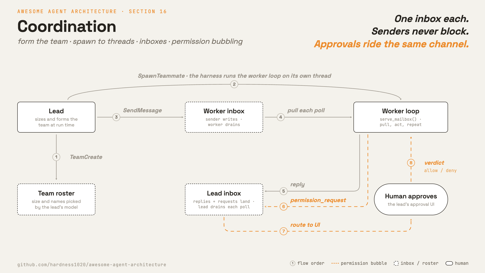

# 16 · Coordination

[English](README.md) · [繁體中文](README.zh-TW.md) · **简体中文**

> lead 依任务规模组出一个团队，把队友各自 spawn 到独立的 thread 上，大家通过共享的 inbox 交谈。

一个 agent 只有一个 context window 和一条进行中的工作线。大型任务通常需要多个 agent 同时运作。

subagent 可以处理聚焦的任务，但一次性的 subagent 一旦启动就很难再引导。

要协调的 agent 需要一种方式互相 spawn、需要稳定的名字、需要 inbox 来交谈，还需要一种方式把权限请求送回给人类。

协调必须：

1. 给 agent 稳定的地址。
2. 让 lead 依任务规模组出团队。
3. 让 lead 把每个队友 spawn 到各自的 thread 上。
4. 让每个队友自己拉取 inbox 并行动，不需要 harness 的程序一步步驱动。
5. 把有闸门的动作层层往上转，最后送到人类审核者面前。

没有这一层，大型工作要么维持串行进行，要么拆成无法协作的 worker。

---

## 机制



每个 agent 拥有一个 inbox。发出消息就是写入收件者的 inbox。投递发生在收件者清空自己的 inbox 时。

团队要有几个人、各叫什么名字，是 lead 的 LLM 在运行时看任务自己决定的，不是写死在程序里。lead 调用 `TeamCreate` 组出团队，接着 spawn 每一位成员。

lead 不会亲手启动队友。它调用 `SpawnTeammate`，由 harness 在后台 thread 上跑队友的 loop（第 13 章）。
队友接着拉取自己的 inbox 并行动，没有任何程序在逐步驱动谁。

demo 里没有中央 broker。有的是名字、inbox 路径与消息形状的共享惯例。

- 每个 agent 拥有一个 inbox。
- 一则消息有 sender、recipient 和 content。
- lead 调用 `TeamCreate` 决定名单的规模与组成；`SpawnTeammate` 再启动每位成员。
- lead 用 `SpawnTeammate` spawn 一个队友；那个队友在自己的 thread 上运作。
- `to="*"` 会 broadcast 给除了 sender 以外的每一位队友。
- sender 写完就返回。它们不会 block 等待回复。
- 队友每次轮询都拉取自己的 inbox，并把新消息折进下一个 turn。
- 权限请求走同一个管道。

### New: 组出团队

`TeamCreate` 是 lead 调用来决定名单规模与组成的工具。它填入一个单槽的 holder，harness 在 spawn 每位成员时读回：

```python
def team_tools(root, me, formed):                      # src/mailbox.py
    def create(a):
        members = list(dict.fromkeys([me, *a["members"]]))   # the lead joins its own team
        formed["team"] = Team(root, members)                 # the tool call sizes and forms the team
        return f"team created: {', '.join(members)}"
    ...                                                # SendMessage stays inert until the team exists
```

- 规模和名字都没有写死在程序里；两者都由 lead 的 LLM 依任务挑选。
- `SendMessage` 在 `TeamCreate` 执行前是无作用的，所以 lead 得先组出团队才能对它说话。
- `formed` 是一个单槽的 holder（ponytail：一个 in-process 的团队登记表替身；可以用一个名单文件作为后端，让另一个 process 的队友加入）。

### New: spawn 一个队友

`SpawnTeammate` 是 lead 的模型调用的工具。harness 在第 13 章的 runtime 上、在自己的 thread 上启动队友的 loop：

```python
def teammate_tools(runtime, spawn_worker):             # src/mailbox.py
    def spawn(a):
        runtime.start(lambda: spawn_worker(a["name"]))  # section-13 thread runs the teammate's loop
        return f"spawned teammate {a['name']}; it runs on its own thread and pulls its own work"
    return [Tool("SpawnTeammate", spawn, is_read_only=True, ...)]
```

队友的 loop 是 `serve_mailbox`：拉取 inbox、行动、重复。它在被 spawn 出来的 thread 上运作，所以队友是自己对消息做反应，不是被程序排好每一步：

```python
def serve_mailbox(team, me, work, *, poll=0.05, max_idle_polls=None):   # src/mailbox.py
    while True:
        chat = [m for m in team.drain(me) if isinstance(m["content"], str)]
        if chat:                                        # a message to act on
            folded = "\n".join(f"<message from={m['from']!r}>{m['content']}</message>" for m in chat)
            work(folded)                                # one inner loop (section 1) on the message
            continue
        time.sleep(poll)                                # empty: poll again
```

- `spawn_worker(name)` 是应用端的 thunk；它为那个队友跑一个 `serve_mailbox` loop。
- 队友在 drain 时就消耗消息，所以一则消息只投递一次。
- 目前还没有优雅的停止方式。thread 是一个 daemon，会随 process 一起死掉。第 17 章加入 shutdown handshake。
- `max_idle_polls` 为空闲等待设上界，好让 demo 或 test 结束；真正的队友会一直轮询，直到 process 停止。

### inbox 与权限管道

`mailbox.py` 实现一个由具名 inbox 组成的 `Team`：

```python
def send(self, frm, to, content):                      # src/mailbox.py
    targets = [m for m in self.members if m != frm] if to == "*" else [self._check(to)]
    with self._lock():                                 # serialize concurrent senders
        for t in targets:
            inbox = self._read(t)
            inbox.append({"from": frm, "to": t, "content": content})
            self._path(t).write_text(json.dumps(inbox))
```

- `_check` 在未知名称变成路径之前就拒绝它。
- lock 把 read-modify-write 序列化，所以并行的 sender 不会漏掉消息。
- `drain` 读取并清空一个 inbox。

permission bubbling 是一种 approver 的实现。它把有闸门的调用通过同一个管道搬给人类：

```python
def bubbling_approver(team, me, lead, human=None, timeout=0.0, poll=0.05):
    def approve(name, args):                            # approver for an agent with no human UI
        team.send(me, lead, {"kind": "permission_request", "tool": name, "args": args})
        if human is not None:                           # the lead routes it to its approval UI
            team.send(lead, me, {"kind": "permission_response", "tool": name, "ok": human(name, args)})
        deadline = time.time() + timeout
        while True:
            resp = [m["content"] for m in team.drain(me)
                    if isinstance(m["content"], dict) and m["content"].get("kind") == "permission_response"]
            if resp:
                return bool(resp[-1]["ok"])
            if time.time() >= deadline:
                return False                            # nobody answered in time: default deny
            time.sleep(poll)
    return approve
```

1. 队友碰到一个有闸门的工具调用，但它自己的 loop 前面没有坐着人类。
2. approver 把一则 `permission_request` 送到 lead 的 inbox。
3. lead 把它导向自己的审核 UI（这里是 `human` callback）。
4. 裁决以 `permission_response` 的形式回到队友的 inbox。
5. 队友读取那则回复，把 allow 或 deny 返回给闸门。

闸门仍然调用 `approver(name, args)`，没有改变。答案以 inbox 消息而非直接调用的形式抵达，所以升级重用了同一个管道。

没有 `human` 时，答案必须来自别处（另一条 thread 上的 lead，或聊天平台上的一个人）。
approver 会轮询自己的 inbox 直到 `timeout`，然后 deny：没有人回答的权限就是不行，绝不是卡住或放行。
这对应 Hermes 的 clarify gateway：`wait_for_response` 会 block 住 agent thread，直到聊天 adapter 回答或 timeout 到期。

### How it integrates

demo 跑一个主 agent。lead 走一步，队友就自己运作起来：

```python
def spawn_worker(name, formed, model):                 # src/demo.py, module level
    team = formed["team"]                              # whatever the lead formed with TeamCreate
    ...                                                 # build the teammate's tools
    return mailbox.serve_mailbox(team, name, work)      # the teammate pulls its own inbox

run_turn([...goal...], model, lead_reg, session)        # the one agent call in demo(): the lead
```

- 程序唯一写死的输入是 lead 的目标。lead 用 `TeamCreate` 决定团队规模、用 `SpawnTeammate` spawn 每一位、用 `SendMessage` 委派。
- `demo()` 跑一个 `run_turn`，也就是 lead 的。队友自己的 `run_turn` 位于 `spawn_worker`，只能通过 spawn 工具抵达。
- 每个队友在第 13 章的 thread 上跑 `serve_mailbox`：拉取 inbox、工作、回复。回复数量由 lead 决定；主 process 只是等待。
- `loop.py` 维持通用。折叠与拉取 loop 属于协调，在这个 wrapper 里完成，不在 `run_turn` 内部。
- 权限闸门没有改变；有闸门的调用仍会往上转给 lead 审核。

> **接下来：** 这里的队友是一个没有优雅停止方式的 daemon，而且它只对消息做反应。
> 第 17 章加入 shutdown handshake，好让 lead 能干净地结束一个队友。
> 第 18 章加入一块共享的 task 看板，让空闲的队友自己认领工作，而不是等着被传消息。

---

## 各系统做法

一种设计如何 spawn 出协作的 agent 并把工作分散给它们。

| System | Teammates | Channel | Shared memory | Permission bubbling |
| --- | --- | --- | --- | --- |
| **Claude Code** | in-process 或 remote；各自跑自己的 loop。 | inbox 消息，memory 或 disk。 | team task list 与 memory dir。 | remote 请求导向本地 UI。 |
| **Hermes Agent** | thread 上的委派子代。 | completion queue 加 gateway RPC。 | 带 lineage 标记的共享 session DB。 | clarify 请求导向用户的聊天平台。 |

### Claude Code

- `TeamCreateTool` 创建一个团队。`TeamDeleteTool` 移除它。
- lead spawn 一个 `InProcessTeammateTask` 或一个 `RemoteAgentTask`；每个队友跑自己的 loop。
- in-process 队友轮询自己的 inbox（`utils/mailbox.ts`）并在 turn 之间折入消息。
- `SendMessageTool` 写入一个 inbox。
- 跨 process 的队友使用位于 `~/.claude/teams/{team}/inboxes/` 底下的文件 inbox，搭配 `proper-lockfile`。
- `to: "*"` 会 broadcast。
- 一个团队拥有一份 task list。团队 memory 位于 `memdir/teamMemPaths.ts`。
- `remotePermissionBridge.ts` 把 remote 权限请求转成本地的审核提示。
- coordinator 模式会清空 inbox 并在 turn 之间折入消息。

### Hermes Agent

- 没有对等的 inbox。协调维持 parent 对 child：`delegate_task` spawn 子代，结果只回到 parent（spawn 本身属于第 6 章）。
- 异步子代把结果丢到 `process_registry.completion_queue`；parent 在空闲时把它们折进一个新的 turn。
- `_active_subagents` 追踪活着的子代。gateway RPC `delegation.pause`、`delegation.status` 和 `subagent.interrupt` 可以从任何已连接的界面控制它们。
- `set_spawn_paused` 是一个全局暂停标志，TUI 或 gateway 可以在运行中途切换，停止新的 spawn。
- 中断是 per-thread 的（`tools/interrupt.py`），所以停掉一个 session 不会杀死并行 session 里的工具。
- permission bubbling 的对象是聊天上的人，不是 lead agent。`clarify_gateway.py` 的 `register()` 排入问题，`wait_for_response()` block 住 agent thread。
- 平台 adapter 通过 `resolve_gateway_clarify()` 回答，解开等待中的工具调用。
- 子代拿到自动 deny 或自动 approve 的权限 callback（`delegation.subagent_auto_approve`），并留下审计记录。
- parent 和子代共享 `state.db`；`_delegate_from` 标记记录 lineage，供连锁清理使用。

> **取舍：** 文件 inbox 具耐久性，并能跨越 process 或机器边界。它们增加轮询与 lock 成本。in-memory inbox 快，但会随 process 一起死掉。

---

## 失效模式

- **丢失消息的竞态：**两个 sender 同时写一个 inbox。用 lock 保护 read-modify-write。
- **对等 deadlock：**agent 互相等待。把消息排入队列并在 turn 之间 drain，而不是用会 block 的发送。
- **权限卡住：**队友没有人类 UI。把请求往上转给 lead 代问。
- **create 之前就 spawn：**lead 在 `TeamCreate` 之前就 spawn 或传消息，于是没有名单。让两者在团队存在之前都保持无作用。
- **孤儿队友：**被 spawn 的队友在工作做完后还一直轮询。为空闲等待设上界，或用第 17 章的 handshake 停止它。
- **含糊的跨 agent 消息：**队友看不到 lead 的对话。让消息自成一体。
- **把 chat 当 memory 用：**耐久的共享事实属于 team memory。

---

## 可执行程序

[`src/`](src/) 承接第 15 章并加上：

- [`mailbox.py`](src/mailbox.py)：具 locking 的具名 inbox、折叠、`serve_mailbox` loop、带 timeout 与默认 deny 的 bubbling，以及团队工具。
- [`test.py`](src/test.py)：检查定址、broadcast、并行发送、折叠、bubbling（inline、异步与 timeout-deny）、mailbox loop，以及团队工具。
- [`demo.py`](src/demo.py)：lead 走一步（`TeamCreate`、`SpawnTeammate`、`SendMessage`）；每个队友拉取自己的 inbox、跑一个有闸门的 shell 任务，然后汇报。

loop 与 subagent 路径不变。协调通过 spawn 队友、drain inbox、传入一个 approver 来包住 turn。

```bash
python sections/16-coordination/src/test.py         # offline checks, no key
uv run python sections/16-coordination/src/demo.py  # live demo, needs a key
```

---

## 出处

- Claude Code 工具与 inbox：`tools/SendMessageTool/`、`tools/TeamCreateTool/`、`utils/mailbox.ts`、`utils/teammateMailbox.ts`。
- Claude Code 队友：`tasks/InProcessTeammateTask/`、`tasks/RemoteAgentTask/`、`remote/remotePermissionBridge.ts`、`memdir/teamMemPaths.ts`。
- Hermes Agent 源码：`tools/delegate_tool.py`、`tools/async_delegation.py`、`tools/clarify_gateway.py`、`tools/interrupt.py`。
- learn-claude-code · s15_agent_teams：章节框架。
