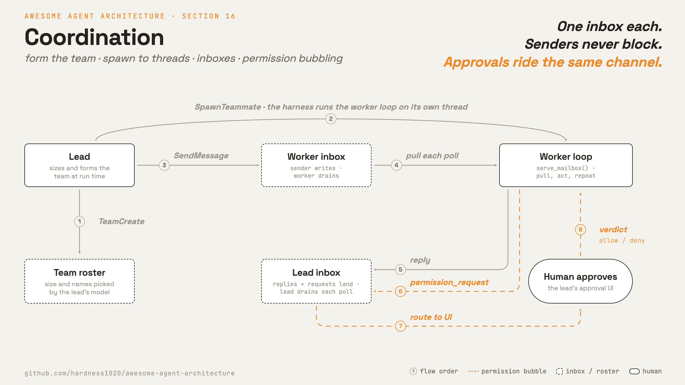

# 16 · Coordination

[English](README.md) · [繁體中文](README.zh-TW.md) · **简体中文**

> lead 依任务规模组出一个团队，把队友各自 spawn 到独立的 thread 上，大家通过共享的 inbox 交谈。

一个 agent 只有一个 context window，同一时间也只能做一件事。大型任务通常需要多个 agent 同时运作。

subagent 可以处理聚焦的任务，但一次性的 subagent 一旦启动就很难再引导。

组团队是有代价的。多一个 agent 就多一份 token 开销，两个 agent 也可能对同一个文件有不同想法。
所以第一个要决定的是形状：要几个 agent、它们共不共享 context、谁指挥谁。

要协调的 agent 需要一种方式互相 spawn、需要稳定的名字、需要 inbox 来交谈，还需要一种方式把权限请求送回给用户。

协调必须：

1. 给 agent 稳定的地址。
2. 让 lead 依任务规模组出团队。
3. 让 lead 把每个队友 spawn 到各自的 thread 上。
4. 让每个队友自己拉取 inbox 并行动，不需要 harness 的程序一步步驱动。
5. 把有闸门的动作层层往上转，最后送到用户面前审核。

没有这一层，大型工作要么维持串行进行，要么拆成无法协作的 worker。

---

## 机制



每个 agent 拥有一个 inbox。发出消息就是写入收件者的 inbox。收件者要等到自己去读 inbox 时，才会真的收到。

团队要有几个人、各叫什么名字，是 lead 的 LLM 在运行时看任务自己决定的，不是写死在程序里。lead 调用 `TeamCreate` 组出团队，接着 spawn 每一位成员。

lead 不会亲手启动队友。它调用 `SpawnTeammate`，由 harness 在后台 thread 上跑队友的 loop（第 13 章）。
队友接着拉取自己的 inbox 并行动，没有任何程序在逐步驱动谁。

demo 里没有中央 broker。有的是名字、inbox 路径与消息格式的共享惯例。

- 每个 agent 拥有一个 inbox。
- 一则消息有 sender、recipient 和 content。
- lead 调用 `TeamCreate` 决定名单的规模与组成；`SpawnTeammate` 再启动每位成员。
- lead 用 `SpawnTeammate` spawn 一个队友；那个队友在自己的 thread 上运作。
- `to="*"` 会 broadcast 给除了 sender 以外的每一位队友。
- sender 写完就返回。它们不会 block 等待回复。
- 队友每次 poll 都会读自己的 inbox，把新消息并入下一个 turn。
- 权限请求走同一个管道。

### 选择团队的形状

只有当第二个 agent 带进第一个 agent 没有的信息，多一个 agent 才有意义：一份测试结果、一张截图、一次查询、一次对真实系统的检查。
只是把同一份文字再读一遍然后投票的 agent，加的是 token，不是信息。
在同样的 thinking token 预算下，Tran 与 Kiela 测过的那些任务上，单个 agent 的表现追平了多 agent 系统。
Anthropic 说他们的 research 团队大约要烧掉单次对话 turn 十五倍的 token。这笔钱总得买到什么。

接下来要决定 context 共不共享：

- **共享。**下一个 agent 直接继承整条 trajectory，什么都不用打包，也不会有事实在途中掉了。但同一时间只有一个 agent 在跑，window 是大家一起塞满的。
- **隔离。**每个 agent 有自己的 window，需要什么就明说。agent 可以并行，其中一个想歪了也不会扩散出去。代价是每次交接都得写清楚。

子任务不多、合起来的历史放进一个 window 还有余裕、工作本来就是串行的，那就共享。
子任务很多、历史塞不下、工作可以并行，或者一次坏掉的 turn 绝对不能扩散，那就隔离。
这个 repo 从头到尾都是隔离的：subagent 每次都从空白开始（第 6 章），队友各自拥有一个 inbox。

第三个选择是拓扑，而且只有隔离的 agent 才要选：

- **对等。**地位相同的 agent 互相传消息。适合互审与交叉检查。
- **管理者。**一个 lead 把工作拆开、指派出去、再把结果合回来。子代返回的是摘要，不是 trajectory。
- **去中心化。**没有 lead。每个 agent 自己判断下一棒该交给谁。

这一章做的是管理者：lead 组出名单、spawn，然后委派。
lead 帮所有人规划，所以计划的质量就是这次运行的上限，拆错了下游没人救得回来。最强的模型放在 lead 上，worker 用便宜的就好。

去中心化的做法差在一次交接怎么找到目标。
MetaGPT 把每则消息发到一个 pool，各角色订阅自己处理的类型，所以 sender 从来不用指名 receiver。
AutoGen 的 group chat 共享一份对话记录，由中央的 selector 挑下一个发言的人，它要是一直挑同样两个人就会 livelock。
OpenAI Swarm 把交接做成一次工具调用，并限制转手次数，这样交接的循环一定会停。

### New: 组出团队

`TeamCreate` 是 lead 调用来决定名单规模与组成的工具。它填入一个单槽的 holder，harness 在 spawn 每位成员时读回：

```python
def team_tools(root, me, formed):                      # src/mailbox.py
    def create(a):
        members = list(dict.fromkeys([me, *a["members"]]))   # the lead joins its own team
        formed["team"] = Team(root, members)                 # the tool call sizes and forms the team
        return f"team created: {', '.join(members)}"
    ...                                                # SendMessage stays inert until the team exists
```

- 规模和名字都没有写死在程序里；两者都由 lead 的 LLM 依任务挑选。
- `SendMessage` 在 `TeamCreate` 执行前是无作用的，所以 lead 得先组出团队才能对它说话。
- `formed` 是一个单槽的 holder（ponytail：一个 in-process 的团队登记表替身；可以用一个名单文件作为后端，让另一个 process 的队友加入）。

### New: spawn 一个队友

`SpawnTeammate` 是 lead 的模型调用的工具。harness 在第 13 章的 runtime 上、在自己的 thread 上启动队友的 loop：

```python
def teammate_tools(runtime, spawn_worker):             # src/mailbox.py
    def spawn(a):
        runtime.start(lambda: spawn_worker(a["name"]))  # section-13 thread runs the teammate's loop
        return f"spawned teammate {a['name']}; it runs on its own thread and pulls its own work"
    return [Tool("SpawnTeammate", spawn, is_read_only=True, ...)]
```

队友的 loop 是 `serve_mailbox`：拉取 inbox、行动、重复。它在被 spawn 出来的 thread 上运作，所以队友是自己对消息做反应，不是被程序排好每一步：

```python
def serve_mailbox(team, me, work, *, poll=0.05, max_idle_polls=None):   # src/mailbox.py
    while True:
        chat = [m for m in team.drain(me) if isinstance(m["content"], str)]
        if chat:                                        # a message to act on
            folded = "\n".join(f"<message from={m['from']!r}>{m['content']}</message>" for m in chat)
            work(folded)                                # one inner loop (section 1) on the message
            continue
        time.sleep(poll)                                # empty: poll again
```

- `spawn_worker(name)` 是应用端的 thunk；它为那个队友跑一个 `serve_mailbox` loop。
- 队友在 drain 时就把消息拿走，所以一则消息只会被收到一次。
- 目前还没有优雅的停止方式。thread 是一个 daemon，会随 process 一起死掉。第 17 章加入 shutdown handshake。
- `max_idle_polls` 为空闲等待设上界，好让 demo 或 test 结束；真正的队友会一直 poll，直到 process 停止。

### inbox 与权限管道

隔离的 agent 之间只有两种沟通范式，跟 process 之间用的是同两种。
shared memory：大家读写同一个地方，看到的是同一份状态。message passing：sender 把一份副本写给指定的 receiver，两边没有任何共享的东西。
常见的管道有三种。工具调用的参数是一次性的，没有回复的路。共享文件系统很耐久，但需要 lock。message bus 有地址也有顺序，耐不耐久要看它有没有持久化。
这里的 inbox 属于 message passing。team memory（第 9 章）和 task 看板（第 18 章）属于 shared memory。
一个团队通常两种都要：用消息指挥工作，用 shared memory 放那些比一则消息活得更久的事实。

`mailbox.py` 实现一个由具名 inbox 组成的 `Team`：

```python
def send(self, frm, to, content):                      # src/mailbox.py
    targets = [m for m in self.members if m != frm] if to == "*" else [self._check(to)]
    with self._lock():                                 # serialize concurrent senders
        for t in targets:
            inbox = self._read(t)
            inbox.append({"from": frm, "to": t, "content": content})
            self._path(t).write_text(json.dumps(inbox))
```

- `_check` 在未知名称变成路径之前就拒绝它。
- lock 把 read-modify-write 序列化，所以并行的 sender 不会漏掉消息。
- `drain` 读取并清空一个 inbox。

permission bubbling 是一种 approver 的实现。它把有闸门的调用通过同一个管道搬给用户：

```python
def bubbling_approver(team, me, lead, human=None, timeout=0.0, poll=0.05):
    def approve(name, args):                            # approver for an agent with no human UI
        team.send(me, lead, {"kind": "permission_request", "tool": name, "args": args})
        if human is not None:                           # the lead routes it to its approval UI
            team.send(lead, me, {"kind": "permission_response", "tool": name, "ok": human(name, args)})
        deadline = time.time() + timeout
        while True:
            resp = [m["content"] for m in team.drain(me)
                    if isinstance(m["content"], dict) and m["content"].get("kind") == "permission_response"]
            if resp:
                return bool(resp[-1]["ok"])
            if time.time() >= deadline:
                return False                            # nobody answered in time: default deny
            time.sleep(poll)
    return approve
```

1. 队友碰到一个有闸门的工具调用，但它自己的 loop 前面没有用户可以问。
2. approver 把一则 `permission_request` 送到 lead 的 inbox。
3. lead 把它导向自己的审核 UI（这里是 `human` callback）。
4. 裁决以 `permission_response` 的形式回到队友的 inbox。
5. 队友读取那则回复，把 allow 或 deny 返回给闸门。

闸门仍然调用 `approver(name, args)`，没有改变。答案以 inbox 消息而非直接调用的形式抵达，所以升级重用了同一个管道。

没有 `human` 时，答案必须来自别处（另一条 thread 上的 lead，或聊天平台上的一个人）。
approver 会 poll 自己的 inbox 直到 `timeout`，然后 deny：没有人回答的权限就是不行，绝不是卡住或放行。
这对应 Hermes 的 clarify gateway：`wait_for_response` 会 block 住 agent thread，直到聊天 adapter 回答或 timeout 到期。

### 团队的状态放在哪里

agent 之间用名字互相寻址，对状态则是用路径寻址。书上把这棵树分成四个区域，每个区域规则不同：

- **私有 scratchpad。**只有一个 agent 会写，别人不会读。草稿和中间产物。不需要任何协调。
- **共享工作区。**任何队友都能读写：repo、task 看板、team memory。冲突都发生在这里，所以需要 lock 或各自分开的 worktree（第 15 章）。
- **外部挂载。**不是团队自己产出的数据，例如一份 checkout 或一份数据集。往这里写，就等于对外面的世界产生了影响。
- **只读的内置内容。**skill、prompt、工具定义（第 7 章与第 2 章）。整个运行期间固定不变，所以每个 agent 看到的都是同一份。

状态放错地方，最后会以协调 bug 的形式冒出来。两个 agent 同时改一个文件是共享工作区的问题；同一个事实在三则消息里重复出现，说明它本来就该写进 team memory。

### 一次 handoff 要带什么

队友看不到 lead 的对话，所以「把坏掉的测试修好」这种话没办法直接动手。一个 handoff 包裹要带三样东西：

1. 任务本身，附上接收方自己就能检查的验收标准。
2. 已经确认的事实和成立的约束，这样接收方不会再查一遍，也不会踩过去。
3. 产出物的路径：文件、log、branch。

原始的 trajectory 不放进去。它很长、里面都是走过的死路，还会逼接收方把 sender 犯过的错再读一次。

另一个做法是共享 context 的交接。一个 agent 把控制权转出去，整段历史跟着走，所以不用打包，途中也不会掉东西。
书上用一个角色互转的工具演示这件事。那是作者自己做的实验，当成单一来源看待就好。
那种做法里控制权像接力棒：同一时间只有一个 agent 拿着，所以什么都无法并行。包裹要花力气写，换来的是并行。

### 如何整合

demo 跑一个主 agent。lead 走一步，队友就自己运作起来：

```python
def spawn_worker(name, formed, model):                 # src/demo.py, module level
    team = formed["team"]                              # whatever the lead formed with TeamCreate
    ...                                                 # build the teammate's tools
    return mailbox.serve_mailbox(team, name, work)      # the teammate pulls its own inbox

run_turn([...goal...], model, lead_reg, session)        # the one agent call in demo(): the lead
```

- 程序唯一写死的输入是 lead 的目标。lead 用 `TeamCreate` 决定团队规模、用 `SpawnTeammate` spawn 每一位、用 `SendMessage` 委派。
- `demo()` 跑一个 `run_turn`，也就是 lead 的。队友自己的 `run_turn` 位于 `spawn_worker`，只能通过 spawn 工具抵达。
- 每个队友在第 13 章的 thread 上跑 `serve_mailbox`：拉取 inbox、工作、回复。回复数量由 lead 决定；主 process 只是等待。
- `loop.py` 维持通用。折叠与拉取 loop 属于协调，在这个 wrapper 里完成，不在 `run_turn` 内部。
- 权限闸门没有改变；有闸门的调用仍会往上转给 lead 审核。

> **接下来：** 这里的队友是一个没有优雅停止方式的 daemon，而且它只对消息做反应。
> 第 17 章加入 shutdown handshake，好让 lead 能干净地结束一个队友。
> 第 18 章加入一块共享的 task 看板，让空闲的队友自己认领工作，而不是等着被传消息。

---

## 各系统做法

一种设计如何 spawn 出协作的 agent 并把工作分散给它们。

| | Claude Code | Hermes Agent |
| --- | --- | --- |
| **Pros** | 队友之间能直接交谈。文件 inbox 具耐久性，能跨越 process 或机器边界。 | 子代可以从任何已连接的界面暂停、查看、中断。 |
| **Cons** | 文件 inbox 增加 poll 与 lock 成本。in-memory inbox 会随 process 一起死掉。 | 没有对等的 inbox，子代之间无法协作。clarify 会 block 住自己的 thread。 |
| **Why** | 队友彼此对等：需要 inbox 来交谈，也需要一条把权限请求送回用户的路。 | 协调维持 parent 对 child。升级的问题由聊天上的人回答，不是 lead agent。 |
| **How: teammates** | in-process 或 remote；各自跑自己的 loop，在 turn 之间把消息并入。 | thread 上的委派子代。全局暂停标志可以在运行中途停止新的 spawn。 |
| **How: channel** | SendMessage 写入 in-memory 或带 lock 的文件 inbox，也能 broadcast。 | completion queue 加 gateway RPC。parent 空闲时把结果并入新的 turn。 |
| **How: shared memory** | team task list 与团队 memory 目录。 | 共享的 session DB。lineage 标记记录谁 spawn 了谁，供连锁清理使用。 |
| **How: permission bubbling** | remote 权限请求转成本地的审核提示。 | clarify 请求导向用户的聊天平台。子代拿到自动 deny 或自动 approve，留下审计记录。 |

---

## 哪里会出错

- **丢失消息的竞态：**两个 sender 同时写一个 inbox。用 lock 保护 read-modify-write。
- **对等 deadlock：**agent 互相等待。把消息排入队列并在 turn 之间 drain，而不是用会 block 的发送。
- **权限卡住：**队友没有 UI 可以问用户。把请求往上转给 lead 代问。
- **create 之前就 spawn：**lead 在 `TeamCreate` 之前就 spawn 或传消息，于是没有名单。让两者在团队存在之前都保持无作用。
- **孤儿队友：**被 spawn 的队友在工作做完后还一直 poll。为空闲等待设上界，或用第 17 章的 handshake 停止它。
- **含糊的跨 agent 消息：**队友看不到 lead 的对话。改成送一个包裹：任务、验收标准、已确认的事实、产出物路径。
- **把 chat 当 memory 用：**耐久的共享事实属于 team memory。
- **拜占庭式的队友：**坏掉的 agent 不会 crash。它会很有自信地回一个错答案，所以重试、或对同一份证据投票，都抓不到。
  只有拿模型以外的东西去检查才抓得到。
- **共享文件的更新丢失：**两个 agent 读同一个文件，都写了，先写的那笔就没了。写入时上 lock，或存一个版本号，对不上就重试。
- **语义冲突：**两边的写入都干净地应用了，结果还是错的：一个 agent 改掉了另一个 agent 正在用的名字。
  把工作拆开，别让两个 agent 拥有同一个概念，或者只在一个点上合并。
- **错误级联放大：**上游 agent 的一个错误事实被下游一路重复，看起来就越来越像已经确认过的事实。
  只看结论的审查方会觉得前后一致。要对原始证据做审查，而且审查的 agent 不能是产出它的那一个。

---

## 可执行程序

[`src/`](src/) 承接第 15 章并加上：

- [`mailbox.py`](src/mailbox.py)：具 locking 的具名 inbox、折叠、`serve_mailbox` loop、带 timeout 与默认 deny 的 bubbling，以及团队工具。
- [`test.py`](src/test.py)：检查定址、broadcast、并行发送、折叠、bubbling（inline、异步与 timeout-deny）、mailbox loop，以及团队工具。
- [`demo.py`](src/demo.py)：lead 走一步（`TeamCreate`、`SpawnTeammate`、`SendMessage`）；每个队友拉取自己的 inbox、跑一个有闸门的 shell 任务，然后汇报。

loop 与 subagent 路径不变。协调通过 spawn 队友、drain inbox、传入一个 approver 来包住 turn。

```bash
python sections/16-coordination/src/test.py         # offline checks, no key
uv run python sections/16-coordination/src/demo.py  # live demo, needs a key
```

---

## 出处

- [Claude Code 工具与 inbox](https://github.com/yasasbanukaofficial/claude-code)：`tools/SendMessageTool/`、`tools/TeamCreateTool/`、`utils/mailbox.ts`、`utils/teammateMailbox.ts`。
- [Claude Code 队友](https://github.com/yasasbanukaofficial/claude-code)：
  `tasks/InProcessTeammateTask/`、`tasks/RemoteAgentTask/`、`remote/remotePermissionBridge.ts`、`memdir/teamMemPaths.ts`。
- [Hermes Agent 源码](https://github.com/NousResearch/hermes-agent)：`tools/delegate_tool.py`、`tools/async_delegation.py`、`tools/clarify_gateway.py`、`tools/interrupt.py`。
- [learn-claude-code · s15_agent_teams](https://github.com/shareAI-lab/learn-claude-code)：章节框架。
- [ai-agent-book](https://github.com/bojieli/ai-agent-book)：`book/chapter10.md`（多 Agent 协作），以中文原文为准。
  context 共不共享、拓扑分类、文件系统分区、handoff 包裹。角色互转那个演示是作者自己的实验。
- Cemri et al., *Why Do Multi-Agent LLM Systems Fail?*（[arXiv:2503.13657](https://arxiv.org/abs/2503.13657)）：MAST 分类法与拜占庭式的框架。
- Tran, Kiela, *Single-Agent LLMs Outperform Multi-Agent Systems Under Equal Thinking Token Budgets*（[arXiv:2604.02460](https://arxiv.org/abs/2604.02460)）。
- Erdogan et al., *Plan-and-Act*（[arXiv:2503.09572](https://arxiv.org/abs/2503.09572)）：planner 的质量就是这次运行的上限。
- Anthropic, [*How we built our multi-agent research system*](https://www.anthropic.com/engineering/multi-agent-research-system)：一个 research 团队的 token 成本。
- [MetaGPT](https://arxiv.org/abs/2308.00352)、[AutoGen](https://arxiv.org/abs/2308.08155)、[OpenAI Swarm](https://github.com/openai/swarm)：去中心化的路由与交接次数上限。
