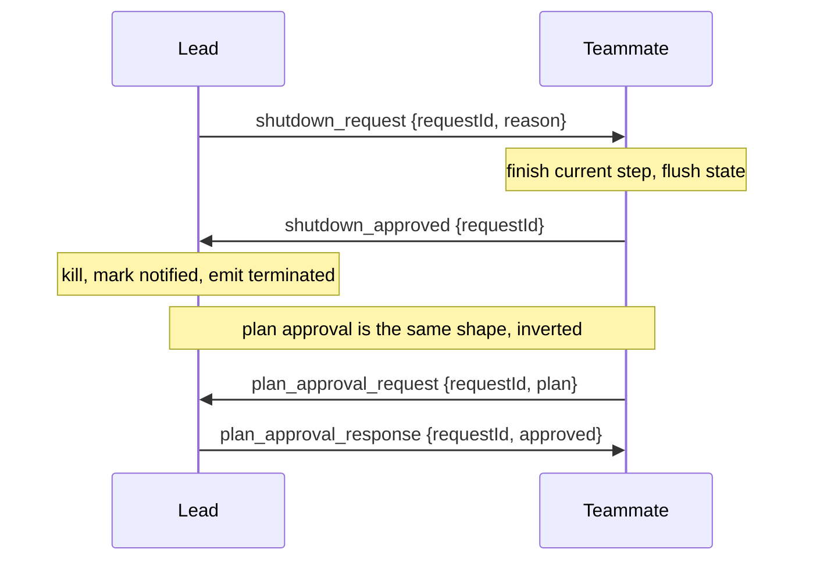

# 17 · Protocols

**English** · [繁體中文](README.zh-TW.md)

> Give messages a contract: approve before acting, confirm before stopping.

Coordination (section 16) gives agents a channel, but a channel only moves text. Text alone has no contract.

A protocol is the agreed rule on top of the channel: how a request and its reply are shaped, and how a reply is matched to the request it answers.

Two exchanges need this most. A lead that kills a teammate mid edit leaves a half written file and an open task record.

A teammate that runs a risky refactor without asking acts first and reports afterward.

Both want the same shape: one side requests, the other replies, and an id ties them together.

A protocol must:

1. Give a request and its reply a typed shape.
2. Correlate each reply to the request it answers.
3. Gate a risky plan before any work starts.
4. Stop an agent without losing work in flight.

Without this layer, coordination is unstructured chat. Nothing is gated, nothing stops cleanly, and a reply cannot be matched to what it answers.

---

## Mechanism

Every exchange is a typed request and a typed response that share one `requestId`.

The sender records the request as pending, routes the reply by its type, and resolves the matching request.



Three rules make it a protocol, not just two messages:

- **Typed variants.** Each message is one variant on a `type` field. A handler dispatches on the type, so a reply is never mistaken for an unrelated request.
- **Correlation id.** `requestId` is set when the request goes out and echoed in the reply. The sender knows which pending request a reply resolves.
- **A small state machine.** A request goes `pending` then `approved` or `rejected`. A reply for an already resolved id is ignored, so duplicates are harmless.

The shutdown and plan flows are mirror images. In shutdown the lead requests and the teammate confirms. In plan approval the teammate requests and the lead confirms.

The approval can also carry the permission mode the work runs under, so the verdict and the mode travel together (section 3).

### New: the protocol tracker

`protocols.py` is one `Protocol` per agent over the section-16 channel. A request mints a correlation id and records itself pending; the reply echoes that id back:

```python
def request(self, to, kind, **fields):                 # src/protocols.py
    self._n += 1
    rid = f"{self.me}-{self._n}"                        # per-sender id: unique, deterministic
    self.pending[rid] = {"kind": kind, "state": PENDING}
    self.team.send(self.me, to, {"type": kind, "request_id": rid, **fields})
    return rid

def reply(self, msg, kind, **fields):                  # echo the id back, do not mint a new one
    req = msg["content"]
    self.team.send(self.me, msg["from"], {"type": kind, "request_id": req["request_id"], **fields})
```

- `request` numbers each id `me-N`, so ids are unique per sender and never collide across agents.
- `reply` reuses the request's `request_id`. That echo is the whole trick: it is how the sender later matches a reply to what it answers.

A small table names which reply kinds may answer each request, and the verdict each one implies:

```python
_REPLIES = {                                           # src/protocols.py
    "shutdown_request": {"shutdown_approved": APPROVED, "shutdown_rejected": REJECTED},
    "plan_approval_request": {"plan_approval_response": None},   # None: the verdict rides an `approved` field
}
```

`resolve` reads that table to reject a mismatched reply and to record the verdict, exactly once:

```python
def resolve(self, msg):                                # src/protocols.py
    reply = msg["content"]
    req = self.pending.get(reply.get("request_id"))
    if not req or req["state"] != PENDING:             # unknown id or already resolved
        return None
    verdicts = _REPLIES[req["kind"]]
    if reply.get("type") not in verdicts:              # type-confusion guard
        return None
    state = verdicts[reply["type"]]
    if state is None:                                  # single-response flow carries the bool
        state = APPROVED if reply.get("approved") else REJECTED
    req["state"] = state
    return state
```

- `resolve` is idempotent: a duplicate or stray reply hits the `state != PENDING` or unknown-id guard and returns `None`.
- The `verdicts` lookup is the type-confusion guard: a `plan_approval_response` cannot resolve a `shutdown_request`, because that type is not in the shutdown row.
- Shutdown splits its verdict across two reply kinds; plan approval uses one kind carrying a bool. Both land in the same `pending` to `approved` or `rejected` state.
- `protocol_tools` exposes the handshake initiations as tools (`ExitPlanMode`, `ApprovePlan`, `StopTeammate`).
- Confirming a shutdown is not a tool; the teammate's `run_teammate` loop replies automatically (harness-driven reception).

### New: the teammate loop

`run_teammate` is section 16's `serve_mailbox` with the shutdown handshake folded in. A spawned teammate now stops on a request instead of dying with its daemon thread:

```python
def run_teammate(team, me, lead, work, *, poll=0.05, max_idle_polls=None):   # src/protocols.py
    proto = Protocol(team, me)
    while True:
        inbox = team.drain(me)
        shutdown = next((m for m in inbox if _is_shutdown(m)), None)
        if shutdown is not None:
            proto.reply(shutdown, "shutdown_approved")     # confirm, then stop
            return "shutdown"
        chat = [m for m in inbox if isinstance(m["content"], str)]
        if chat:
            work(_fold(chat)); continue                    # section 16: fold and run
        time.sleep(poll)                                   # empty: poll again
```

- Shutdown is checked before chat, so peer traffic cannot starve a stop.
- Initiation is model-driven (the lead's `StopTeammate`); reception is harness-driven (the loop confirms), matching the reference's split.
- The loop returns `"shutdown"`, so the spawning runtime (section 13) reports the clean stop.
- Section 18 adds one more branch: claim a task off a shared board when the inbox is empty.

### How it integrates

The demo runs one main agent. The lead spawns a teammate, delegates, and stops it in one turn; the teammate confirms on its own thread:

```python
def spawn_worker(name, team, model):                   # src/demo.py, module level
    ...                                                 # build the teammate's tools
    return run_teammate(team, name, "lead", work)       # serve_mailbox plus the shutdown handshake

run_turn([...goal...], model, lead_reg, session)        # the one agent call in demo(): the lead
state = next(filter(None, (lead_proto.resolve(m) for m in team.drain("lead")   # -> approved
                           if isinstance(m["content"], dict))), None)
```

- `demo()` runs one `run_turn`, the lead's. It calls `SpawnTeammate`, `SendMessage`, then `StopTeammate`.
- `StopTeammate` sends a `shutdown_request`; the teammate's `run_teammate` confirms it and returns. The stop is a handshake, not a kill.
- The lead resolves the echoed `shutdown_approved` to `approved`. The main process only waits.
- The plan-approval flow is the symmetric inverse (`ExitPlanMode` then `ApprovePlan`), driven by the same tools and proven in test.py.
- The loop does not change. Protocols wrap a turn by shaping requests and resolving replies on the channel.

---

## Per system

How one design shapes requests, gates plans, and stops agents cleanly.

| System                | Message shape                                  | Plan approval                     | Shutdown                     |
| --------------------- | ---------------------------------------------- | --------------------------------- | ---------------------------- |
| **Claude Code** | Typed union on`type`, with a `request_id`. | Teammate requests, lead approves. | Request, confirm, then kill. |

### Claude Code

- `SendMessageTool` carries a `StructuredMessage` union discriminated on `type`.
- `request_id` correlates a reply to its request.
- The message schemas live in `utils/teammateMailbox.ts`.
- A `plan_mode_required` teammate calling `ExitPlanModeV2Tool` writes a `plan_approval_request` to the `team-lead` mailbox and sets `awaitingPlanApproval`.
- The lead replies with `plan_approval_response`: `approved`, optional `feedback`, optional `permissionMode`.
- `tasks/stopTask.ts` requires `status === 'running'`, calls `taskImpl.kill`, marks the task `notified`, and emits a terminated event.
- The graceful path runs `shutdown_request` then `shutdown_approved` or `shutdown_rejected` before `gracefulShutdown`.

> **Trade-off:** A typed handshake makes every stop confirmed and every risky plan gated.
> It costs round trips and protocol state.
> A fire and forget kill is faster but loses in flight work and leaks task records.

---

## Failure modes

- **Hard kill instead of handshake.** Killing a teammate's thread drops in flight work and orphans its task record. Use a request then confirm flow that marks the task `notified`.
- **Orphaned request.** A reply that never arrives leaves a request `pending` forever, so the sender blocks. Add a timeout or idle check that surfaces the stuck request.
- **Type confusion.** Matching a reply by id alone lets a shutdown reply resolve a plan request. Check that the reply variant matches the recorded request type.
- **Approval without enforcement.** An approved plan still needs the permission layer to gate execution (section 3). Carry the `permissionMode` in the response.
- **Duplicate replies.** A retried reply can flip an already resolved state. Treat any reply to a non pending id as a no op.

---

## Runnable

[`src/`](src/) carries 16 forward and adds:

- [`protocols.py`](src/protocols.py): the request tracker (typed variants, correlation ids, state machine), the handshake tools, and the `run_teammate` loop.
- [`test.py`](src/test.py): checks the shutdown and plan flows, the guards, a tool-driven handshake, and a self-running teammate stopped by the handshake.
- [`demo.py`](src/demo.py): one lead turn spawns a teammate, delegates, and stops it with StopTeammate; the teammate confirms on its own thread.

The loop and subagent path are unchanged. Protocols wrap a turn by shaping requests and resolving replies on the channel.

```bash
python sections/17-protocols/src/test.py         # offline checks, no key
uv run python sections/17-protocols/src/demo.py  # live demo, needs a key
```

---

## Sources

- Claude Code protocol shape: `tools/SendMessageTool/SendMessageTool.ts`, `utils/teammateMailbox.ts`.
- Claude Code plan and stop: `tools/ExitPlanModeTool/ExitPlanModeV2Tool.ts`, `tasks/stopTask.ts`, `coordinator/coordinatorMode.ts`.
- learn-claude-code · s16_team_protocols: section framing.
