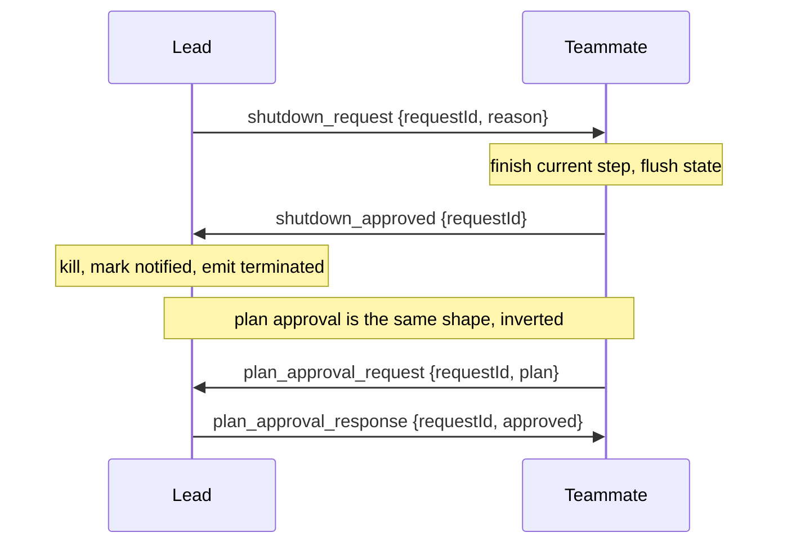

# 17 · Protocols

> Give messages a contract: approve before acting, confirm before stopping.

Coordination (section 16) gives agents a channel, but a channel only moves text. Text alone has no contract.

A protocol is the agreed rule on top of the channel: how a request and its reply are shaped, and how a reply is matched to the request it answers.

Two exchanges need this most. A lead that kills a teammate mid edit leaves a half written file and an open task record.

A teammate that runs a risky refactor without asking acts first and reports afterward.

Both want the same shape: one side requests, the other replies, and an id ties them together.

A protocol must:

1. Give a request and its reply a typed shape.
2. Correlate each reply to the request it answers.
3. Gate a risky plan before any work starts.
4. Stop an agent without losing work in flight.

Without this layer, coordination is unstructured chat. Nothing is gated, nothing stops cleanly, and a reply cannot be matched to what it answers.

---

## Mechanism

Every exchange is a typed request and a typed response that share one `requestId`.

The sender records the request as pending, routes the reply by its type, and resolves the matching request.



Three rules make it a protocol, not just two messages:

- **Typed variants.** Each message is one variant on a `type` field. A handler dispatches on the type, so a reply is never mistaken for an unrelated request.
- **Correlation id.** `requestId` is set when the request goes out and echoed in the reply. The sender knows which pending request a reply resolves.
- **A small state machine.** A request goes `pending` then `approved` or `rejected`. A reply for an already resolved id is ignored, so duplicates are harmless.

The shutdown and plan flows are mirror images. In shutdown the lead requests and the teammate confirms. In plan approval the teammate requests and the lead confirms.

The approval can also carry the permission mode the work runs under, so the verdict and the mode travel together (section 3).

### New: the protocol tracker

`protocols.py` is one `Protocol` per agent over the section-16 channel. It records each request as pending and resolves the matching reply once:

```python
def resolve(self, msg):                                # src/protocols.py
    reply = msg["content"]
    req = self.pending.get(reply.get("request_id"))
    if not req or req["state"] != PENDING:             # unknown id or already resolved
        return None
    verdicts = _REPLIES[req["kind"]]
    if reply.get("type") not in verdicts:              # type-confusion guard
        return None
    state = verdicts[reply["type"]]
    if state is None:                                  # single-response flow carries the bool
        state = APPROVED if reply.get("approved") else REJECTED
    req["state"] = state
    return state
```

- `request` sends a typed message, stores it `pending`, and returns the `request_id`.
- `reply` echoes that id back, so a response correlates to one request.
- `resolve` is idempotent: a duplicate or stray reply returns `None`.
- `_REPLIES` maps each request kind to the reply kinds that may answer it.

### How it integrates

Protocols wrap a turn from outside, like coordination (section 16):

```python
worker.request("lead", "plan_approval_request", plan=plan)   # src/demo.py
ask = next(m for m in team.drain("lead") if m["content"]["type"] == "plan_approval_request")
lead.reply(ask, "plan_approval_response", approved=True, permissionMode="acceptEdits")
state = next(filter(None, (worker.resolve(m) for m in team.drain("worker"))), None)
```

- The loop and the subagent path do not change.
- A request and its reply both ride the inbox channel.
- The verdict travels with the permission mode the work runs under (section 3).

---

## Per system

How one design shapes requests, gates plans, and stops agents cleanly.

| System | Message shape | Plan approval | Shutdown |
| --- | --- | --- | --- |
| **Claude Code** | Typed union on `type`, with a `request_id`. | Teammate requests, lead approves. | Request, confirm, then kill. |

### Claude Code

- `SendMessageTool` carries a `StructuredMessage` union discriminated on `type`.
- `request_id` correlates a reply to its request.
- The message schemas live in `utils/teammateMailbox.ts`.
- A `plan_mode_required` teammate calling `ExitPlanModeV2Tool` writes a `plan_approval_request` to the `team-lead` mailbox and sets `awaitingPlanApproval`.
- The lead replies with `plan_approval_response`: `approved`, optional `feedback`, optional `permissionMode`.
- `tasks/stopTask.ts` requires `status === 'running'`, calls `taskImpl.kill`, marks the task `notified`, and emits a terminated event.
- The graceful path runs `shutdown_request` then `shutdown_approved` or `shutdown_rejected` before `gracefulShutdown`.

> **Trade-off:** A typed handshake makes every stop confirmed and every risky plan gated.
> It costs round trips and protocol state.
> A fire and forget kill is faster but loses in flight work and leaks task records.

---

## Failure modes

- **Hard kill instead of handshake.** Killing a teammate's thread drops in flight work and orphans its task record. Use a request then confirm flow that marks the task `notified`.
- **Orphaned request.** A reply that never arrives leaves a request `pending` forever, so the sender blocks. Add a timeout or idle check that surfaces the stuck request.
- **Type confusion.** Matching a reply by id alone lets a shutdown reply resolve a plan request. Check that the reply variant matches the recorded request type.
- **Approval without enforcement.** An approved plan still needs the permission layer to gate execution (section 3). Carry the `permissionMode` in the response.
- **Duplicate replies.** A retried reply can flip an already resolved state. Treat any reply to a non pending id as a no op.

---

## Runnable

[`src/`](src/) carries 16 forward and adds:

- [`protocols.py`](src/protocols.py): a per-agent request tracker with typed variants, correlation ids, and an idempotent state machine.
- [`test.py`](src/test.py): checks the shutdown and plan flows, the type-confusion guard, duplicate replies, and unanswered requests.
- [`demo.py`](src/demo.py): runs a plan-approval round trip and a shutdown handshake over the channel.

The loop and subagent path are unchanged. Protocols wrap a turn by shaping requests and resolving replies on the channel.

```bash
python sections/17-protocols/src/test.py         # offline checks, no key
uv run python sections/17-protocols/src/demo.py  # live demo, needs a key
```

---

## Sources

- Claude Code protocol shape: `tools/SendMessageTool/SendMessageTool.ts`, `utils/teammateMailbox.ts`.
- Claude Code plan and stop: `tools/ExitPlanModeTool/ExitPlanModeV2Tool.ts`, `tasks/stopTask.ts`, `coordinator/coordinatorMode.ts`.
- learn-claude-code · s16_team_protocols: section framing.
