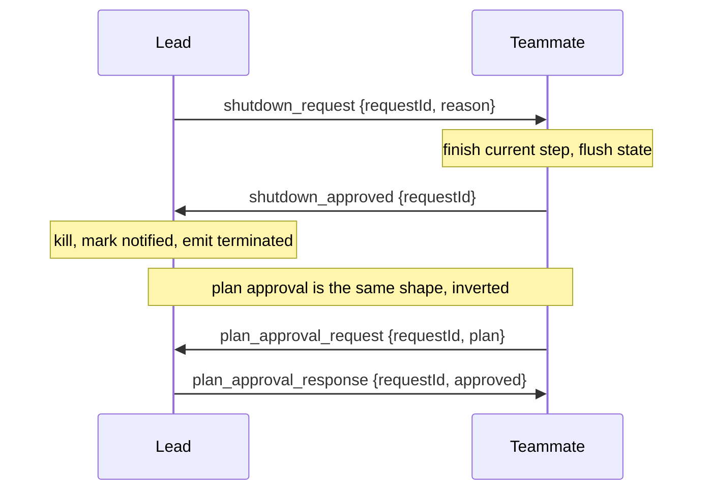

# 17 · Protocols

[English](README.md) · [繁體中文](README.zh-TW.md) · **简体中文**

> 给消息一份契约：行动前先审核，停止前先确认。

协调（第 16 章）给了 agent 一个管道，但管道只搬运文字。单靠文字没有契约。

protocol 是叠在管道之上的约定规则：一条请求与其回复长什么样子，以及一条回复如何对应到它所回答的请求。

有两种交换最需要它。lead 在队友编辑到一半时把它杀掉，会留下一个写到一半的文件和一条开着的 task 记录。

队友在没有询问的情况下跑一个有风险的重构，是先行动、后汇报。

两者都想要同一种形状：一方请求，另一方回复，一个 id 把它们绑在一起。

protocol 必须：

1. 给请求与其回复一份带类型的形状。
2. 把每条回复对应到它所回答的请求。
3. 在任何工作开始前先为有风险的计划设闸门。
4. 停止一个 agent 而不丢失进行中的工作。

没有这一层，协调就是没有结构的闲聊。没有东西被设闸门，没有东西干净地停止，回复也无法对应到它所回答的内容。

---

## 机制

每一次交换都是一条带类型的请求和一条带类型的响应，两者共用同一个 `requestId`。

sender 把请求记为 pending，按类型路由回复，并解析出相符的请求。



有三条规则让它成为一个 protocol，而不只是两条消息：

- **Typed variants。** 每条消息是 `type` 字段上的一个 variant。handler 按类型 dispatch，所以回复绝不会被误认为某个不相干的请求。
- **Correlation id。** `requestId` 在请求发出时设置，并在回复里返回。sender 就知道一条回复解析的是哪一条 pending 请求。
- **A small state machine。** 一条请求从 `pending` 走到 `approved` 或 `rejected`。针对一个已解析 id 的回复会被忽略，所以重复是无害的。

shutdown 与 plan 这两个流程是彼此的镜像。shutdown 是 lead 请求、队友确认。plan approval 是队友请求、lead 确认。

审核结果也可以携带工作所在的权限模式，这样裁决与模式就一起传递（第 3 章）。

### New: protocol 追踪器

`protocols.py` 是每个 agent 在第 16 章管道之上的一个 `Protocol`。一条请求铸造一个 correlation id 并把自己记为 pending；回复把那个 id 返回：

```python
def request(self, to, kind, **fields):                 # src/protocols.py
    self._n += 1
    rid = f"{self.me}-{self._n}"                        # per-sender id: unique, deterministic
    self.pending[rid] = {"kind": kind, "state": PENDING}
    self.team.send(self.me, to, {"type": kind, "request_id": rid, **fields})
    return rid

def reply(self, msg, kind, **fields):                  # echo the id back, do not mint a new one
    req = msg["content"]
    self.team.send(self.me, msg["from"], {"type": kind, "request_id": req["request_id"], **fields})
```

- `request` 把每个 id 编号为 `me-N`，所以 id 对每个 sender 都唯一，且跨 agent 绝不冲突。
- `reply` 重用请求的 `request_id`。那个返回就是整个诀窍所在：sender 之后就是靠它把回复对应到它所回答的内容。

一张小表指明哪些回复种类可以回答每种请求，以及各自代表的裁决：

```python
_REPLIES = {                                           # src/protocols.py
    "shutdown_request": {"shutdown_approved": APPROVED, "shutdown_rejected": REJECTED},
    "plan_approval_request": {"plan_approval_response": None},   # None: the verdict rides an `approved` field
}
```

`resolve` 读这张表，用来拒绝不相符的回复，并刚好记录裁决一次：

```python
def resolve(self, msg):                                # src/protocols.py
    reply = msg["content"]
    req = self.pending.get(reply.get("request_id"))
    if not req or req["state"] != PENDING:             # unknown id or already resolved
        return None
    verdicts = _REPLIES[req["kind"]]
    if reply.get("type") not in verdicts:              # type-confusion guard
        return None
    state = verdicts[reply["type"]]
    if state is None:                                  # single-response flow carries the bool
        state = APPROVED if reply.get("approved") else REJECTED
    req["state"] = state
    return state
```

- `resolve` 是 idempotent 的：重复或走失的回复会撞上 `state != PENDING` 或未知 id 的守卫，并返回 `None`。
- `verdicts` 查表就是 type-confusion 守卫：一条 `plan_approval_response` 无法解析一条 `shutdown_request`，因为那个类型不在 shutdown 那一行里。
- shutdown 把它的裁决拆到两个回复种类；plan approval 用一个携带 bool 的种类。两者都落到同一个从 `pending` 到 `approved` 或 `rejected` 的状态。
- `protocol_tools` 把 handshake 的发起作为工具暴露出来（`ExitPlanMode`、`ApprovePlan`、`StopTeammate`）。
- 确认一个 shutdown 不是一个工具；队友的 `run_teammate` loop 会自动回复（harness 驱动的接收）。

### New: 队友 loop

`run_teammate` 是第 16 章的 `serve_mailbox`，把 shutdown handshake 折了进来。被 spawn 的队友现在会因为一条请求而停止，而不是随它的 daemon thread 一起死掉：

```python
def run_teammate(team, me, lead, work, *, poll=0.05, max_idle_polls=None):   # src/protocols.py
    proto = Protocol(team, me)
    while True:
        inbox = team.drain(me)
        shutdown = next((m for m in inbox if _is_shutdown(m)), None)
        if shutdown is not None:
            proto.reply(shutdown, "shutdown_approved")     # confirm, then stop
            return "shutdown"
        chat = [m for m in inbox if isinstance(m["content"], str)]
        if chat:
            work(_fold(chat)); continue                    # section 16: fold and run
        time.sleep(poll)                                   # empty: poll again
```

- shutdown 在 chat 之前先检查，所以对等的流量无法把一次停止饿死。
- 发起是模型驱动的（lead 的 `StopTeammate`）；接收是 harness 驱动的（loop 确认），对应参考实现的分工。
- loop 返回 `"shutdown"`，所以进行 spawn 的 runtime（第 13 章）能汇报这次干净的停止。
- 第 18 章再加一个分支：inbox 为空时，从一块共享看板认领一个 task。

### How it integrates

demo 跑一个主 agent。lead 在一个 turn 里 spawn 一个队友、委派、然后停止它；队友在自己的 thread 上确认：

```python
def spawn_worker(name, team, model):                   # src/demo.py, module level
    ...                                                 # build the teammate's tools
    return run_teammate(team, name, "lead", work)       # serve_mailbox plus the shutdown handshake

run_turn([...goal...], model, lead_reg, session)        # the one agent call in demo(): the lead
state = next(filter(None, (lead_proto.resolve(m) for m in team.drain("lead")   # -> approved
                           if isinstance(m["content"], dict))), None)
```

- `demo()` 跑一个 `run_turn`，也就是 lead 的。它调用 `SpawnTeammate`、`SendMessage`，然后 `StopTeammate`。
- `StopTeammate` 发出一条 `shutdown_request`；队友的 `run_teammate` 确认它并返回。这次停止是一场 handshake，不是一次 kill。
- lead 把返回的 `shutdown_approved` 解析成 `approved`。主 process 只是等待。
- plan-approval 流程是对称的反向（先 `ExitPlanMode` 再 `ApprovePlan`），由相同的工具驱动，并在 test.py 里验证。
- loop 没有改变。protocol 通过在管道上塑形请求并解析回复来包住 turn。

---

## 各系统做法

一种设计如何塑形请求、为计划设闸门，并干净地停止 agent。

| System                | Message shape                                  | Plan approval                     | Shutdown                     |
| --------------------- | ---------------------------------------------- | --------------------------------- | ---------------------------- |
| **Claude Code** | 在 `type` 上的 typed union，带一个 `request_id`。 | 队友请求，lead 审核。 | 请求、确认，然后 kill。 |

### Claude Code

- `SendMessageTool` 携带一个以 `type` 区分的 `StructuredMessage` union。
- `request_id` 把一条回复对应到它的请求。
- 消息 schema 位于 `utils/teammateMailbox.ts`。
- 一个 `plan_mode_required` 的队友调用 `ExitPlanModeV2Tool` 时，会把一条 `plan_approval_request` 写到 `team-lead` mailbox 并设置 `awaitingPlanApproval`。
- lead 用 `plan_approval_response` 回复：`approved`、可选的 `feedback`、可选的 `permissionMode`。
- `tasks/stopTask.ts` 要求 `status === 'running'`，调用 `taskImpl.kill`，把 task 标记为 `notified`，并发出一个 terminated 事件。
- 优雅路径在 `gracefulShutdown` 之前先跑 `shutdown_request`，然后 `shutdown_approved` 或 `shutdown_rejected`。

> **取舍：** 带类型的 handshake 让每一次停止都经过确认、每一个有风险的计划都设了闸门。
> 代价是往返次数与 protocol 状态。
> fire and forget 的 kill 比较快，但会丢失进行中的工作并泄漏 task 记录。

---

## 失效模式

- **用硬 kill 取代 handshake。** 杀掉队友的 thread 会丢掉进行中的工作，并让它的 task 记录变孤儿。改用先请求再确认、并把 task 标记为 `notified` 的流程。
- **孤儿请求。** 一条永远不到的回复会让一条请求永远停在 `pending`，于是 sender 一直 block。加上一个 timeout 或闲置检查，把卡住的请求浮上来。
- **类型混淆。** 只靠 id 对应回复，会让一条 shutdown 回复解析掉一条 plan 请求。检查回复的 variant 是否符合记录下的请求类型。
- **审核却不强制。** 一个被审核通过的计划，仍需要权限层来为执行设闸门（第 3 章）。在响应里携带 `permissionMode`。
- **重复回复。** 一条重发的回复可能翻转一个已解析的状态。把任何针对非 pending id 的回复当作 no op。

---

## 可执行程序

[`src/`](src/) 承接第 16 章并加上：

- [`protocols.py`](src/protocols.py)：请求追踪器（typed variants、correlation id、状态机）、handshake 工具，以及 `run_teammate` loop。
- [`test.py`](src/test.py)：检查 shutdown 与 plan 流程、各个守卫、一次工具驱动的 handshake，以及一个被 handshake 停止的自运作队友。
- [`demo.py`](src/demo.py)：一个 lead turn spawn 一个队友、委派，并用 StopTeammate 停止它；队友在自己的 thread 上确认。

loop 与 subagent 路径不变。protocol 通过在管道上塑形请求并解析回复来包住 turn。

```bash
python sections/17-protocols/src/test.py         # offline checks, no key
uv run python sections/17-protocols/src/demo.py  # live demo, needs a key
```

---

## 来源

- Claude Code protocol 形状：`tools/SendMessageTool/SendMessageTool.ts`、`utils/teammateMailbox.ts`。
- Claude Code plan 与 stop：`tools/ExitPlanModeTool/ExitPlanModeV2Tool.ts`、`tasks/stopTask.ts`、`coordinator/coordinatorMode.ts`。
- learn-claude-code · s16_team_protocols：章节框架。
