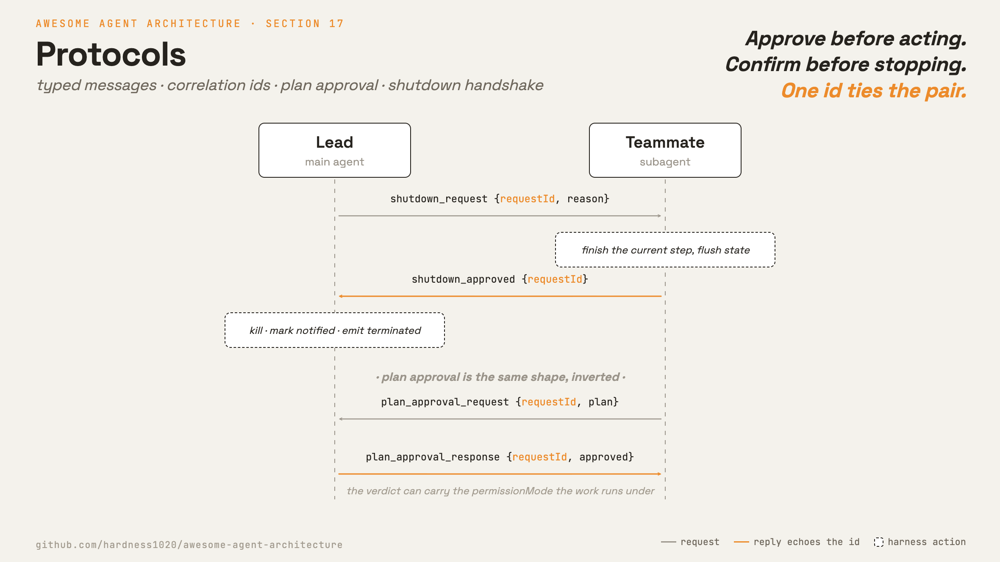

# 17 · Protocols

[English](README.md) · **繁體中文** · [简体中文](README.zh-CN.md)

> 給訊息一套約定：行動前先審核，停止前先確認。

協調（第 16 章）給了 agent 一個管道，但管道只搬運文字。文字本身沒有規則：分不出請求和回覆，也沒辦法要求對方先回應才行動。

protocol 是疊在管道之上的約定規則：一則請求與其回覆長什麼樣子，以及一則回覆如何對應到它所回答的請求。

有兩種情況最需要這套約定。一種是 lead 在隊友編輯到一半時把它強制停掉，留下一個寫到一半的檔案和一筆開著的 task 記錄。

另一種是隊友沒先問過，就直接跑一個有風險的重構：先做了，才回報。

兩種情況要的其實是同一件事：一方送出請求，另一方回覆，一個 id 把它們綁在一起。

protocol 必須：

1. 給請求和回覆定好固定的格式。
2. 把每則回覆對應到它所回答的請求。
3. 在任何工作開始前先為有風險的計畫設閘門。
4. 停止一個 agent 而不遺失進行中的工作。

少了這一層，協調就只是傳來傳去的閒聊：有風險的動作沒有閘門擋著，停止不會乾淨收尾，收到回覆也對不上它在回答哪個請求。

---

## 機制



每一次來回都是一則帶型別的請求，配一則帶型別的回應，兩者共用同一個 `requestId`。

sender 把請求記為 pending，依型別路由回覆，並解析出相符的請求。

有三條規則讓它成為一個 protocol，而不只是兩則訊息：

- **Typed variants。** 每則訊息是 `type` 欄位上的一個 variant。handler 依型別 dispatch，所以回覆絕不會被誤認為某個不相干的請求。
- **Correlation id。** `requestId` 在請求送出時設定，並在回覆裡回傳。sender 就知道一則回覆解析的是哪一筆 pending 請求。
- **A small state machine。** 一筆請求從 `pending` 走到 `approved` 或 `rejected`。一個 id 有了結果之後，再收到的回覆都會被忽略，所以同一則回覆重複送也沒關係。

shutdown 與 plan 這兩個流程一樣，只是方向相反：shutdown 是 lead 請求、隊友確認；plan approval 是隊友請求、lead 確認。

審核的回覆裡也可以附上這件工作要用哪種權限模式（第 3 章），核准和模式一次送到。

### New: protocol 追蹤器

`protocols.py` 是每個 agent 在第 16 章管道之上的一個 `Protocol`。一筆請求鑄造一個 correlation id 並把自己記為 pending；回覆把那個 id 回傳：

```python
def request(self, to, kind, **fields):                 # src/protocols.py
    self._n += 1
    rid = f"{self.me}-{self._n}"                        # per-sender id: unique, deterministic
    self.pending[rid] = {"kind": kind, "state": PENDING}
    self.team.send(self.me, to, {"type": kind, "request_id": rid, **fields})
    return rid

def reply(self, msg, kind, **fields):                  # echo the id back, do not mint a new one
    req = msg["content"]
    self.team.send(self.me, msg["from"], {"type": kind, "request_id": req["request_id"], **fields})
```

- `request` 把每個 id 編號為 `me-N`，所以 id 對每個 sender 都唯一，且跨 agent 絕不衝突。
- `reply` 重用請求的 `request_id`。那個回傳就是整個訣竅所在：sender 之後就是靠它把回覆對應到它所回答的內容。

一張小表指明哪些回覆種類可以回答每種請求，以及各自代表的裁決：

```python
_REPLIES = {                                           # src/protocols.py
    "shutdown_request": {"shutdown_approved": APPROVED, "shutdown_rejected": REJECTED},
    "plan_approval_request": {"plan_approval_response": None},   # None: the verdict rides an `approved` field
}
```

`resolve` 讀這張表，用來拒絕不相符的回覆，並剛好記錄裁決一次：

```python
def resolve(self, msg):                                # src/protocols.py
    reply = msg["content"]
    req = self.pending.get(reply.get("request_id"))
    if not req or req["state"] != PENDING:             # unknown id or already resolved
        return None
    verdicts = _REPLIES[req["kind"]]
    if reply.get("type") not in verdicts:              # type-confusion guard
        return None
    state = verdicts[reply["type"]]
    if state is None:                                  # single-response flow carries the bool
        state = APPROVED if reply.get("approved") else REJECTED
    req["state"] = state
    return state
```

- `resolve` 是 idempotent 的：重複或走失的回覆會撞上 `state != PENDING` 或未知 id 的守衛，並回傳 `None`。
- `verdicts` 查表就是 type-confusion 守衛：一則 `plan_approval_response` 無法解析一筆 `shutdown_request`，因為那個型別不在 shutdown 那一列裡。
- shutdown 把它的裁決拆到兩個回覆種類；plan approval 用一個攜帶 bool 的種類。兩者都落到同一個從 `pending` 到 `approved` 或 `rejected` 的狀態。
- `protocol_tools` 把 handshake 的發起作為工具暴露出來（`ExitPlanMode`、`ApprovePlan`、`StopTeammate`）。
- 確認一個 shutdown 不是一個工具；隊友的 `run_teammate` loop 會自動回覆（harness 驅動的接收）。

### New: 隊友 loop

`run_teammate` 是第 16 章的 `serve_mailbox`，把 shutdown handshake 折了進來。被 spawn 的隊友現在會因為一筆請求而停止，而不是隨它的 daemon thread 一起死掉：

```python
def run_teammate(team, me, lead, work, *, poll=0.05, max_idle_polls=None):   # src/protocols.py
    proto = Protocol(team, me)
    while True:
        inbox = team.drain(me)
        shutdown = next((m for m in inbox if _is_shutdown(m)), None)
        if shutdown is not None:
            proto.reply(shutdown, "shutdown_approved")     # confirm, then stop
            return "shutdown"
        chat = [m for m in inbox if isinstance(m["content"], str)]
        if chat:
            work(_fold(chat)); continue                    # section 16: fold and run
        time.sleep(poll)                                   # empty: poll again
```

- shutdown 在 chat 之前先檢查，所以對等的流量無法把一次停止餓死。
- 發起是模型驅動的（lead 的 `StopTeammate`）；接收是 harness 驅動的（loop 確認），對應參考實作的分工。
- loop 回傳 `"shutdown"`，所以進行 spawn 的 runtime（第 13 章）能回報這次乾淨的停止。
- 第 18 章再加一個分支：inbox 為空時，從一塊共用看板認領一個 task。

### 如何整合

demo 跑一個主 agent。lead 在一個 turn 裡 spawn 一個隊友、委派、然後停止它；隊友在自己的 thread 上確認：

```python
def spawn_worker(name, team, model):                   # src/demo.py, module level
    ...                                                 # build the teammate's tools
    return run_teammate(team, name, "lead", work)       # serve_mailbox plus the shutdown handshake

run_turn([...goal...], model, lead_reg, session)        # the one agent call in demo(): the lead
state = next(filter(None, (lead_proto.resolve(m) for m in team.drain("lead")   # -> approved
                           if isinstance(m["content"], dict))), None)
```

- `demo()` 跑一個 `run_turn`，也就是 lead 的。它呼叫 `SpawnTeammate`、`SendMessage`，然後 `StopTeammate`。
- `StopTeammate` 送出一筆 `shutdown_request`；隊友的 `run_teammate` 確認它並返回。這次停止走的是 handshake，不是直接 kill。
- lead 把回傳的 `shutdown_approved` 解析成 `approved`。主 process 只是等待。
- plan-approval 流程就是同一套 handshake 反過來跑（先 `ExitPlanMode` 再 `ApprovePlan`），由相同的工具驅動，並在 test.py 裡驗證。
- loop 沒有改變。protocol 只動管道上的訊息：請求照格式送出，回覆對回原本的請求，turn 的內部不用動。

---

## 各系統做法

一種設計如何定出請求的格式、為計畫設閘門，並乾淨地停止 agent。

|                              | Claude Code                                                                                        |
| ---------------------------- | -------------------------------------------------------------------------------------------------- |
| **Pros**               | 每一次停止都經過確認，每一個有風險的計畫都設了閘門。不會丟掉進行中的工作，也不會洩漏 task 記錄。   |
| **Cons**               | 每次 handshake 都要付出往返次數和 protocol 狀態，比 fire and forget 的 kill 慢。                   |
| **Why**                | 隊友編輯到一半就被強制停掉，會留下寫到一半的檔案和開著的 task 記錄。有風險的計畫要在行動前先審核。 |
| **How: message shape** | 在`type` 上區分的 typed union。`request_id` 把每則回覆對應到它的請求。                         |
| **How: plan approval** | 隊友請求後等待，lead 審核。回覆帶著裁決、可選的 feedback，以及工作所在的權限模式。                 |
| **How: shutdown**      | lead 先請求，隊友確認後才 kill。task 會被標記為 notified，並發出 terminated 事件。                 |

---

## 哪裡會出錯

- **用硬 kill 取代 handshake：**殺掉隊友的 thread 會丟掉進行中的工作，並讓它的 task 記錄變孤兒。改用先請求再確認、並把 task 標記為 `notified` 的流程。
- **孤兒請求：**一則永遠不到的回覆會讓一筆請求永遠停在 `pending`，於是 sender 一直 block。加上一個 timeout 或閒置檢查，把卡住的請求浮上來。
- **型別混淆：**只靠 id 對應回覆，會讓一則 shutdown 回覆解析掉一筆 plan 請求。檢查回覆的 variant 是否符合記錄下的請求型別。
- **審核卻不強制：**一個被審核通過的計畫，仍需要權限層來為執行設閘門（第 3 章）。在回應裡攜帶 `permissionMode`。
- **重複回覆：**一則重送的回覆可能把已經定案的狀態翻掉。任何針對非 pending id 的回覆都不做事。

---

## 可執行程式

[`src/`](src/) 承接第 16 章並加上：

- [`protocols.py`](src/protocols.py)：請求追蹤器（typed variants、correlation id、狀態機）、handshake 工具，以及 `run_teammate` loop。
- [`test.py`](src/test.py)：檢查 shutdown 與 plan 流程、各個守衛、一次工具驅動的 handshake，以及一個被 handshake 停止的自運作隊友。
- [`demo.py`](src/demo.py)：一個 lead turn spawn 一個隊友、委派，並用 StopTeammate 停止它；隊友在自己的 thread 上確認。

loop 與 subagent 路徑不變。protocol 只動管道上的訊息：請求照格式送出，回覆對回原本的請求，turn 的內部不用動。

```bash
python sections/17-protocols/src/test.py         # offline checks, no key
uv run python sections/17-protocols/src/demo.py  # live demo, needs a key
```

---

## 出處

- [Claude Code 的 protocol 格式](https://github.com/yasasbanukaofficial/claude-code)：`tools/SendMessageTool/SendMessageTool.ts`、`utils/teammateMailbox.ts`。
- [Claude Code plan 與 stop](https://github.com/yasasbanukaofficial/claude-code)：`tools/ExitPlanModeTool/ExitPlanModeV2Tool.ts`、`tasks/stopTask.ts`、`coordinator/coordinatorMode.ts`。
- [learn-claude-code · s16_team_protocols](https://github.com/shareAI-lab/learn-claude-code)：章節框架。
