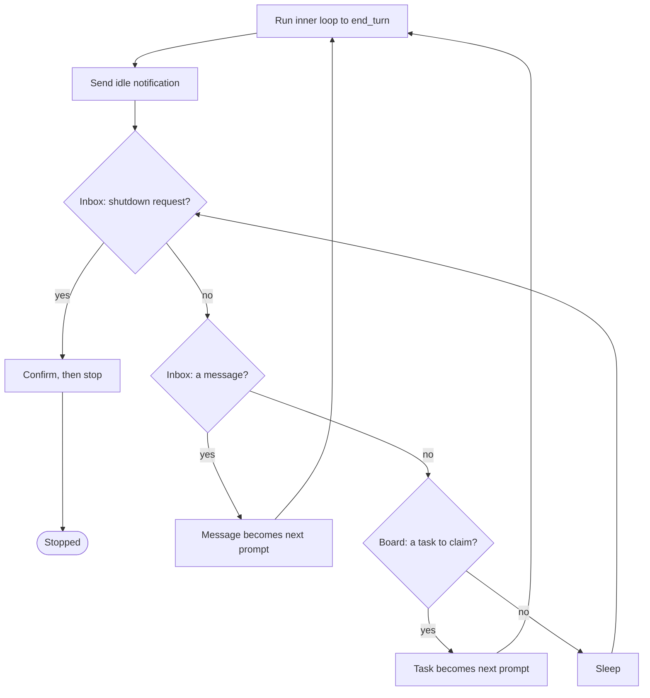

# 18 · Autonomy

**English** · [繁體中文](README.zh-TW.md)

> Run the loop with no human prompt: on idle, scan the board, claim a ready task, work it.

Autonomy is section 1 (the agent loop) running with no human prompt to start each turn.

Spawn a team and the obvious design is a lead that hands each worker its next task.

That does not scale. Ten unclaimed tasks mean ten manual assignments, and the lead becomes the bottleneck.

A worker that goes idle the moment it finishes also wastes the context it just loaded.

The fix is self organization, not central assignment.

Autonomy must let an idle agent:

1. Notice it has nothing to do (the work phase reached `end_turn`).
2. Look at the shared board for tasks no one owns and nothing blocks.
3. Claim one without racing other idle agents for it.
4. Re-enter the loop on the claimed task, and repeat until the board is empty.

Leave this out and every agent is a puppet. It waits for a human or a lead to push the next prompt, so throughput is capped by how fast the dispatcher types.

---

## Mechanism

An outer loop wraps the agent loop.

The inner loop is the normal `while` from section 1. When it reaches `end_turn` the agent does not return. It enters a poll.

The poll drains two channels: a directed inbox (section 16) for messages addressed to this agent, and an undirected board (section 12) of tasks any idle agent can claim.

It checks them in priority order: a shutdown request first, then an inbox message, then a task on the board.

Whatever it finds becomes the next prompt, and the inner loop runs again.



- The inner loop ends on the model's `stop_reason`, the same signal as section 1.
- The poll checks shutdown first, so a stop is never buried under peer messages.
- Claiming is read, check, then write under a lock: pick an unowned, unblocked task, then write ownership before another agent can.
- A task is claimable only when its dependencies are `completed`, so no agent claims blocked work.

The shutdown request and its confirm are the section-17 protocol, so a stop is a handshake, not a kill.

### New: the idle poll

`autonomy.py` adds the outer loop and one poll pass. `next_action` drains the inbox once, then returns the first thing it finds, in priority order:

```python
def next_action(proto, team, store, me):               # src/autonomy.py
    inbox = team.drain(me)
    shutdown = next((m for m in inbox if _is(m, "shutdown_request")), None)
    if shutdown is not None:                            # checked first, so chat cannot starve a stop
        proto.reply(shutdown, "shutdown_approved")
        return ("shutdown", shutdown["content"].get("reason"))
    chat = [m for m in inbox if isinstance(m["content"], str)]
    if chat:
        chat.sort(key=lambda m: m["from"] != "lead")   # lead before peers; sort is stable
        return ("message", _fold(chat))                # section 16's shared fold helper
    task = claim_next(store, me)                        # else claim the next ready task
    return ("task", task) if task is not None else None
```

- It returns the first of: a shutdown (confirm and stop), folded chat, or a claimed task.
- Shutdown is checked before chat, so peer traffic cannot starve a stop (section 16).
- `claim_next` claims the first pending, unowned task; `TaskStore.claim` rejects blocked work and serializes the claim (section 12).
- `None` means idle: the outer loop sleeps and polls again.

### The claim, under a lock

The poll proposes a task; the lock decides who gets it. `claim_next` scans the board oldest first and proposes the first unowned, pending task:

```python
def claim_next(store, me):                             # src/autonomy.py
    for t in store.list():                             # oldest first
        if t["status"] == "pending" and t["owner"] is None:
            got = store.claim(t["id"], me)             # read, check, write under a lock
            if got["ok"]:
                return got["task"]
            # not ok: another agent won it, or it just became blocked; try the next
    return None
```

The check in `claim_next` is only a hint: two idle agents can read the same task as unowned at once. `TaskStore.claim` (section 12) settles it under a lock:

```python
def claim(self, tid, owner):                           # src/tasks.py, section 12
    with self._lock():                                 # fcntl.flock: one claimer at a time
        task = self.get(tid)
        if task["owner"] is not None:                  # someone already won: back off
            return {"ok": False, "reason": "already_claimed"}
        unmet = [b for b in task["blockedBy"]
                 if (self.get(b) or {}).get("status") != "completed"]
        if unmet:                                       # a dependency is not done yet
            return {"ok": False, "reason": "blocked"}
        task["owner"], task["status"] = owner, "in_progress"
        self._write(task)
        return {"ok": True, "task": task}
```

- The lock makes read, check, and write one atomic step, so the check cannot go stale before the write.
- The loser re-reads inside the lock, sees `owner` set, and gets `already_claimed`; `claim_next` moves to the next task.
- A blocked task is refused here too, so no agent claims work whose dependencies are not `completed`.
- This is the only place two threads contend for shared state. The rest of the poll is local.

### How it integrates

The outer loop wraps `run_turn` from outside, so the loop and the subagent path do not change:

```python
def run_teammate(team, store, me, lead, work):         # src/autonomy.py
    proto, prompt, claimed = Protocol(team, me), None, None
    while True:
        if prompt is not None:
            work(prompt, claimed)                      # inner loop (section 1) does the claimed task
            prompt, claimed = None, None
            team.send(me, lead, {"type": "idle", "reason": "available"})
        action = next_action(proto, team, store, me)   # poll: shutdown, message, or task
        if action is None:                             # idle: sleep, then poll again
            time.sleep(POLL_INTERVAL); continue
        kind, payload = action
        if kind == "shutdown":
            return "shutdown"
        if kind == "task":
            prompt, claimed = task_prompt(payload), payload
        else:
            prompt = payload
```

- This `run_teammate` is section 17's, with one more poll source: the task board. Shutdown (section 17) and chat (section 16) are unchanged.
- `work(prompt, claimed)` runs one inner loop to `end_turn` on the claimed task, then the agent announces it is available.
- A claimed task becomes the next prompt. When the poll finds nothing, the worker decides its own stop.
- That stop is either mode: idle until a shutdown handshake (section 17), or wind down after a bound of empty polls on a finite board.
- One worker runs here, but the loop is per agent. A real team runs a lead loop and many worker loops at once over the one shared board and inbox set.
- The lead takes one active step: it builds the team and the work by calling tools, then it is done.
- `TeamCreate` and `SpawnTeammate` are section 16's tools; `TaskCreate` posts the board (section 12).
- `SpawnTeammate` is `runtime.start(...)` (section 13): the lead's tool call starts a worker's autonomy loop on a thread.
- After the spawn, pulling work and deciding when to stop are each worker's own doing, not the lead's or the script's. The main process only waits for the workers to wind down.
- Forming the team, spawning, and posting the board are the model's decisions (sections 16 and 12); the autonomous claim is section 18's addition.

---

## Per system

How an idle agent finds and claims its own work.

| System | Idle behavior | Work claim | Self-organization |
| --- | --- | --- | --- |
| **Claude Code** | Short poll loop, announces availability. | Claim an unblocked, unowned task under a lock. | Workers pull from a shared board; the lead delegates. |

### Claude Code

- `inProcessRunner.ts`: `runInProcessTeammate()` is the outer loop, `waitForNextPromptOrShutdown()` is the poll, a `500ms` cycle.
- The poll scans for a shutdown request first, then unread messages (lead before peers), then calls `tryClaimNextTask()`.
- It announces idleness with `sendIdleNotification()` and `idleReason: 'available'`.
- `findAvailableTask()` picks a task that is `pending`, has no `owner`, and whose `blockedBy` are all `completed`.
- `claimTask()` writes ownership under a `proper-lockfile` lock, so two idle agents cannot both win one task.
- `claimTaskWithBusyCheck()` takes a task-list lock so the busy check and the claim are atomic, closing the TOCTOU window.
- The board is the `TaskList` tool's task files (section 12).
- `useTaskListWatcher.ts` is a second entry point: `fs.watch` on the tasks dir (`1000ms` debounce) auto-claims externally created tasks via the same `claimTask()`.
- `coordinatorMode.ts` frames the lead as a synthesizer that spawns workers, not a task router (`isCoordinatorMode()`).

> **Trade-off:** Self organization removes the dispatcher bottleneck and keeps idle agents working.
> It costs a real lock and a freshness check to settle races when two agents eye one task.
> A lead-assigns model needs no locking but cannot scale past the lead.

---

## Failure modes

- **Claim race.** Two agents read a task as unowned and both claim it, dropping one agent's work. Claim inside a file lock that makes the check and write atomic (section 12).
- **Starvation by chatter.** Peer chatter buries a shutdown request, so an agent that should stop keeps polling. Check for shutdown before regular messages (section 16).
- **Premature claim of blocked work.** An agent claims a task whose dependencies are not done, then stalls. Skip any task whose `blockedBy` holds an unresolved id (section 12).
- **Identity loss after compaction.** A long-running teammate is auto-compacted mid-run (section 8) and forgets its role. Preserve the system prompt so the role survives.
- **Stuck busy, or stuck idle.** A phase that never reaches `end_turn` never frees it; a poll with no exit spins. End on the stop signal (section 1); check abort each poll.

---

## Runnable

[`src/`](src/) carries 17 forward and adds:

- [`autonomy.py`](src/autonomy.py): the outer loop and idle poll over the section-12 board (section 16's `SpawnTeammate` starts each worker).
- [`test.py`](src/test.py): the single-worker mechanism, a `TeamCreate` check, a forced claim-race (16 threads, one task, one winner), a threaded pipeline, and a spawn-tool check.
- [`demo.py`](src/demo.py): the lead takes one step (`TeamCreate`, `TaskCreate`, `SpawnTeammate`); the workers then pull tasks off the board and stop themselves when it drains.

The single-worker `run_teammate` in the mechanism is the teaching reduction.

A real team runs a lead loop and several worker loops at once over one shared board and inbox set.

Section 13 starts work on threads; the section-12 and section-16 file locks keep the shared state safe under the race.

The concurrent demo and the claim-race test wire that up.

```bash
python sections/18-autonomy/src/test.py         # offline checks, no key
uv run python sections/18-autonomy/src/demo.py  # live demo, needs a key
```

---

## Sources

- Claude Code autonomy: `utils/swarm/inProcessRunner.ts` (`runInProcessTeammate`, `waitForNextPromptOrShutdown`, `findAvailableTask`, `tryClaimNextTask`, `sendIdleNotification`).
- Claude Code claim and watch: `utils/tasks.ts` (`claimTask`, `claimTaskWithBusyCheck` under `proper-lockfile`), `hooks/useTaskListWatcher.ts`, `coordinator/coordinatorMode.ts`.
- learn-claude-code · s17 autonomous agents: section framing.
