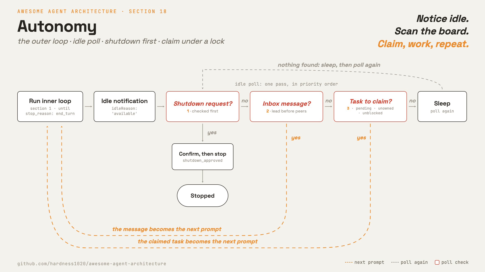

# 18 · Autonomy

[English](README.md) · [繁體中文](README.zh-TW.md) · **简体中文**

> 在没有人类 prompt 的情况下跑 loop：闲置时扫描看板，认领一个就绪的 task，然后动工。

自主（autonomy）就是第 1 章的 agent loop，在没有人类 prompt 触发每一轮的情况下持续运转。

要 spawn 一支团队，最直觉的设计是有一位 lead 把下一个 task 逐一交给每个 worker。

但这样无法扩展。十个尚未认领的 task 就意味着十次手动指派，lead 也因此成为瓶颈。

一个 worker 一做完就闲置，也浪费了它刚载入的 context。

解法是自我组织，而不是集中指派。

自主机制必须让一个闲置的 agent 能够：

1. 察觉自己没事可做（work 阶段已抵达 `end_turn`）。
2. 查看共享看板，找出无人拥有、也没有被阻挡的 task。
3. 认领其中一个，且不与其他闲置 agent 相互竞争。
4. 针对认领到的 task 重新进入 loop，并持续重复直到看板清空。

少了这一环，每个 agent 都是傀儡。它必须等待人类或 lead 推来下一个 prompt，于是吞吐量被卡在派工者打字的速度上。

---

## 机制



一个 outer loop 包住 agent loop。

inner loop 就是第 1 章那个普通的 `while`。当它抵达 `end_turn` 时，agent 不会返回，而是进入 poll。

poll 会排空两个 channel：一个定向的 inbox（第 16 章），承接寄给这个 agent 的消息；一个非定向的看板（第 12 章），放着任何闲置 agent 都能认领的 task。

它按优先级检查这些来源：先看 shutdown 请求，再看 inbox 消息，最后才看看板上的 task。

无论找到什么，都会成为下一个 prompt，接着 inner loop 再跑一次。

- inner loop 按模型的 `stop_reason` 结束，这与第 1 章是同一个信号。
- poll 先检查 shutdown，所以停止指令永远不会被 peer 消息淹没。
- 认领是在 lock 之下做「读取、检查、再写入」：挑一个无人拥有、未被阻挡的 task，然后在别的 agent 出手前写入拥有权。
- 只有当一个 task 的依赖项全都 `completed` 时它才可被认领，所以没有 agent 会认领被阻挡的工作。

shutdown 请求与其确认就是第 17 章的协议，所以停止是一次握手，而不是强制砍掉。

### New: the idle poll

`autonomy.py` 加上 outer loop 与一次 poll pass。`next_action` 把 inbox 排空一次，然后按优先级返回它找到的第一样东西：

```python
def next_action(proto, team, store, me):               # src/autonomy.py
    inbox = team.drain(me)
    shutdown = next((m for m in inbox if _is(m, "shutdown_request")), None)
    if shutdown is not None:                            # checked first, so chat cannot starve a stop
        proto.reply(shutdown, "shutdown_approved")
        return ("shutdown", shutdown["content"].get("reason"))
    chat = [m for m in inbox if isinstance(m["content"], str)]
    if chat:
        chat.sort(key=lambda m: m["from"] != "lead")   # lead before peers; sort is stable
        return ("message", _fold(chat))                # section 16's shared fold helper
    task = claim_next(store, me)                        # else claim the next ready task
    return ("task", task) if task is not None else None
```

- 它会返回三者中最先出现的：shutdown（确认后停止）、折叠后的 chat，或一个认领到的 task。
- shutdown 在 chat 之前检查，所以 peer 流量无法饿死一次停止（第 16 章）。
- `claim_next` 认领第一个 pending、无人拥有的 task；`TaskStore.claim` 会拒绝被阻挡的工作，并把认领序列化（第 12 章）。
- `None` 代表闲置：outer loop 睡一下再 poll 一次。

### The claim, under a lock

poll 提议一个 task；lock 决定谁拿到它。`claim_next` 由旧到新扫描看板，并提议第一个无人拥有、pending 的 task：

```python
def claim_next(store, me):                             # src/autonomy.py
    for t in store.list():                             # oldest first
        if t["status"] == "pending" and t["owner"] is None:
            got = store.claim(t["id"], me)             # read, check, write under a lock
            if got["ok"]:
                return got["task"]
            # not ok: another agent won it, or it just became blocked; try the next
    return None
```

`claim_next` 里的检查只是一个提示：两个闲置 agent 可能同时把同一个 task 读成无人拥有。`TaskStore.claim`（第 12 章）在 lock 之下做出裁决：

```python
def claim(self, tid, owner):                           # src/tasks.py, section 12
    with self._lock():                                 # fcntl.flock: one claimer at a time
        task = self.get(tid)
        if task["owner"] is not None:                  # someone already won: back off
            return {"ok": False, "reason": "already_claimed"}
        unmet = [b for b in task["blockedBy"]
                 if (self.get(b) or {}).get("status") != "completed"]
        if unmet:                                       # a dependency is not done yet
            return {"ok": False, "reason": "blocked"}
        task["owner"], task["status"] = owner, "in_progress"
        self._write(task)
        return {"ok": True, "task": task}
```

- lock 让读取、检查、写入成为一个原子步骤，所以检查不会在写入前变得过时。
- 落败者在 lock 内重新读取，看到 `owner` 已被设置，于是拿到 `already_claimed`；`claim_next` 便移到下一个 task。
- 被阻挡的 task 在这里同样会被拒绝，所以没有 agent 会认领依赖项尚未 `completed` 的工作。
- 这是唯一一处两条线程争用共享状态的地方。poll 的其余部分都是本地的。

### How it integrates

outer loop 从外部包住 `run_turn`，所以 loop 与 subagent 路径都不变：

```python
def run_teammate(team, store, me, lead, work):         # src/autonomy.py
    proto, prompt, claimed = Protocol(team, me), None, None
    while True:
        if prompt is not None:
            work(prompt, claimed)                      # inner loop (section 1) does the claimed task
            prompt, claimed = None, None
            team.send(me, lead, {"type": "idle", "reason": "available"})
        action = next_action(proto, team, store, me)   # poll: shutdown, message, or task
        if action is None:                             # idle: sleep, then poll again
            time.sleep(POLL_INTERVAL); continue
        kind, payload = action
        if kind == "shutdown":
            return "shutdown"
        if kind == "task":
            prompt, claimed = task_prompt(payload), payload
        else:
            prompt = payload
```

- 这个 `run_teammate` 就是第 17 章的版本，只多一个 poll 来源：task 看板。shutdown（第 17 章）与 chat（第 16 章）都不变。
- `work(prompt, claimed)` 针对认领到的 task 跑一次 inner loop 到 `end_turn`，接着 agent 宣告自己有空。
- 认领到的 task 成为下一个 prompt。当 poll 找不到任何东西时，worker 自己决定何时停止。
- 那个停止有两种模式：闲置直到一次 shutdown 握手（第 17 章），或在有限看板上跑满一定次数的空 poll 后收工。
- 这里只跑一个 worker，但 loop 是每个 agent 各一份。真正的团队会同时跑一个 lead loop 与多个 worker loop，共享同一组看板与 inbox。
- lead 只做一个主动步骤：它调用工具建立团队与工作，然后就结束了。
- `TeamCreate` 与 `SpawnTeammate` 是第 16 章的工具；`TaskCreate` 把 task 贴上看板（第 12 章）。
- `SpawnTeammate` 就是 `runtime.start(...)`（第 13 章）：lead 的工具调用会在一条线程上启动一个 worker 的自主 loop。
- spawn 之后，拉取工作与决定何时停止都是每个 worker 自己的事，不是 lead 或脚本的事。主进程只是等待 worker 收工。
- 组建团队、spawn、贴看板都是模型的决定（第 16 章与第 12 章）；自主认领则是第 18 章新增的部分。

---

## 各系统做法

一个闲置 agent 如何找到并认领属于自己的工作。

| System | Idle behavior | Work claim | Self-organization |
| --- | --- | --- | --- |
| **Claude Code** | 短 poll loop，并宣告自己有空。 | 在 lock 之下认领一个未被阻挡、无人拥有的 task。 | Worker 从共享看板拉取工作；lead 负责委派。 |

### Claude Code

- `inProcessRunner.ts`：`runInProcessTeammate()` 是 outer loop，`waitForNextPromptOrShutdown()` 是 poll，一个 `500ms` 的周期。
- poll 先扫 shutdown 请求，接着是未读消息（lead 先于 peer），然后调用 `tryClaimNextTask()`。
- 它用 `sendIdleNotification()` 与 `idleReason: 'available'` 宣告闲置。
- `findAvailableTask()` 挑一个 `pending`、没有 `owner`、且 `blockedBy` 全为 `completed` 的 task。
- `claimTask()` 在 `proper-lockfile` lock 之下写入拥有权，所以两个闲置 agent 不会同时抢到同一个 task。
- `claimTaskWithBusyCheck()` 取得一个 task-list lock，让忙碌检查与认领成为原子操作，关掉 TOCTOU 空窗。
- 看板就是 `TaskList` 工具的 task 文件（第 12 章）。
- `useTaskListWatcher.ts` 是第二个进入点：对 tasks 目录做 `fs.watch`（`1000ms` debounce），通过同一个 `claimTask()` 自动认领外部建立的 task。
- `coordinatorMode.ts` 把 lead 定位为 spawn worker 的整合者，而非 task 路由器（`isCoordinatorMode()`）。

> **取舍：** 自我组织移除了派工者瓶颈，并让闲置 agent 持续有工作可做。
> 代价是需要一个真正的 lock 与一次新鲜度检查，好在两个 agent 盯上同一个 task 时裁定竞争。
> lead 指派模型不需要 lock，但无法扩展到超过 lead 的处理能力。

---

## 失效模式

- **认领竞争（Claim race）：**两个 agent 把一个 task 读成无人拥有并双双认领，丢掉了其中一个 agent 的工作。在一个 file lock 内做认领，让检查与写入成为原子操作（第 12 章）。
- **被闲聊饿死（Starvation by chatter）：**peer 闲聊淹没了一个 shutdown 请求，于是一个该停止的 agent 继续 poll。在一般消息之前先检查 shutdown（第 16 章）。
- **过早认领被阻挡的工作：**一个 agent 认领了依赖项尚未完成的 task，然后卡住。跳过任何 `blockedBy` 仍含未解 id 的 task（第 12 章）。
- **compaction 后身份丢失：**一个长时间运行的 teammate 在执行途中被自动 compaction（第 8 章），忘了自己的角色。保留 system prompt，让角色得以存续。
- **卡在忙碌，或卡在闲置：**一个永远抵达不了 `end_turn` 的阶段永远不会释放；一个没有出口的 poll 会空转。按 stop 信号结束（第 1 章）；每次 poll 都检查 abort。

---

## 可执行程序

[`src/`](src/) 承接第 17 章并加上：

- [`autonomy.py`](src/autonomy.py)：在第 12 章看板之上的 outer loop 与 idle poll（由第 16 章的 `SpawnTeammate` 启动每个 worker）。
- [`test.py`](src/test.py)：单一 worker 的机制、一个 `TeamCreate` 检查、一次强制的认领竞争（16 条线程、一个 task、一个赢家）、一条多线程 pipeline，以及一个 spawn 工具检查。
- [`demo.py`](src/demo.py)：lead 做一个步骤（`TeamCreate`、`TaskCreate`、`SpawnTeammate`）；接着 worker 从看板拉取 task，并在看板清空时自行停止。

机制段落里的单一 worker `run_teammate` 是教学用的简化版。

真正的团队会同时跑一个 lead loop 与数个 worker loop，共享同一组看板与 inbox。

第 13 章在线程上启动工作；第 12 章与第 16 章的 file lock 在竞争下保护共享状态的安全。

并行 demo 与认领竞争测试把这一切串起来。

```bash
python sections/18-autonomy/src/test.py         # offline checks, no key
uv run python sections/18-autonomy/src/demo.py  # live demo, needs a key
```

---

## 来源

- Claude Code autonomy：`utils/swarm/inProcessRunner.ts`（`runInProcessTeammate`、`waitForNextPromptOrShutdown`、`findAvailableTask`、`tryClaimNextTask`、`sendIdleNotification`）。
- Claude Code claim and watch：`utils/tasks.ts`（`proper-lockfile` 之下的 `claimTask`、`claimTaskWithBusyCheck`）、`hooks/useTaskListWatcher.ts`、`coordinator/coordinatorMode.ts`。
- learn-claude-code · s17 autonomous agents：章节定位。
