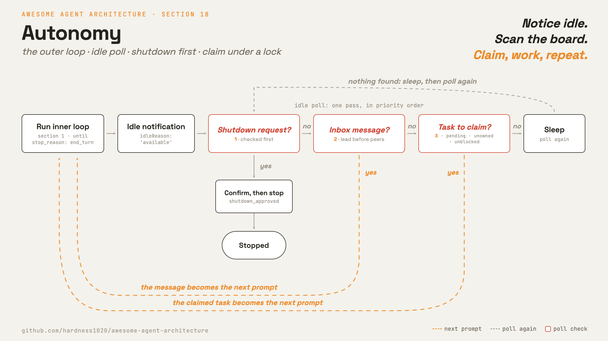

# 18 · Autonomy

[English](README.md) · [繁體中文](README.zh-TW.md) · **简体中文**

> 在没有用户 prompt 的情况下跑 loop：闲置时扫描看板，认领一个就绪的 task，然后动工。

自主（autonomy）就是第 1 章的 agent loop，在没有用户 prompt 触发每一轮的情况下持续运转。

要 spawn 一支团队，最直觉的设计是有一位 lead 把下一个 task 逐一交给每个 worker。

但这样无法扩展。十个尚未认领的 task 就意味着十次手动指派，lead 也因此成为瓶颈。

一个 worker 一做完就闲置，也浪费了它刚载入的 context。

解法是自我组织，而不是集中指派。

集中指派也是一种真实可行的设计，而且多数已发表的 multi-agent 研究讲的都是它。
在 manager 模式里，每个子 agent 都注册成一个 tool，由一位 manager 把每个 subtask 发出去。
manager 手上有完整的计划，所以它能排顺序、砍掉重复的 task，也能提早收工。
代价是每个 task 它都要经手两次：一次发出去，一次收结果。
两种设计付的代价不一样。manager 给你一份全局排序，但每个 task 都得等它排到。
看板给你吞吐量，但得靠 lock，因为认领会过期。这一章走的是看板这条路。

自主机制必须让一个闲置的 agent 能够：

1. 察觉自己没事可做（work 阶段已抵达 `end_turn`）。
2. 查看共享看板，找出无人拥有、也没有被阻挡的 task。
3. 认领其中一个，且不与其他闲置 agent 相互竞争。
4. 针对认领到的 task 重新进入 loop，并持续重复直到看板清空。

少了这一环，每个 agent 都是傀儡。它必须等待用户或 lead 推来下一个 prompt，于是吞吐量被卡在派工那一端出 prompt 的速度上。

---

## 机制



一个 outer loop 包住 agent loop。

inner loop 就是第 1 章那个普通的 `while`。当它抵达 `end_turn` 时，agent 不会返回，而是进入 poll。

poll 会把两个 channel 里的东西都收进来：一个定向的 inbox（第 16 章），承接寄给这个 agent 的消息；一个非定向的看板（第 12 章），放着任何闲置 agent 都能认领的 task。

它按优先级检查这些来源：先看 shutdown 请求，再看 inbox 消息，最后才看看板上的 task。

无论找到什么，都会成为下一个 prompt，接着 inner loop 再跑一次。

- inner loop 按模型的 `stop_reason` 结束，这与第 1 章是同一个信号。
- poll 先检查 shutdown，所以停止指令永远不会被 peer 消息淹没。
- 认领是在 lock 之下做「读取、检查、再写入」：挑一个无人拥有、未被阻挡的 task，然后在别的 agent 出手前写入拥有权。
- 只有当一个 task 的依赖项全都 `completed` 时它才可被认领，所以没有 agent 会认领被阻挡的工作。

shutdown 请求与其确认就是第 17 章的 protocol，所以停止走的是 handshake，不是强制中止。

### New: 闲置 poll

`autonomy.py` 加上 outer loop 与一次 poll pass。`next_action` 把 inbox 收完一次，然后按优先级返回它找到的第一样东西：

```python
def next_action(proto, team, store, me):               # src/autonomy.py
    inbox = team.drain(me)
    shutdown = next((m for m in inbox if _is(m, "shutdown_request")), None)
    if shutdown is not None:                            # checked first, so chat cannot starve a stop
        proto.reply(shutdown, "shutdown_approved")
        return ("shutdown", shutdown["content"].get("reason"))
    chat = [m for m in inbox if isinstance(m["content"], str)]
    if chat:
        chat.sort(key=lambda m: m["from"] != "lead")   # lead before peers; sort is stable
        return ("message", _fold(chat))                # section 16's shared fold helper
    task = claim_next(store, me)                        # else claim the next ready task
    return ("task", task) if task is not None else None
```

- 它会返回三者中最先出现的：shutdown（确认后停止）、折叠后的 chat，或一个认领到的 task。
- shutdown 在 chat 之前检查，所以 peer 流量无法饿死一次停止（第 16 章）。
- `claim_next` 认领第一个 pending、无人拥有的 task；`TaskStore.claim` 会拒绝被阻挡的工作，并把认领序列化（第 12 章）。
- `None` 代表闲置：outer loop 睡一下再 poll 一次。

### 在 lock 之下认领

poll 提议一个 task；lock 决定谁拿到它。`claim_next` 由旧到新扫描看板，并提议第一个无人拥有、pending 的 task：

```python
def claim_next(store, me):                             # src/autonomy.py
    for t in store.list():                             # oldest first
        if t["status"] == "pending" and t["owner"] is None:
            got = store.claim(t["id"], me)             # read, check, write under a lock
            if got["ok"]:
                return got["task"]
            # not ok: another agent won it, or it just became blocked; try the next
    return None
```

`claim_next` 里的检查只是一个提示：两个闲置 agent 可能同时把同一个 task 读成无人拥有。`TaskStore.claim`（第 12 章）在 lock 之下做出裁决：

```python
def claim(self, tid, owner):                           # src/tasks.py, section 12
    with self._lock():                                 # fcntl.flock: one claimer at a time
        task = self.get(tid)
        if task["owner"] is not None:                  # someone already won: back off
            return {"ok": False, "reason": "already_claimed"}
        unmet = [b for b in task["blockedBy"]
                 if (self.get(b) or {}).get("status") != "completed"]
        if unmet:                                       # a dependency is not done yet
            return {"ok": False, "reason": "blocked"}
        task["owner"], task["status"] = owner, "in_progress"
        self._write(task)
        return {"ok": True, "task": task}
```

- lock 把读取、检查、写入包成一步做完，中间插不进别的 agent，所以检查不会在写入前过时。
- 落败者在 lock 内重新读取，看到 `owner` 已被设置，于是拿到 `already_claimed`；`claim_next` 便移到下一个 task。
- 被阻挡的 task 在这里同样会被拒绝，所以没有 agent 会认领依赖项尚未 `completed` 的工作。
- 这是唯一一处两条线程争用共享状态的地方。poll 的其余部分都是本地的。

### 如何整合

outer loop 从外部包住 `run_turn`，所以 loop 与 subagent 路径都不变：

```python
def run_teammate(team, store, me, lead, work):         # src/autonomy.py
    proto, prompt, claimed = Protocol(team, me), None, None
    while True:
        if prompt is not None:
            work(prompt, claimed)                      # inner loop (section 1) does the claimed task
            prompt, claimed = None, None
            team.send(me, lead, {"type": "idle", "reason": "available"})
        action = next_action(proto, team, store, me)   # poll: shutdown, message, or task
        if action is None:                             # idle: sleep, then poll again
            time.sleep(POLL_INTERVAL); continue
        kind, payload = action
        if kind == "shutdown":
            return "shutdown"
        if kind == "task":
            prompt, claimed = task_prompt(payload), payload
        else:
            prompt = payload
```

- 这个 `run_teammate` 就是第 17 章的版本，只多一个 poll 来源：task 看板。shutdown（第 17 章）与 chat（第 16 章）都不变。
- `work(prompt, claimed)` 针对认领到的 task 跑一次 inner loop 到 `end_turn`，接着 agent 宣告自己有空。
- 认领到的 task 成为下一个 prompt。当 poll 找不到任何东西时，worker 自己决定何时停止。
- 那个停止有两种模式：闲置直到完成 shutdown handshake（第 17 章），或在有限看板上跑满一定次数的空 poll 后收工。
- 这里只跑一个 worker，但 loop 是每个 agent 各一份。真正的团队会同时跑一个 lead loop 与多个 worker loop，共享同一组看板与 inbox。
- lead 只做一个主动步骤：它调用工具建立团队与工作，然后就结束了。
- `TeamCreate` 与 `SpawnTeammate` 是第 16 章的工具；`TaskCreate` 把 task 贴上看板（第 12 章）。
- `SpawnTeammate` 就是 `runtime.start(...)`（第 13 章）：lead 的工具调用会在一条线程上启动一个 worker 的自主 loop。
- spawn 之后，拉取工作与决定何时停止都是每个 worker 自己的事，不是 lead 或脚本的事。主进程只是等待 worker 收工。
- 组建团队、spawn、贴看板都是模型的决定（第 16 章与第 12 章）；自主认领则是第 18 章新增的部分。

### 延伸阅读

底下这两套设计，这一章的可执行程序并没有实现。它们来自 ai-agent-book 对线上 agent 的描述，以及已发表的研究。
它们也不是下面表格那些系统确定的行为。把它们当成可以试试看的设计就好。

**怎么问一个正在忙的 worker：**poll 只告诉 worker 下一步做什么，它从来不会告诉 lead 某个正在跑的 worker 现在怎么样。

**状态查询（status RPC）为什么很弱：**worker 正在跑一次 tool call 的时候，它根本没在听消息，所以这种调用不是卡住，就是返回空的。
真正卡死的那个 worker，刚好就是不会回你的那个。

**三种真的可行的做法：**第一种要 worker 配合，最后一种完全不用。

1. 用消息问。把一条状态请求丢进 inbox（第 16 章），worker 下次 poll 时就会回答。这很准，前提是 worker 还在 poll。
2. 读一个讲好的进度文件。worker 每做一步就往双方都知道的路径加一行，读的人完全不打断它干活。
3. 跟着读存下来的 trajectory。runtime 本来就会把每一轮写进磁盘（第 13 章），lead 直接读那些轮次，worker 什么都不用做。

**怎么看出它卡住了：**后两种做法顺便就给了答案。看文件最后一次写入是什么时候，没有新的写入就是没有新的进展。
再配一个阈值，这就能拿来下判断。慢的 tool call 跑起来同样不会写东西，所以阈值要设得比你预期最慢的调用还长。超过阈值，就当这个 worker 卡死了。
「卡在忙碌」这个失败模式缺的就是这个触发条件。有了阈值，lead 可以把 task 收回来，或是开一次 shutdown handshake（第 17 章），不用一直干等。

**给 worker 池加上预算：**poll 里没有任何东西会叫 worker 别再认领了。每个闲下来的 worker 都会再拿一个 task，所以收工的时机是预算用完，而不是活做完。

**要分配的到底是什么：**有一个公开的 multi-agent 系统发现，光是 token 用量就解释了大约 80% 的表现差异。
所以真正要分配的是 token，不是轮次。有四个旋钮可以挂在看板和 worker 池上：

- 单个 task 的预算。每个 task 贴上看板时就写好自己的步数上限与 token 上限，这样一个失控的 task 吃不掉整场的资源。
- 并发上限。限制同时最多几个 task 停在 `in_progress`。看板本来就在算这个数，超过上限的认领直接失败就好。
- 模型配置。最强的模型放在最需要动脑的地方。计划的好坏决定结果，所以强模型给 lead，例行的 worker 用便宜的就好。
- 抢占（preemption）。超出预算的 worker，或是停摆超过阈值的 worker，手上的 task 会被收回看板。下一个认领的人从干净的状态开始。

**把预算摊给 worker 看：**知道自己手上剩多少的 agent，花起来会跟只是拿到更大上限的 agent 不一样。
这个结论出自书里自己做的实验，只有这一个来源。把它当成一个可以验证的方向，别当成可以照抄的数字。

---

## 各系统做法

一个闲置 agent 如何找到并认领属于自己的工作。

| | Claude Code |
| --- | --- |
| **Pros** | 没有派工者瓶颈。闲置 agent 会持续拉工作，直到看板清空，外部建立的 task 也会被接手。 |
| **Cons** | 两个闲置 agent 可能盯上同一个 task，得靠一个真正的 lock 加一次新鲜度检查来裁定竞争。lead 指派不需要 lock，但无法扩展到超过 lead 的处理能力。 |
| **Why** | lead 逐一派 task 会成为瓶颈，worker 一做完就闲置又浪费刚载入的 context，所以让 worker 自我组织。 |
| **How: idle behavior** | 短 poll loop，500ms 一个周期。先查 shutdown，再看未读消息（lead 先于 peer），然后尝试认领，并宣告自己有空。 |
| **How: work claim** | 挑一个无人拥有、也没有被阻挡的 task，在 lock 之下写入拥有权，两个 agent 不会抢到同一个。watcher 也会自动认领外部建立的 task。 |
| **How: self-organization** | Worker 从共享看板拉取工作（第 12 章）。lead 是 spawn worker 的整合者，不是 task 路由器。 |

---

## 哪里会出错

- **认领竞争（Claim race）：**两个 agent 把一个 task 读成无人拥有并双双认领，丢掉了其中一个 agent 的工作。在一个 file lock 内做认领，检查与写入一步做完，中间插不进别的 agent（第 12 章）。
- **被闲聊饿死（Starvation by chatter）：**peer 闲聊淹没了一个 shutdown 请求，于是一个该停止的 agent 继续 poll。在一般消息之前先检查 shutdown（第 16 章）。
- **过早认领被阻挡的工作：**一个 agent 认领了依赖项尚未完成的 task，然后卡住。跳过任何 `blockedBy` 仍含未解 id 的 task（第 12 章）。
- **compaction 后身份丢失：**一个长时间运行的 teammate 在执行途中被自动 compaction（第 8 章），忘了自己的角色。保留 system prompt，让角色得以存续。
- **卡在忙碌，或卡在闲置：**一个永远抵达不了 `end_turn` 的阶段永远不会释放；一个没有出口的 poll 会空转。按 stop 信号结束（第 1 章）；每次 poll 都检查 abort。
- **停摆没人发现：**一个 worker 抓着 task 看起来很忙，其实毫无进展，看板就一直不会把它放回去。看它的进度文件最后一次写入是什么时候，超时就把 task 收回来。
- **整池预算失控：**闲下来的 worker 一直认领，于是要等预算花光才收得了工。每个 task 都给步数与 token 上限，同时能跑几个也要设上限。
- **抢占后重复写入：**task 被放回看板又被别人认领时，旧的 worker 还在跑，于是两个 agent 写同一批文件。等停止被确认之后再放回去（第 17 章）。

---

## 可执行程序

[`src/`](src/) 承接第 17 章并加上：

- [`autonomy.py`](src/autonomy.py)：在第 12 章看板之上的 outer loop 与 idle poll（由第 16 章的 `SpawnTeammate` 启动每个 worker）。
- [`test.py`](src/test.py)：单一 worker 的机制、一个 `TeamCreate` 检查、一次强制的认领竞争（16 条线程、一个 task、一个赢家）、一条多线程 pipeline，以及一个 spawn 工具检查。
- [`demo.py`](src/demo.py)：lead 做一个步骤（`TeamCreate`、`TaskCreate`、`SpawnTeammate`）；接着 worker 从看板拉取 task，并在看板清空时自行停止。

机制段落里的单一 worker `run_teammate` 是教学用的简化版。

真正的团队会同时跑一个 lead loop 与数个 worker loop，共享同一组看板与 inbox。

第 13 章在线程上启动工作；第 12 章与第 16 章的 file lock 在竞争下保护共享状态的安全。

并行 demo 与认领竞争测试把这一切串起来。

```bash
python sections/18-autonomy/src/test.py         # offline checks, no key
uv run python sections/18-autonomy/src/demo.py  # live demo, needs a key
```

---

## 来源

- [Claude Code autonomy](https://github.com/yasasbanukaofficial/claude-code)：
  `utils/swarm/inProcessRunner.ts`（`runInProcessTeammate`、`waitForNextPromptOrShutdown`、`findAvailableTask`、`tryClaimNextTask`、`sendIdleNotification`）。
- [Claude Code claim and watch](https://github.com/yasasbanukaofficial/claude-code)：
  `utils/tasks.ts`（`proper-lockfile` 之下的 `claimTask`、`claimTaskWithBusyCheck`）、`hooks/useTaskListWatcher.ts`、`coordinator/coordinatorMode.ts`。
- [learn-claude-code · s17 autonomous agents](https://github.com/shareAI-lab/learn-claude-code)：章节定位。
- [ai-agent-book · 第 10 章](https://github.com/bojieli/ai-agent-book/blob/main/book/chapter10.md)（《深入理解 AI Agent》，李博杰，以中文原版为准）：
  为什么主动去拉的状态查询很弱、进度文件与跟读 trajectory、用 mtime 判断停摆、manager 模式的集中指派，
  以及团队层级的资源调度（每个 subtask 的预算、并发上限、模型配置、抢占）。
  其中「让 agent 知道还剩多少预算」的结论出自书里自己的实验，只有这一个来源。
- [Plan-and-Act](https://arxiv.org/abs/2503.09572)（Erdogan 等，2025）：把 planner 和 executor 拆开，并指出计划质量才是决定结果的那一项。
- [How we built our multi-agent research system](https://www.anthropic.com/engineering/multi-agent-research-system)（Anthropic，2025）：
  光是 token 用量就解释了大约 80% 的性能差异，其次才是 tool call 次数与模型选择。
