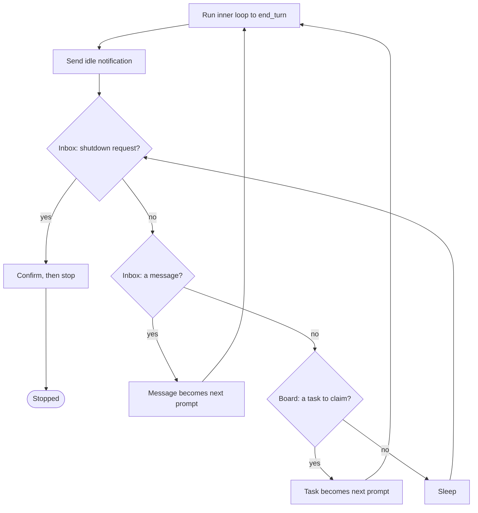

# 18 · Autonomy

[English](README.md) · **繁體中文**

> 在沒有人類 prompt 的情況下跑 loop：閒置時掃描看板，認領一個就緒的 task，然後動工。

自主（autonomy）就是第 1 章的 agent loop，在沒有人類 prompt 觸發每一輪的情況下持續運轉。

要 spawn 一支團隊，最直覺的設計是有一位 lead 把下一個 task 逐一交給每個 worker。

但這樣無法擴展。十個尚未認領的 task 就意味著十次手動指派，lead 也因此成為瓶頸。

一個 worker 一做完就閒置，也浪費了它剛載入的 context。

解法是自我組織，而不是集中指派。

自主機制必須讓一個閒置的 agent 能夠：

1. 察覺自己沒事可做（work 階段已抵達 `end_turn`）。
2. 查看共享看板，找出無人擁有、也沒有被阻擋的 task。
3. 認領其中一個，且不與其他閒置 agent 相互競爭。
4. 針對認領到的 task 重新進入 loop，並持續重複直到看板清空。

少了這一環，每個 agent 都是傀儡。它必須等待人類或 lead 推來下一個 prompt，於是吞吐量被卡在派工者打字的速度上。

---

## 機制

一個 outer loop 包住 agent loop。

inner loop 就是第 1 章那個普通的 `while`。當它抵達 `end_turn` 時，agent 不會回傳，而是進入 poll。

poll 會排空兩個 channel：一個定向的 inbox（第 16 章），承接寄給這個 agent 的訊息；一個非定向的看板（第 12 章），放著任何閒置 agent 都能認領的 task。

它依優先序檢查這些來源：先看 shutdown 請求，再看 inbox 訊息，最後才看看板上的 task。

無論找到什麼，都會成為下一個 prompt，接著 inner loop 再跑一次。



- inner loop 依模型的 `stop_reason` 結束，這與第 1 章是同一個訊號。
- poll 先檢查 shutdown，所以停止指令永遠不會被 peer 訊息淹沒。
- 認領是在 lock 之下做「讀取、檢查、再寫入」：挑一個無人擁有、未被阻擋的 task，然後在別的 agent 出手前寫入擁有權。
- 只有當一個 task 的相依項全都 `completed` 時它才可被認領，所以沒有 agent 會認領被阻擋的工作。

shutdown 請求與其確認就是第 17 章的協定，所以停止是一次握手，而不是強制砍掉。

### New: the idle poll

`autonomy.py` 加上 outer loop 與一次 poll pass。`next_action` 把 inbox 排空一次，然後依優先序回傳它找到的第一樣東西：

```python
def next_action(proto, team, store, me):               # src/autonomy.py
    inbox = team.drain(me)
    shutdown = next((m for m in inbox if _is(m, "shutdown_request")), None)
    if shutdown is not None:                            # checked first, so chat cannot starve a stop
        proto.reply(shutdown, "shutdown_approved")
        return ("shutdown", shutdown["content"].get("reason"))
    chat = [m for m in inbox if isinstance(m["content"], str)]
    if chat:
        chat.sort(key=lambda m: m["from"] != "lead")   # lead before peers; sort is stable
        return ("message", _fold(chat))                # section 16's shared fold helper
    task = claim_next(store, me)                        # else claim the next ready task
    return ("task", task) if task is not None else None
```

- 它會回傳三者中最先出現的：shutdown（確認後停止）、折疊後的 chat，或一個認領到的 task。
- shutdown 在 chat 之前檢查，所以 peer 流量無法餓死一次停止（第 16 章）。
- `claim_next` 認領第一個 pending、無人擁有的 task；`TaskStore.claim` 會拒絕被阻擋的工作，並把認領序列化（第 12 章）。
- `None` 代表閒置：outer loop 睡一下再 poll 一次。

### The claim, under a lock

poll 提議一個 task；lock 決定誰拿到它。`claim_next` 由舊到新掃描看板，並提議第一個無人擁有、pending 的 task：

```python
def claim_next(store, me):                             # src/autonomy.py
    for t in store.list():                             # oldest first
        if t["status"] == "pending" and t["owner"] is None:
            got = store.claim(t["id"], me)             # read, check, write under a lock
            if got["ok"]:
                return got["task"]
            # not ok: another agent won it, or it just became blocked; try the next
    return None
```

`claim_next` 裡的檢查只是一個提示：兩個閒置 agent 可能同時把同一個 task 讀成無人擁有。`TaskStore.claim`（第 12 章）在 lock 之下做出裁決：

```python
def claim(self, tid, owner):                           # src/tasks.py, section 12
    with self._lock():                                 # fcntl.flock: one claimer at a time
        task = self.get(tid)
        if task["owner"] is not None:                  # someone already won: back off
            return {"ok": False, "reason": "already_claimed"}
        unmet = [b for b in task["blockedBy"]
                 if (self.get(b) or {}).get("status") != "completed"]
        if unmet:                                       # a dependency is not done yet
            return {"ok": False, "reason": "blocked"}
        task["owner"], task["status"] = owner, "in_progress"
        self._write(task)
        return {"ok": True, "task": task}
```

- lock 讓讀取、檢查、寫入成為一個原子步驟，所以檢查不會在寫入前變得過時。
- 落敗者在 lock 內重新讀取，看到 `owner` 已被設定，於是拿到 `already_claimed`；`claim_next` 便移到下一個 task。
- 被阻擋的 task 在這裡同樣會被拒絕，所以沒有 agent 會認領相依項尚未 `completed` 的工作。
- 這是唯一一處兩條執行緒爭用共享狀態的地方。poll 的其餘部分都是本地的。

### How it integrates

outer loop 從外部包住 `run_turn`，所以 loop 與 subagent 路徑都不變：

```python
def run_teammate(team, store, me, lead, work):         # src/autonomy.py
    proto, prompt, claimed = Protocol(team, me), None, None
    while True:
        if prompt is not None:
            work(prompt, claimed)                      # inner loop (section 1) does the claimed task
            prompt, claimed = None, None
            team.send(me, lead, {"type": "idle", "reason": "available"})
        action = next_action(proto, team, store, me)   # poll: shutdown, message, or task
        if action is None:                             # idle: sleep, then poll again
            time.sleep(POLL_INTERVAL); continue
        kind, payload = action
        if kind == "shutdown":
            return "shutdown"
        if kind == "task":
            prompt, claimed = task_prompt(payload), payload
        else:
            prompt = payload
```

- 這個 `run_teammate` 就是第 17 章的版本，只多一個 poll 來源：task 看板。shutdown（第 17 章）與 chat（第 16 章）都不變。
- `work(prompt, claimed)` 針對認領到的 task 跑一次 inner loop 到 `end_turn`，接著 agent 宣告自己有空。
- 認領到的 task 成為下一個 prompt。當 poll 找不到任何東西時，worker 自己決定何時停止。
- 那個停止有兩種模式：閒置直到一次 shutdown 握手（第 17 章），或在有限看板上跑滿一定次數的空 poll 後收工。
- 這裡只跑一個 worker，但 loop 是每個 agent 各一份。真正的團隊會同時跑一個 lead loop 與多個 worker loop，共用同一組看板與 inbox。
- lead 只做一個主動步驟：它呼叫工具建立團隊與工作，然後就結束了。
- `TeamCreate` 與 `SpawnTeammate` 是第 16 章的工具；`TaskCreate` 把 task 貼上看板（第 12 章）。
- `SpawnTeammate` 就是 `runtime.start(...)`（第 13 章）：lead 的工具呼叫會在一條執行緒上啟動一個 worker 的自主 loop。
- spawn 之後，拉取工作與決定何時停止都是每個 worker 自己的事，不是 lead 或腳本的事。主行程只是等待 worker 收工。
- 組建團隊、spawn、貼看板都是模型的決定（第 16 章與第 12 章）；自主認領則是第 18 章新增的部分。

---

## 各系統做法

一個閒置 agent 如何找到並認領屬於自己的工作。

| System | Idle behavior | Work claim | Self-organization |
| --- | --- | --- | --- |
| **Claude Code** | 短 poll loop，並宣告自己有空。 | 在 lock 之下認領一個未被阻擋、無人擁有的 task。 | Worker 從共享看板拉取工作；lead 負責委派。 |

### Claude Code

- `inProcessRunner.ts`：`runInProcessTeammate()` 是 outer loop，`waitForNextPromptOrShutdown()` 是 poll，一個 `500ms` 的週期。
- poll 先掃 shutdown 請求，接著是未讀訊息（lead 先於 peer），然後呼叫 `tryClaimNextTask()`。
- 它用 `sendIdleNotification()` 與 `idleReason: 'available'` 宣告閒置。
- `findAvailableTask()` 挑一個 `pending`、沒有 `owner`、且 `blockedBy` 全為 `completed` 的 task。
- `claimTask()` 在 `proper-lockfile` lock 之下寫入擁有權，所以兩個閒置 agent 不會同時搶到同一個 task。
- `claimTaskWithBusyCheck()` 取得一個 task-list lock，讓忙碌檢查與認領成為原子操作，關掉 TOCTOU 空窗。
- 看板就是 `TaskList` 工具的 task 檔案（第 12 章）。
- `useTaskListWatcher.ts` 是第二個進入點：對 tasks 目錄做 `fs.watch`（`1000ms` debounce），透過同一個 `claimTask()` 自動認領外部建立的 task。
- `coordinatorMode.ts` 把 lead 定位為 spawn worker 的整合者，而非 task 路由器（`isCoordinatorMode()`）。

> **取捨：** 自我組織移除了派工者瓶頸，並讓閒置 agent 持續有工作可做。
> 代價是需要一個真正的 lock 與一次新鮮度檢查，好在兩個 agent 盯上同一個 task 時裁定競爭。
> lead 指派模型不需要 lock，但無法擴展到超過 lead 的處理能力。

---

## 失效模式

- **認領競爭（Claim race）。** 兩個 agent 把一個 task 讀成無人擁有並雙雙認領，丟掉了其中一個 agent 的工作。在一個 file lock 內做認領，讓檢查與寫入成為原子操作（第 12 章）。
- **被閒聊餓死（Starvation by chatter）。** peer 閒聊淹沒了一個 shutdown 請求，於是一個該停止的 agent 繼續 poll。在一般訊息之前先檢查 shutdown（第 16 章）。
- **過早認領被阻擋的工作。** 一個 agent 認領了相依項尚未完成的 task，然後卡住。跳過任何 `blockedBy` 仍含未解 id 的 task（第 12 章）。
- **compaction 後身分遺失。** 一個長時間運行的 teammate 在執行途中被自動 compaction（第 8 章），忘了自己的角色。保留 system prompt，讓角色得以存續。
- **卡在忙碌，或卡在閒置。** 一個永遠抵達不了 `end_turn` 的階段永遠不會釋放；一個沒有出口的 poll 會空轉。依 stop 訊號結束（第 1 章）；每次 poll 都檢查 abort。

---

## 可執行程式

[`src/`](src/) 承接第 17 章並加上：

- [`autonomy.py`](src/autonomy.py)：在第 12 章看板之上的 outer loop 與 idle poll（由第 16 章的 `SpawnTeammate` 啟動每個 worker）。
- [`test.py`](src/test.py)：單一 worker 的機制、一個 `TeamCreate` 檢查、一次強制的認領競爭（16 條執行緒、一個 task、一個贏家）、一條多執行緒 pipeline，以及一個 spawn 工具檢查。
- [`demo.py`](src/demo.py)：lead 做一個步驟（`TeamCreate`、`TaskCreate`、`SpawnTeammate`）；接著 worker 從看板拉取 task，並在看板清空時自行停止。

機制段落裡的單一 worker `run_teammate` 是教學用的簡化版。

真正的團隊會同時跑一個 lead loop 與數個 worker loop，共用同一組看板與 inbox。

第 13 章在執行緒上啟動工作；第 12 章與第 16 章的 file lock 在競爭下保護共享狀態的安全。

並行 demo 與認領競爭測試把這一切串起來。

```bash
python sections/18-autonomy/src/test.py         # offline checks, no key
uv run python sections/18-autonomy/src/demo.py  # live demo, needs a key
```

---

## 出處

- Claude Code autonomy：`utils/swarm/inProcessRunner.ts`（`runInProcessTeammate`、`waitForNextPromptOrShutdown`、`findAvailableTask`、`tryClaimNextTask`、`sendIdleNotification`）。
- Claude Code claim and watch：`utils/tasks.ts`（`proper-lockfile` 之下的 `claimTask`、`claimTaskWithBusyCheck`）、`hooks/useTaskListWatcher.ts`、`coordinator/coordinatorMode.ts`。
- learn-claude-code · s17 autonomous agents：章節定位。
</content>
</invoke>
