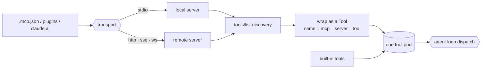

# 19 · MCP / plugins / channels

> Not enough capability? Plug in more. The harness reaches the world through one standard protocol.

A harness can only do what its tools let it do, and every built-in tool is hand written: input schema, execution, error handling, all of it.

That does not scale to the services a user wants: issue trackers, deploy systems, knowledge bases. You cannot hand write a tool for each, in each language it uses.

MCP (Model Context Protocol) is the open contract that closes the gap. An external service declares its tools, and the agent calls them blind, not knowing who wrote them or how.

So the agent gains a Jira tool or a deploy tool without anyone editing the harness. Leave it out and capability is frozen at whatever shipped in the binary.

A plugin bundles servers with hooks and skills. A channel lets a server push messages back in. Both ride the same protocol.

---

## Mechanism

Connect to each server, discover its tools (`tools/list`), wrap each as a runtime `Tool` (section 2), and merge those into the same pool the loop dispatches.

Names are namespaced `mcp__<server>__<tool>` so two servers never collide. The loop and gate do not change: an MCP tool is a `Tool` whose `run()` calls out over a transport.



- Discovery is one `tools/list` call per server; each returned spec becomes one wrapped `Tool`.
- The name is namespaced and normalized, so it is unique and matches the API's name pattern.
- Each tool's MCP annotations (`readOnlyHint`, `destructiveHint`) become the permission hints the gate reads (section 3).
- Merged into the one `Registry`, the model sees MCP tools and built-ins in the same list.

### New: wrapping a discovered tool

`mcp.py` turns each discovered spec into a `Tool`. The name is namespaced so servers never collide, and normalized to the API's charset:

```python
def tool_name(server, tool):                           # src/mcp.py
    return f"mcp__{normalize(server)}__{normalize(tool)}"   # buildMcpToolName

def wrap(server, spec, call):
    ann = spec.get("annotations", {})
    read_only = bool(ann.get("readOnlyHint"))
    bare = spec["name"]
    return Tool(
        name=tool_name(server, bare),
        run=lambda args, _t=bare: call(_t, args),      # dispatch calls out over the transport
        input_schema=spec.get("inputSchema") or dict(NO_INPUT),
        is_read_only=read_only,
        is_concurrency_safe=read_only,                 # reads are safe to batch
    )
```

- `tool_name` namespaces every tool; `normalize` replaces any char outside `[a-zA-Z0-9_-]` with `_`, satisfying the API name pattern.
- `run` closes over the bare tool name and the server's `call`, so dispatching the wrapped `Tool` reaches back over the transport.
- The `readOnlyHint` annotation becomes `is_read_only`, which is what the permission gate (section 3) reads to decide allow vs ask.

### New: discovering and merging

`connect` runs discovery once and returns wrapped tools; the caller merges them into the loop's `Registry`:

```python
def connect(server, conn):                             # src/mcp.py
    return [wrap(server, spec, conn.call) for spec in conn.list_tools()]
```

- `conn` is a live transport: `stdio` or `http` in production, in-process in the demo. Discovery does not care which.
- The returned `Tool`s register into the same pool as built-ins, so `registry.schemas()` advertises them together and the loop dispatches them the same way.

### New: channels and plugin config

Two smaller pieces round out the section. A server can push a message back in, which wraps into a tagged block folded into the next turn:

```python
def wrap_channel(source, payload):                     # src/mcp.py
    return f'<{CHANNEL_TAG} source="{source}">{payload}</{CHANNEL_TAG}>'
```

And a plugin's servers layer with user and project config by precedence:

```python
def merge_servers(*layers):                            # src/mcp.py
    merged = {}
    for scope in PRECEDENCE:                            # plugin < user < project < local
        for layer in layers:
            merged.update(layer.get(scope, {}))
    return merged
```

- `wrap_channel` turns Slack, Discord, or SMS into a two-way surface over the same protocol; the tagged block enqueues like a background note (section 13).
- `merge_servers` resolves a server defined in more than one scope: `local` overrides `project` overrides `user` overrides `plugin`.

### How it integrates

The demo discovers a server and runs one agent turn. The model calls the MCP tool blind:

```python
reg = Registry()
for t in mcp.connect("kb", KBServer()):                # discover, wrap, merge
    reg.register(t)
run_turn([...goal...], model, reg, Session(mode=DEFAULT))   # the one agent call
```

- The model sees `mcp__kb__search` in its tool list next to any built-in and calls it; it never learns who wrote the tool.
- The tool is read-only, so the gate allows it with no prompt. A destructive tool would ask, or be pre-approved by a rule keyed on the qualified name.
- The loop does not change. MCP adds tools to the pool; everything downstream is section-2 dispatch and section-3 gating.

---

## Per system

How the harness reaches outside itself.

| System | Transports | Plugin format | Tool pool assembly |
| --- | --- | --- | --- |
| **Claude Code** | Six, from stdio to http/sse/ws. | A plugin bundles servers, hooks, skills. | Each server tool cloned, namespaced, merged with built-ins. |

### Claude Code

- `types.ts` `TransportSchema` lists six transports: `stdio`, `sse`, `sse-ide`, `http`, `ws`, `sdk`.
- `client.ts` clones each discovered tool from `MCPTool`, names it with `buildMcpToolName`, and binds `call()` to the server.
- Local servers (`stdio`/`sdk`) and remote (`http`/`sse`/`ws`) connect in separate pools (defaults 3 local, 20 remote) because spawning a process is heavier than opening a socket.
- `normalizeNameForMCP` (`normalization.ts`) sanitizes names; `mcpInfoFromString` documents that a server name containing `__` parses wrong.
- The clone's `isReadOnly()` / `isDestructive()` / `isOpenWorld()` read the server's `readOnlyHint` / `destructiveHint` / `openWorldHint` annotations (section 3).
- `config.ts` merges by precedence `plugin < user < project < local`, with `claude.ai` connectors lowest and an enterprise `managed-mcp.json` able to override.
- `builtinPlugins.ts` bundles `mcpServers` + `hooks` + `skills` under id `{name}@builtin`.
- Four built-in tools manage the surface itself: `MCPTool`, `McpAuthTool` (`mcp__<server>__authenticate`), `ListMcpResourcesTool`, `ReadMcpResourceTool`.
- `channelNotification.ts` wraps a server push in `CHANNEL_TAG`; `SleepTool` polls and wakes within 1s.

> **Trade-off:** a standard protocol buys open-ended capability (any service, any language, no harness edits) and pushes permission decisions onto server-declared annotations.
> The cost is trust and surface: every connected server is new attack surface, its annotations are self reported, and its tools inflate the tool list.
> You trade a sealed, auditable tool set for an extensible but partly trusted one.

---

## Failure modes

- **Name collisions.** Two servers both expose `search`. The `mcp__server__tool` namespace prevents clashes; a server name with `__` still parses wrong, so keep names simple.
- **Tool-list bloat.** Many servers make a large tool list that costs tokens and confuses selection (section 2). Mitigation: truncate descriptions and defer loading.
- **Stale pool after connect.** A server added mid-session is not in the cached tool list, so the model never sees it. Mitigation: rebuild pool and prompt on change (section 8).
- **Connection churn.** A flaky server times out, resets, or expires its token. Mitigation: reconnect after repeated failures, re-auth on `401`, time out each call (section 11).
- **Over-trusted side effects.** A server marks a destructive tool `readOnlyHint: true` to skip the prompt. Mitigation: a rule on the qualified name gates it anyway (section 3).

---

## Runnable

[`src/`](src/) carries 18 forward and adds:

- [`mcp.py`](src/mcp.py): discovery and wrapping (`connect`, `wrap`, `tool_name`, `normalize`), the plugin config merge (`merge_servers`), and the channel wrap (`wrap_channel`).
- [`test.py`](src/test.py): discovery and namespacing, the annotation to permission-hint mapping, merging into the pool with the gate, config precedence, and the channel tag.
- [`demo.py`](src/demo.py): one agent turn calls an in-process MCP tool blind through the discovered `mcp__kb__search`.

The loop and dispatch do not change. MCP adds tools to the section-2 pool; the section-3 gate reads their self-declared annotations.

```bash
python sections/19-mcp-plugins-channels/src/test.py         # offline checks, no key
uv run python sections/19-mcp-plugins-channels/src/demo.py  # live demo, needs a key
```

---

## Sources

- Claude Code MCP transport: `services/mcp/types.ts` (`TransportSchema`), `client.ts` (`MCPTool` cloning, `buildMcpToolName`), `normalization.ts` (`normalizeNameForMCP`).
- Claude Code MCP config and channels: `config.ts` (precedence), `channelNotification.ts` (`CHANNEL_TAG`), plus `McpAuthTool`, `ListMcpResourcesTool`, `ReadMcpResourceTool`.
- Claude Code plugins: `plugins/builtinPlugins.ts`, `plugins/bundled/`, `types/plugin.ts`, plus `remote/` and `bridge/`.
- Framing: learn-claude-code · s19_mcp_plugin.
