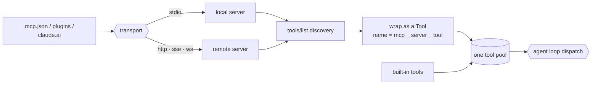

# 19 · MCP / plugins / channels

[English](README.md) · [繁體中文](README.zh-TW.md) · **简体中文**

> 能力不够？插进更多。harness 通过一套标准协议伸手触及外面的世界。

一个 harness（外层架构）只能做它的工具允许它做的事，而每个内建工具都是手写的：input schema、执行逻辑、错误处理，全都是。

这无法扩展到用户想要的各种服务：issue tracker、部署系统、知识库。你没办法为每一个、以它使用的每一种语言，都手写一个工具。

MCP（Model Context Protocol）就是填补这道缺口的开放合约。一个外部服务宣告它的工具，agent 则盲调用它们，不需要知道是谁写的、怎么写的。

于是 agent 不需要任何人动 harness，就得到了 Jira 工具或部署工具。少了它，能力就冻结在二进制文件出货时的样子。

一个 plugin 把 server 与 hook、skill 打包在一起。一个 channel 让 server 能把消息推回来。两者都跑在同一套协议上。

---

## 机制

连上每个 server，探索它的工具（`tools/list`），把每个工具包装成一个 runtime `Tool`（第 2 章），再把这些合并进 loop 用来 dispatch 的同一个工具池。

名称以 `mcp__<server>__<tool>` 加上命名空间，所以两个 server 永远不会撞名。loop 与 gate 都不变：一个 MCP 工具就是一个 `Tool`，只是它的 `run()` 会通过 transport 对外调用。



- 探索是每个 server 一次 `tools/list` 调用；每个返回的规格都会变成一个被包装的 `Tool`。
- 名称加了命名空间并经过正规化，所以它是唯一的，也符合 API 的名称样式。
- 每个工具的 MCP annotation（`readOnlyHint`、`destructiveHint`）成为 gate 读取的权限提示（第 3 章）。
- 合并进那一个 `Registry` 之后，模型会在同一份清单里看到 MCP 工具与内建工具。

### New: wrapping a discovered tool

`mcp.py` 把每个探索到的规格变成一个 `Tool`。名称加上命名空间让 server 永不撞名，并正规化到符合 API 的字符集：

```python
def tool_name(server, tool):                           # src/mcp.py
    return f"mcp__{normalize(server)}__{normalize(tool)}"   # buildMcpToolName

def wrap(server, spec, call):
    ann = spec.get("annotations", {})
    read_only = bool(ann.get("readOnlyHint"))
    bare = spec["name"]
    return Tool(
        name=tool_name(server, bare),
        run=lambda args, _t=bare: call(_t, args),      # dispatch calls out over the transport
        input_schema=spec.get("inputSchema") or dict(NO_INPUT),
        is_read_only=read_only,
        is_concurrency_safe=read_only,                 # reads are safe to batch
    )
```

- `tool_name` 为每个工具加上命名空间；`normalize` 把任何落在 `[a-zA-Z0-9_-]` 之外的字符换成 `_`，以符合 API 名称样式。
- `run` 捕捉了裸工具名与 server 的 `call`，所以 dispatch 被包装的 `Tool` 时会通过 transport 回调过去。
- `readOnlyHint` annotation 成为 `is_read_only`，这正是权限 gate（第 3 章）用来决定放行或询问的依据。

### New: discovering and merging

`connect` 执行一次探索并返回被包装的工具；调用端把它们合并进 loop 的 `Registry`：

```python
def connect(server, conn):                             # src/mcp.py
    return [wrap(server, spec, conn.call) for spec in conn.list_tools()]
```

- `conn` 是一个活的 transport：正式环境是 `stdio` 或 `http`，demo 里是 in-process。探索并不在意是哪一种。
- 返回的 `Tool` 注册进与内建工具同一个池，所以 `registry.schemas()` 会把它们一起公告，loop 也以相同方式 dispatch。

### New: channels and plugin config

两个较小的部件把这一章补齐。一个 server 可以把消息推回来，包装成一个带标签的区块，折进下一轮：

```python
def wrap_channel(source, payload):                     # src/mcp.py
    return f'<{CHANNEL_TAG} source="{source}">{payload}</{CHANNEL_TAG}>'
```

而一个 plugin 的 server 会按优先级与用户、项目配置分层叠加：

```python
def merge_servers(*layers):                            # src/mcp.py
    merged = {}
    for scope in PRECEDENCE:                            # plugin < user < project < local
        for layer in layers:
            merged.update(layer.get(scope, {}))
    return merged
```

- `wrap_channel` 把 Slack、Discord 或 SMS 变成同一套协议上的双向接口；带标签的区块像一条背景备注一样进入队列（第 13 章）。
- `merge_servers` 解决一个在多个 scope 都有定义的 server：`local` 覆盖 `project`，`project` 覆盖 `user`，`user` 覆盖 `plugin`。

### How it integrates

demo 探索一个 server 并跑一轮 agent。模型盲调用这个 MCP 工具：

```python
reg = Registry()
for t in mcp.connect("kb", KBServer()):                # discover, wrap, merge
    reg.register(t)
run_turn([...goal...], model, reg, Session(mode=DEFAULT))   # the one agent call
```

- 模型在它的工具清单里看到 `mcp__kb__search` 就在任何内建工具旁边，并调用它；它永远不会得知是谁写了这个工具。
- 这个工具是只读的，所以 gate 不提示就放行。一个具破坏性的工具则会询问，或由一条以完整名称为键的规则预先核准。
- loop 不变。MCP 只是往池里加工具；下游的一切都是第 2 章的 dispatch 与第 3 章的 gating。

---

## 各系统做法

harness 如何伸手触及自身之外。

| System | Transports | Plugin format | Tool pool assembly |
| --- | --- | --- | --- |
| **Claude Code** | 六种，从 stdio 到 http/sse/ws。 | 一个 plugin 打包 server、hook、skill。 | 每个 server 工具被复制、加命名空间，并与内建工具合并。 |

### Claude Code

- `types.ts` 的 `TransportSchema` 列出六种 transport：`stdio`、`sse`、`sse-ide`、`http`、`ws`、`sdk`。
- `client.ts` 从 `MCPTool` 复制每个探索到的工具，用 `buildMcpToolName` 命名，并把 `call()` 绑到该 server。
- 本地 server（`stdio`/`sdk`）与远端 server（`http`/`sse`/`ws`）连在各自独立的池里（默认本地 3、远端 20），因为 spawn 一个进程比开一个 socket 更耗费资源。
- `normalizeNameForMCP`（`normalization.ts`）净化名称；`mcpInfoFromString` 记载了一个名称含 `__` 的 server 会被解析错误。
- 复制件的 `isReadOnly()` / `isDestructive()` / `isOpenWorld()` 读取该 server 的 `readOnlyHint` / `destructiveHint` / `openWorldHint` annotation（第 3 章）。
- `config.ts` 按优先级 `plugin < user < project < local` 合并，其中 `claude.ai` connector 最低，而企业版的 `managed-mcp.json` 能覆盖。
- `builtinPlugins.ts` 以 id `{name}@builtin` 打包 `mcpServers` + `hooks` + `skills`。
- 四个内建工具管理这个接口本身：`MCPTool`、`McpAuthTool`（`mcp__<server>__authenticate`）、`ListMcpResourcesTool`、`ReadMcpResourceTool`。
- `channelNotification.ts` 把一个 server push 包进 `CHANNEL_TAG`；`SleepTool` 会 poll 并在 1 秒内唤醒。

> **取舍：** 一套标准协议换来了开放式能力（任何服务、任何语言、不用改 harness），并把权限决策推到 server 自行宣告的 annotation 上。
> 代价是信任与攻击面：每个连上的 server 都是新的攻击面，它的 annotation 是自我陈报的，它的工具也会膨胀工具清单。
> 你以一套封闭、可审计的工具集，换来一套可扩展但部分可信的工具集。

---

## 失效模式

- **撞名（Name collisions）。** 两个 server 都公开 `search`。`mcp__server__tool` 命名空间避免了冲突；但一个名称含 `__` 的 server 仍会被解析错误，所以名称要保持简单。
- **工具清单膨胀（Tool-list bloat）。** 太多 server 会造成庞大的工具清单，既花 token 又干扰选择（第 2 章）。缓解：截断描述并延后载入。
- **connect 之后池过时。** 一个在 session 中途加入的 server 不在缓存的工具清单里，于是模型永远看不到它。缓解：变动时重建池并重建 prompt（第 8 章）。
- **连接抖动（Connection churn）。** 一个不稳的 server 会超时、重置，或 token 过期。缓解：反复失败后重连、`401` 时重新验证、为每次调用设超时（第 11 章）。
- **被过度信任的副作用。** 一个 server 把具破坏性的工具标成 `readOnlyHint: true` 以跳过提示。缓解：以完整名称设一条规则照样 gate 它（第 3 章）。

---

## 可执行程序

[`src/`](src/) 承接第 18 章并加上：

- [`mcp.py`](src/mcp.py)：探索与包装（`connect`、`wrap`、`tool_name`、`normalize`）、plugin 配置合并（`merge_servers`），以及 channel 包装（`wrap_channel`）。
- [`test.py`](src/test.py)：探索与命名空间、annotation 到权限提示的对应、连同 gate 合并进池、配置优先级，以及 channel 标签。
- [`demo.py`](src/demo.py)：一轮 agent 通过探索到的 `mcp__kb__search` 盲调用一个 in-process MCP 工具。

loop 与 dispatch 都不变。MCP 只是往第 2 章的池里加工具；第 3 章的 gate 读取它们自我宣告的 annotation。

```bash
python sections/19-mcp-plugins-channels/src/test.py         # offline checks, no key
uv run python sections/19-mcp-plugins-channels/src/demo.py  # live demo, needs a key
```

---

## 来源

- Claude Code MCP transport：`services/mcp/types.ts`（`TransportSchema`）、`client.ts`（`MCPTool` cloning、`buildMcpToolName`）、`normalization.ts`（`normalizeNameForMCP`）。
- Claude Code MCP config and channels：`config.ts`（precedence）、`channelNotification.ts`（`CHANNEL_TAG`），加上 `McpAuthTool`、`ListMcpResourcesTool`、`ReadMcpResourceTool`。
- Claude Code plugins：`plugins/builtinPlugins.ts`、`plugins/bundled/`、`types/plugin.ts`，加上 `remote/` 与 `bridge/`。
- 章节定位：learn-claude-code · s19_mcp_plugin。
