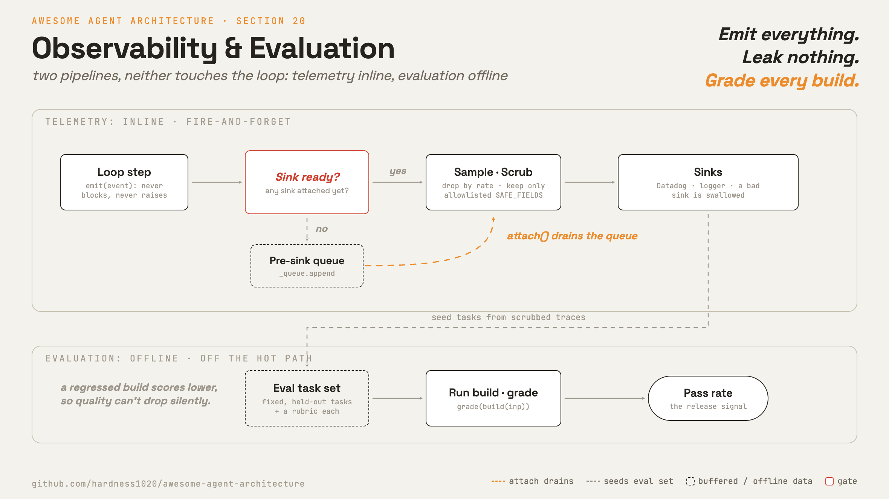

# 20 · Observability & evaluation

**English** · [繁體中文](README.zh-TW.md) · [简体中文](README.zh-CN.md)

> You cannot fix what you cannot see, and you cannot grade a run nobody recorded.

An agent runs unattended, takes side effects, and spends money. A model call is a black box: it burns tokens and triggers real actions.

Without instrumentation you cannot answer the basic questions. What did it do. How often did a tool fail. What did this session cost.

This section owns the record: one trace per run, spend attributed to the task that caused it, and events clean enough to store and share.

Whether a change made quality better or worse is a separate job with its own section (section 23). It runs on what this section records.

Leave the record out and every cost spike is a surprise, every bug report is unreproducible, and the eval set has nothing real to draw from.

---

## Mechanism



Two separable pipelines that never touch the loop's control flow.

Telemetry runs inline: each step calls a fire-and-forget logger.

Events go to sinks, destinations such as the terminal, a file, or a backend like Datadog.
The logger queues events until a sink attaches, then samples, scrubs sensitive fields, and fans out.

Evaluation runs offline against its own task set (section 23). This section is where those tasks come from.

- `emit` never blocks and never raises, so a logging fault cannot stall or crash the loop (section 1).
- Events buffer in a queue until a sink attaches, then drain, so the loop can log before telemetry is ready.
- Sampling drops events by rate; scrubbing keeps only allowlisted fields, so code and paths never leak.
- A parent link on each event turns the flat stream into one tree per run, which is what makes a finished run readable.
- Cost accumulates per model into one USD total, and per task, so a single runaway run is visible instead of averaged away.
- Scrubbed traces of failed and expensive runs become eval tasks, so the offline suite tracks what production actually sees.

### New: fire-and-forget event logging

`telemetry.py` emits events that queue until a sink attaches, then sample, scrub, and fan out. `emit` never raises:

```python
def emit(self, name, **meta):                          # src/telemetry.py
    if not self.sinks:
        self._queue.append((name, meta))               # buffer until a sink is ready
        return
    self._deliver(name, meta)

def _deliver(self, name, meta):
    if not self.sample(name):                          # dropped by sampling rate
        return
    clean = scrub(meta)                                # allowlist before any backend sees it
    for sink in self.sinks:
        try:
            sink(name, clean)
        except Exception:                              # one bad sink never breaks the loop
            pass
```

- Before any sink attaches, events buffer in `_queue`; `attach` drains them through the same `_deliver` path, so queued events are sampled and scrubbed too.
- `scrub` keeps only `SAFE_FIELDS`, so a value not known safe (code, a file path, a prompt) never reaches a backend.
- A sink that throws is swallowed, so one broken backend cannot stall or crash the loop.

### Spans, not flat events

A flat stream says a call happened. It does not say which step it belonged to. One request fans out into model calls, tool calls, and retrievals,
some nested, some in parallel, and putting that back together by timestamp is guesswork.

A trace is one run. A span is one unit of work inside it. Each span carries a start time, a duration, a status, and the id of its parent,
so the spans of a run form a tree. Reading the tree top down shows which step failed, which one was slow, and what each subtree cost.

Two conventions carry it. OpenTelemetry defines the span itself: trace id, parent link, timings, status, attributes.
OpenInference names the LLM-specific attributes on top of it: prompt, completion, model, token counts, tool call.
Instrument once against those names and the backend becomes a deployment choice, not a rewrite.

Export stays off the hot path for the same reason `emit` does. Spans queue and flush in batches from a background worker, so a slow collector costs the run nothing.
This section's `emit` is the flat version of all this. Adding a trace id and a parent span id to the same events is the whole upgrade.

### New: per-model cost and offline eval

Cost accumulates per model into one running USD total:

```python
def add(self, model, input_tokens, output_tokens):    # src/telemetry.py
    i, o = self.by_model.get(model, (0, 0))
    self.by_model[model] = (i + input_tokens, o + output_tokens)
    pi, po = PRICES.get(model, (0.0, 0.0))             # modelCost.ts pricing tiers
    self.cost_usd += input_tokens * pi + output_tokens * po
    return self.cost_usd
```

- `add` looks up per-token pricing and rolls the spend into `cost_usd`, the number surfaced live and on exit.
- That total is the coarsest useful number. It says what the session cost, never which task spent it.

Agent cost does not grow with the step count. Every turn resends the whole conversation, so a tool result returned on turn two is billed again on turns three, four, and five.
Each addition to the context is paid for by every turn after it, so total spend climbs closer to the square of the turn count than to the count itself.
Prompt caching (section 10) and compaction (section 8) each cut part of that, and the savings do not add up: compaction removes the tokens caching would have discounted.

So attribute cost per task, not only per session, and cap it per task. The cap stops a run the way the step limit stops a loop that will not finish (section 1).
The book chapter this comes from carries no external citation for it, so treat the shape as the author's field account, not a measured curve.

`run_eval` in this section's source is the smallest possible eval: replay a fixed task set against a candidate build, count the passes, return a rate.
Section 23 puts an environment, a simulated user, and repeat runs under that entry point, and shows why a small drop in the rate is often noise rather than a regression.

### Traces feed the eval set

The two pipelines meet in one direction: production traces become eval tasks.

- **Filter.** Keep the runs worth learning from: errors, runs the user retried or corrected, and runs that cost far above the median. A clean run teaches the suite nothing.
- **Scrub.** The allowlist that keeps code and paths out of a backend keeps them out of the task file too. A task set carrying a customer's paths cannot be shared.
- **Replay.** The trace holds the starting state and every tool call, so it rebuilds into a task: this state, this request, this outcome that should have happened.

Run it continuously and the eval set follows the live distribution instead of the one someone guessed at the start. Section 23 grades what lands here.

### How it integrates

The demo rides telemetry on the model wrapper. The loop does not change:

```python
def model(messages, registry, system):
    r = client.messages.create(...)
    cost.add(MODEL, r.usage.input_tokens, r.usage.output_tokens)   # cost rollup
    tel.emit("model_call", model=MODEL, tokens=..., cost_usd=...)  # scrubbed event
    return r
run_turn([...goal...], lambda m, r, s: model(m, r, SYSTEM), reg, Session(mode=DEFAULT))   # the one agent call
```

- Telemetry observes from outside: the wrapper emits an event and tracks cost, so `run_turn` and dispatch stay byte-identical to section 13.
- The sink prints each event; the session cost prints at the end; then an offline `run_eval` grades a fixed task set.
- Everything upstream is unchanged. Observability is a side-observer, not a new step in the loop.

---

## Per system

How each agent emits telemetry, tracks spend, and feeds the eval set.

| | Claude Code | mini-swe-agent |
| --- | --- | --- |
| **Pros** | Rich production visibility, cheap and safe. A bad sink never stalls the loop. | Even a crashed run leaves a file. Files double as audit log and eval corpus. |
| **Cons** | Says what happened, not whether it was good. Flat events, so a run is reassembled by hand. | Almost no production telemetry. No live event stream to watch. |
| **Why** | Production must be watched for crashes and cost spikes, without touching the loop. | Quality is graded offline by benchmark, so the full run record matters most. |
| **How: telemetry** | Events queue until a sink attaches, then sample, scrub, and fan out. | One trajectory file per run: messages, config, cost, exit status, saved each step. |
| **How: cost tracking** | Per-model tokens priced into one session USD total, shown on exit. | litellm prices each call into run and global totals; unknown models raise errors. |
| **How: eval feed** | Not in source; reconstruction: scrubbed traces become regression cases. | Saved trajectories are the corpus; a shipped benchmark runner grades a task set. |

---

## Failure modes

- **Telemetry on the hot path.** A logging call that blocks or throws stalls the loop (section 1), and so does a span exporter that waits on the network.
  Mitigation: fire-and-forget with a pre-sink queue, a per-sink killswitch, and batched export from a background worker.
- **Sensitive data leaks into logs.** Code, file paths, or prompts land in a general-access backend, or in a task file built from a trace.
  Mitigation: allowlist loggable fields and scrub the rest before fan-out or storage.
- **A flat stream with no parent link.** Nothing says which model call belonged to which step, so a failed run has to be reassembled by timestamp.
  Mitigation: a trace id and a parent span id on every event, under naming conventions the backend already understands.
- **Cost drift goes unnoticed.** A model swap or a runaway loop multiplies spend, and one session total hides the single task that burned it.
  Mitigation: per-model and per-task totals surfaced live and on exit, a per-task cap, and the loop's step ceiling (section 1).
- **The eval set drifts from production.** Offline tasks miss real usage, so the suite passes while users fail (section 23).
  Mitigation: keep filtering scrubbed traces of failed and expensive runs into the task set.

---

## Runnable

[`src/`](src/) carries 19 forward and adds:

- [`telemetry.py`](src/telemetry.py): the event logger (`Telemetry.emit`, queue and drain, `sample`, `scrub`), the per-model `CostTracker`, and the offline `run_eval`.
- [`test.py`](src/test.py): queue-then-drain, sampling, scrub plus sink isolation over a real tool dispatch, per-model cost, and an eval that catches a regressed build.
- [`demo.py`](src/demo.py): one agent turn observed by telemetry on the model wrapper, a live session cost, then an offline eval.

The loop and dispatch do not change. Telemetry observes from outside, and the eval it feeds runs off the hot path (section 23).

```bash
python sections/20-observability/src/test.py         # offline checks, no key
uv run python sections/20-observability/src/demo.py  # live demo, needs a key
```

---

## Sources

- [Claude Code analytics](https://github.com/yasasbanukaofficial/claude-code):
  `services/analytics/index.ts` (queue + `logEvent`), `sink.ts`, `datadog.ts`, `firstPartyEventLogger.ts`, `sinkKillswitch.ts`, `shouldSampleEvent`.
- [Claude Code cost and diagnostics](https://github.com/yasasbanukaofficial/claude-code):
  `cost-tracker.ts`, `utils/modelCost.ts`, `costHook.ts` (`formatTotalCost`), `diagnosticTracking.ts`, `upstreamproxy/relay.ts`.
- [ai-agent-book](https://github.com/bojieli/ai-agent-book): `book/chapter6.md`, Chinese original canonical.
  The span tree, nonlinear agent cost with per-task caps, and production traces recycled into the eval set.
  The cost analysis carries no external citation there, so it is single-source.
- [OpenTelemetry tracing](https://opentelemetry.io/docs/specs/otel/trace/api/): the span itself, its parent link, timings, status, and attributes.
- [OpenInference](https://github.com/Arize-ai/openinference): the semantic conventions that name LLM and tool attributes on a span.
- Evaluation is not present in the Claude Code source, and section 23 owns it here. Held-out task sets and LLM-as-judge remain reconstruction and general practice.
- [mini-swe-agent source](https://github.com/swe-agent/mini-swe-agent):
  `serialize` and `save` in `agents/default.py`, `GLOBAL_MODEL_STATS` in `models/__init__.py`, `run/benchmarks/swebench.py`, `run/utilities/inspector.py`.
- Framing: [learn-claude-code · s20_comprehensive](https://github.com/shareAI-lab/learn-claude-code).
