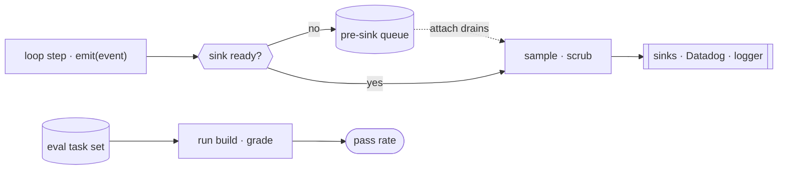

# 20 · Observability & evaluation

[English](README.md) · [繁體中文](README.zh-TW.md) · **简体中文**

> 你无法修好你看不见的东西，也无法信任你从未测量过的东西。

一个 agent 无人看管地运行、产生副作用，还花钱。一次模型调用是个黑盒子：它烧 token，并触发真实的动作。

没有 instrumentation，你连最基本的问题都答不出来。它做了什么。某个工具失败了几次。这个 session 花了多少钱。上一次发布是否变差了。

有两项工作能回答这些问题。observability 监看正式环境：每一步一个 event、追踪花费、可重建的 run。evaluation 判断一次变更让质量变好还是变差。

两者都不做，那么每次 regression 都会无声上线，每次成本暴涨都是意外，而每份 bug 报告都无法重现，因为什么都没被记录下来。

---

## 机制

两条可分离的 pipeline，都不碰 loop 的控制流。

telemetry 内联运行：每一步调用一个发射即忘（fire-and-forget）的 logger，它会先排入队列直到某个 sink 接上，然后采样、洗掉敏感字段，再扇出。

evaluation 离线运行：把一组固定的 task 集重播到某个候选 build 上，并为每个输出评分。



- `emit` 永不阻塞、永不抛异常，所以一次 logging 故障无法卡住或弄垮 loop（第 1 章）。
- event 会在队列里缓冲直到某个 sink 接上，然后排空，所以 loop 在 telemetry 就绪之前就能 log。
- 采样按速率丢弃 event；scrub 只保留白名单字段，所以代码与路径永不外泄。
- 成本按模型累加成一个 USD 总额，实时显示并在退出时显示。
- eval 在热路径之外：它为一组固定的 task 集评分，所以一次悄悄的质量下滑会在用户遇到之前被抓到。

### New: fire-and-forget event logging

`telemetry.py` 发射 event，它们会排入队列直到某个 sink 接上，然后采样、scrub、扇出。`emit` 永不抛异常：

```python
def emit(self, name, **meta):                          # src/telemetry.py
    if not self.sinks:
        self._queue.append((name, meta))               # buffer until a sink is ready
        return
    self._deliver(name, meta)

def _deliver(self, name, meta):
    if not self.sample(name):                          # dropped by sampling rate
        return
    clean = scrub(meta)                                # allowlist before any backend sees it
    for sink in self.sinks:
        try:
            sink(name, clean)
        except Exception:                              # one bad sink never breaks the loop
            pass
```

- 在任何 sink 接上之前，event 会在 `_queue` 里缓冲；`attach` 通过同一条 `_deliver` 路径把它们排空，所以排队的 event 同样会被采样与 scrub。
- `scrub` 只保留 `SAFE_FIELDS`，所以一个未知安全的值（代码、文件路径、prompt）永远不会抵达 backend。
- 一个抛异常的 sink 会被吞掉，所以一个坏掉的 backend 无法卡住或弄垮 loop。

### New: per-model cost and offline eval

成本按模型累加成一个滚动的 USD 总额：

```python
def add(self, model, input_tokens, output_tokens):    # src/telemetry.py
    i, o = self.by_model.get(model, (0, 0))
    self.by_model[model] = (i + input_tokens, o + output_tokens)
    pi, po = PRICES.get(model, (0.0, 0.0))             # modelCost.ts pricing tiers
    self.cost_usd += input_tokens * pi + output_tokens * po
    return self.cost_usd
```

而 evaluation 把一组固定的 task 集重播到某个候选 build 上，并为每个输出评分：

```python
def run_eval(build, tasks):                            # src/telemetry.py
    verdicts = [bool(grade(build(inp))) for inp, grade in tasks]
    passed = sum(verdicts)
    return {"passed": passed, "total": len(tasks), "rate": passed / len(tasks), "verdicts": verdicts}
```

- `add` 查出每 token 的定价，并把花费滚进 `cost_usd`，也就是实时与退出时显示的那个数字。
- `run_eval` 用各自的评分准则为每个输出评分，并返回一个 pass rate；一个退步的 build 分数较低，这就是发布信号。
- 这两条 pipeline 共用一套词汇（event 名称、成本单位），所以一个漂移的 metric 能对应回一个本该抓到它的 eval。

### How it integrates

demo 把 telemetry 挂在 model wrapper 上。loop 不变：

```python
def model(messages, registry, system):
    r = client.messages.create(...)
    cost.add(MODEL, r.usage.input_tokens, r.usage.output_tokens)   # cost rollup
    tel.emit("model_call", model=MODEL, tokens=..., cost_usd=...)  # scrubbed event
    return r
run_turn([...goal...], lambda m, r, s: model(m, r, SYSTEM), reg, Session(mode=DEFAULT))   # the one agent call
```

- telemetry 从外部观察：wrapper 发射一个 event 并追踪成本，所以 `run_turn` 与 dispatch 与第 13 章逐字节相同。
- sink 打印出每个 event；session 成本在最后打印出；接着一个离线 `run_eval` 为一组固定的 task 集评分。
- 上游的一切都不变。observability 是一个旁观者，不是 loop 里的一个新步骤。

---

## 各系统做法

每个 agent 如何发射 telemetry、追踪花费、测量质量。

| System | Telemetry | Cost tracking | Evaluation |
| --- | --- | --- | --- |
| **Claude Code** | 先排队再扇出到 sink，经过采样与 scrub。 | 每模型 token 滚进一个 session USD 总额。 | 源码中没有；为重建。 |

### Claude Code

- `services/analytics/index.ts` 提供带队列的 `logEvent`，所以 loop 与工具在 sink 就绪之前就能发射；`attachAnalyticsSink` 排空缓冲。
- `sink.ts` 扇出到 Datadog（`datadog.ts`）与一个第一方 logger（`firstPartyEventLogger.ts`）；每个 sink 都可单独关闭（`sinkKillswitch.ts`）。
- 采样是 `shouldSampleEvent` 对照 `tengu_event_sampling_config`；event 在扇出之前按速率丢弃。
- 敏感数据由标记类型 `AnalyticsMetadata_I_VERIFIED_THIS_IS_NOT_CODE_OR_FILEPATHS` 与 `_PII_TAGGED` 把关；`stripProtoFields` 移除受保护的键。
- `cost-tracker.ts` 从 `utils/modelCost.ts` 的定价层级累加每模型 token 成本（`addToTotalSessionCost`）；`costHook.ts` 在退出时打印出 `formatTotalCost()`。
- `diagnosticTracking.ts` 把 LSP 错误与一份编辑前基准做 diff，抓得到新的代码错误，但抓不到答案质量。
- 企业版部署通过 `upstreamproxy/relay.ts` 把出向流量打隧道，它会注入组织凭证（例如 `DD-API-KEY`），所以路由由组织掌控。
- evaluation 不在这份源码里。一般做法：一组保留（held-out）的 task 集按 build 评分，并从 scrub 过的 trace 播种。

> **取舍：** 内联 logging 加上采样与 scrub，以低成本又安全地换来丰富的正式环境可见度，但它只告诉你发生了什么。
> 答案好不好，需要一个独立的离线 eval 搭配评分过的 task。
> telemetry 抓崩溃与成本暴涨；唯有 evaluation 才抓得到答案质量上一次悄悄的 regression。

---

## 失效模式

- **telemetry 落在热路径上：**一个会阻塞或抛异常的 logging 调用会卡住 loop（第 1 章）。缓解：发射即忘，搭配 pre-sink 队列与每 sink killswitch。
- **敏感数据泄漏到 log：**代码、文件路径或 prompt 落进一个一般访问的 backend。缓解：白名单可记录字段，扇出前 scrub 掉其余。
- **成本漂移没被察觉：**一次模型替换或失控 loop 会让花费倍增。缓解：实时与退出时显示每模型总额，加上 loop 的步数上限（第 1 章）。
- **没有 regression 信号：**没有一套 eval，一次 prompt 或 harness 变更就上线，质量默默下滑。缓解：一组保留的 task 集按 build 评分，作为发布的闸门。
- **eval 与正式环境不符：**离线 task 漏掉了真实用法，于是套件通过而用户失败。缓解：从 scrub 过的 trace 播种 task，让两者共用同一个分布。

---

## 可执行程序

[`src/`](src/) 承接第 19 章并加上：

- [`telemetry.py`](src/telemetry.py)：event logger（`Telemetry.emit`、排队与排空、`sample`、`scrub`）、每模型的 `CostTracker`，以及离线的 `run_eval`。
- [`test.py`](src/test.py)：排队再排空、采样、scrub 加上真实工具 dispatch 上的 sink 隔离、每模型成本，以及一个抓到退步 build 的 eval。
- [`demo.py`](src/demo.py)：一轮 agent 由挂在 model wrapper 上的 telemetry 观察、一个实时 session 成本，接着一个离线 eval。

loop 与 dispatch 都不变。telemetry 从外部观察；eval 在热路径之外运行。

```bash
python sections/20-observability/src/test.py         # offline checks, no key
uv run python sections/20-observability/src/demo.py  # live demo, needs a key
```

---

## 来源

- Claude Code analytics：`services/analytics/index.ts`（queue + `logEvent`）、`sink.ts`、`datadog.ts`、`firstPartyEventLogger.ts`、`sinkKillswitch.ts`、`shouldSampleEvent`。
- Claude Code cost and diagnostics：`cost-tracker.ts`、`utils/modelCost.ts`、`costHook.ts`（`formatTotalCost`）、`diagnosticTracking.ts`、`upstreamproxy/relay.ts`。
- evaluation 不在这份源码里。eval harness、SWE-bench 风格的套件，以及 LLM-as-judge，均以重建与一般做法描述。
- 章节定位：learn-claude-code · s20_comprehensive。
