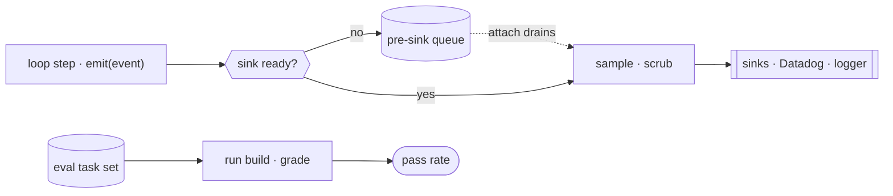

# 20 · Observability & evaluation

[English](README.md) · **繁體中文**

> 你無法修好你看不見的東西，也無法信任你從未量測過的東西。

一個 agent 無人看管地運行、產生副作用，還花錢。一次模型呼叫是個黑盒子：它燒 token，並觸發真實的動作。

沒有 instrumentation，你連最基本的問題都答不出來。它做了什麼。某個工具失敗了幾次。這個 session 花了多少錢。上一次發佈是否變差了。

有兩項工作能回答這些問題。observability 監看正式環境：每一步一個 event、追蹤花費、可重建的 run。evaluation 判斷一次變更讓品質變好還是變差。

兩者都不做，那麼每次 regression 都會無聲上線，每次成本暴衝都是意外，而每份 bug 回報都無法重現，因為什麼都沒被記錄下來。

---

## 機制

兩條可分離的 pipeline，都不碰 loop 的控制流。

telemetry 內聯運行：每一步呼叫一個發射即忘（fire-and-forget）的 logger，它會先排入佇列直到某個 sink 接上，然後採樣、洗掉敏感欄位，再扇出。

evaluation 離線運行：把一組固定的 task 集重播到某個候選 build 上，並為每個輸出評分。



- `emit` 永不阻塞、永不拋例外，所以一次 logging 故障無法卡住或弄垮 loop（第 1 章）。
- event 會在佇列裡緩衝直到某個 sink 接上，然後排空，所以 loop 在 telemetry 就緒之前就能 log。
- 採樣依速率丟棄 event；scrub 只保留白名單欄位，所以程式碼與路徑永不外洩。
- 成本按模型累加成一個 USD 總額，即時顯示並在退出時顯示。
- eval 在熱路徑之外：它為一組固定的 task 集評分，所以一次悄悄的品質下滑會在使用者遇到之前被抓到。

### New: fire-and-forget event logging

`telemetry.py` 發射 event，它們會排入佇列直到某個 sink 接上，然後採樣、scrub、扇出。`emit` 永不拋例外：

```python
def emit(self, name, **meta):                          # src/telemetry.py
    if not self.sinks:
        self._queue.append((name, meta))               # buffer until a sink is ready
        return
    self._deliver(name, meta)

def _deliver(self, name, meta):
    if not self.sample(name):                          # dropped by sampling rate
        return
    clean = scrub(meta)                                # allowlist before any backend sees it
    for sink in self.sinks:
        try:
            sink(name, clean)
        except Exception:                              # one bad sink never breaks the loop
            pass
```

- 在任何 sink 接上之前，event 會在 `_queue` 裡緩衝；`attach` 透過同一條 `_deliver` 路徑把它們排空，所以排隊的 event 同樣會被採樣與 scrub。
- `scrub` 只保留 `SAFE_FIELDS`，所以一個未知安全的值（程式碼、檔案路徑、prompt）永遠不會抵達 backend。
- 一個拋例外的 sink 會被吞掉，所以一個壞掉的 backend 無法卡住或弄垮 loop。

### New: per-model cost and offline eval

成本按模型累加成一個滾動的 USD 總額：

```python
def add(self, model, input_tokens, output_tokens):    # src/telemetry.py
    i, o = self.by_model.get(model, (0, 0))
    self.by_model[model] = (i + input_tokens, o + output_tokens)
    pi, po = PRICES.get(model, (0.0, 0.0))             # modelCost.ts pricing tiers
    self.cost_usd += input_tokens * pi + output_tokens * po
    return self.cost_usd
```

而 evaluation 把一組固定的 task 集重播到某個候選 build 上，並為每個輸出評分：

```python
def run_eval(build, tasks):                            # src/telemetry.py
    verdicts = [bool(grade(build(inp))) for inp, grade in tasks]
    passed = sum(verdicts)
    return {"passed": passed, "total": len(tasks), "rate": passed / len(tasks), "verdicts": verdicts}
```

- `add` 查出每 token 的定價，並把花費滾進 `cost_usd`，也就是即時與退出時顯示的那個數字。
- `run_eval` 用各自的評分準則為每個輸出評分，並回傳一個 pass rate；一個退步的 build 分數較低，這就是發佈訊號。
- 這兩條 pipeline 共用一套詞彙（event 名稱、成本單位），所以一個漂移的 metric 能對應回一個本該抓到它的 eval。

### How it integrates

demo 把 telemetry 掛在 model wrapper 上。loop 不變：

```python
def model(messages, registry, system):
    r = client.messages.create(...)
    cost.add(MODEL, r.usage.input_tokens, r.usage.output_tokens)   # cost rollup
    tel.emit("model_call", model=MODEL, tokens=..., cost_usd=...)  # scrubbed event
    return r
run_turn([...goal...], lambda m, r, s: model(m, r, SYSTEM), reg, Session(mode=DEFAULT))   # the one agent call
```

- telemetry 從外部觀察：wrapper 發射一個 event 並追蹤成本，所以 `run_turn` 與 dispatch 與第 13 章逐位元組相同。
- sink 印出每個 event；session 成本在最後印出；接著一個離線 `run_eval` 為一組固定的 task 集評分。
- 上游的一切都不變。observability 是一個旁觀者，不是 loop 裡的一個新步驟。

---

## 各系統做法

每個 agent 如何發射 telemetry、追蹤花費、量測品質。

| System | Telemetry | Cost tracking | Evaluation |
| --- | --- | --- | --- |
| **Claude Code** | 先排隊再扇出到 sink，經過採樣與 scrub。 | 每模型 token 滾進一個 session USD 總額。 | 原始碼中沒有；為重建。 |

### Claude Code

- `services/analytics/index.ts` 提供帶佇列的 `logEvent`，所以 loop 與工具在 sink 就緒之前就能發射；`attachAnalyticsSink` 排空緩衝。
- `sink.ts` 扇出到 Datadog（`datadog.ts`）與一個第一方 logger（`firstPartyEventLogger.ts`）；每個 sink 都可個別關閉（`sinkKillswitch.ts`）。
- 採樣是 `shouldSampleEvent` 對照 `tengu_event_sampling_config`；event 在扇出之前依速率丟棄。
- 敏感資料由標記型別 `AnalyticsMetadata_I_VERIFIED_THIS_IS_NOT_CODE_OR_FILEPATHS` 與 `_PII_TAGGED` 把關；`stripProtoFields` 移除受保護的鍵。
- `cost-tracker.ts` 從 `utils/modelCost.ts` 的定價層級累加每模型 token 成本（`addToTotalSessionCost`）；`costHook.ts` 在退出時印出 `formatTotalCost()`。
- `diagnosticTracking.ts` 把 LSP 錯誤與一份編輯前基準做 diff，抓得到新的程式碼錯誤，但抓不到答案品質。
- 企業版部署透過 `upstreamproxy/relay.ts` 把出向流量打隧道，它會注入組織憑證（例如 `DD-API-KEY`），所以路由由組織掌控。
- evaluation 不在這份原始碼裡。一般做法：一組保留（held-out）的 task 集按 build 評分，並從 scrub 過的 trace 播種。

> **取捨：** 內聯 logging 加上採樣與 scrub，以低成本又安全地換來豐富的正式環境可見度，但它只告訴你發生了什麼。
> 答案好不好，需要一個獨立的離線 eval 搭配評分過的 task。
> telemetry 抓當機與成本暴衝；唯有 evaluation 才抓得到答案品質上一次悄悄的 regression。

---

## 失效模式

- **telemetry 落在熱路徑上。** 一個會阻塞或拋例外的 logging 呼叫會卡住 loop（第 1 章）。緩解：發射即忘，搭配 pre-sink 佇列與每 sink killswitch。
- **敏感資料洩漏到 log。** 程式碼、檔案路徑或 prompt 落進一個一般存取的 backend。緩解：白名單可記錄欄位，扇出前 scrub 掉其餘。
- **成本漂移沒被察覺。** 一次模型替換或失控 loop 會讓花費倍增。緩解：即時與退出時顯示每模型總額，加上 loop 的步數上限（第 1 章）。
- **沒有 regression 訊號。** 沒有一套 eval，一次 prompt 或 harness 變更就上線，品質默默下滑。緩解：一組保留的 task 集按 build 評分，作為發佈的閘門。
- **eval 與正式環境不符。** 離線 task 漏掉了真實用法，於是套件通過而使用者失敗。緩解：從 scrub 過的 trace 播種 task，讓兩者共用同一個分布。

---

## 可執行程式

[`src/`](src/) 承接第 19 章並加上：

- [`telemetry.py`](src/telemetry.py)：event logger（`Telemetry.emit`、排隊與排空、`sample`、`scrub`）、每模型的 `CostTracker`，以及離線的 `run_eval`。
- [`test.py`](src/test.py)：排隊再排空、採樣、scrub 加上真實工具 dispatch 上的 sink 隔離、每模型成本，以及一個抓到退步 build 的 eval。
- [`demo.py`](src/demo.py)：一輪 agent 由掛在 model wrapper 上的 telemetry 觀察、一個即時 session 成本，接著一個離線 eval。

loop 與 dispatch 都不變。telemetry 從外部觀察；eval 在熱路徑之外運行。

```bash
python sections/20-observability/src/test.py         # offline checks, no key
uv run python sections/20-observability/src/demo.py  # live demo, needs a key
```

---

## 出處

- Claude Code analytics：`services/analytics/index.ts`（queue + `logEvent`）、`sink.ts`、`datadog.ts`、`firstPartyEventLogger.ts`、`sinkKillswitch.ts`、`shouldSampleEvent`。
- Claude Code cost and diagnostics：`cost-tracker.ts`、`utils/modelCost.ts`、`costHook.ts`（`formatTotalCost`）、`diagnosticTracking.ts`、`upstreamproxy/relay.ts`。
- evaluation 不在這份原始碼裡。eval harness、SWE-bench 風格的套件，以及 LLM-as-judge，均以重建與一般做法描述。
- 章節定位：learn-claude-code · s20_comprehensive。
</content>
