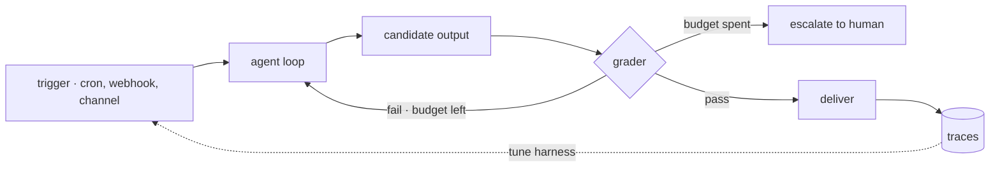

# 21 · Loop engineering

**English** · [繁體中文](README.zh-TW.md) · [简体中文](README.zh-CN.md)

> Stop writing the next prompt. Design the loop that runs the agent without you.

Every earlier section adds one mechanism around one model call. This section composes them.

Loop engineering names a shift in where the engineering effort goes.
Instead of prompting an agent turn by turn, you build the outer system that discovers work, runs the agent, checks the output, and decides what happens next.
The human moves from operator to designer.

An outer loop must:

1. Start runs from triggers, not only from a user (section 14).
2. Check output before it counts as done.
3. Stop on a budget, not on hope.
4. Persist state so the next run continues instead of restarting (sections 9, 12).
5. Report what happened, even when nobody was watching (section 20).

Without this layer, a human is the outer loop. They prompt, read, judge, and retry by hand, and the agent stops working the moment they do.

---

## Mechanism

The simple version: the agent loop, wrapped by three more loops. Each wraps the one inside it, and each answers a different question.

1. **Agent loop** (section 1). Calls tools until the task looks done. Answers: how does one step get done.
2. **Verification loop.** Grades the output against a rubric. A failure feeds back into a retry, up to a budget. Answers: is it actually done.
3. **Event loop.** Cron schedules, webhooks, and channels start runs (section 14, section 19). Answers: when does work start.
4. **Improvement loop.** Traces and evals (section 20) feed changes to the harness config, skills, or model. Answers: does the system get better.
   At its mature end this loop edits the harness itself: mine weaknesses from traces, propose a bounded edit, validate it against a regression set.
   The loop structure becomes a search space, not a hand-designed template.



Data moves outward. A trigger fires and enqueues a prompt. The agent loop produces a candidate. The grader scores it.
A failure appends feedback and retries while budget remains. A pass delivers through the task's channel.
The run's trace lands in telemetry, where the improvement loop reads it.

### New: the verification loop

The one loop earlier sections did not build. The inner loop stops when the model says it is done. The verification loop makes "done" a checked claim:

```python
def verified_run(task, worker, checker, budget=2):    # src/verify.py
    feedback = ""
    attempts = []
    for n in range(1, budget + 1):                    # the ceiling: harness-enforced
        out = worker(task + feedback)                 # the inner loop (section 1)
        verdict = checker(task, out)                  # a separate checker (section 6)
        attempts.append({"attempt": n, "passed": verdict["passed"], "reason": verdict["reason"]})
        if verdict["passed"]:
            return {"ok": True, "output": out, "attempts": attempts}
        feedback = f"\n\nA prior attempt was rejected... Why it failed: {verdict['reason']}"
    return {"ok": False, "output": None, "attempts": attempts}   # budget spent: escalate
```

- The grader is a separate agent with a fresh context (section 6). A worker that grades its own output tends to pass it.
  `agent_checker` builds one: each grade runs the inner loop on a new `messages[]`, with PASS or FAIL as the first word of the verdict.
- The rubric is fixed outside the loop. The model can satisfy it, not rewrite it.
- Feedback is data. The failed verdict rides into the retry as part of the prompt, so attempt two knows what attempt one got wrong.
- `ok: False` is the escalation signal. The record of attempts goes to a human; the loop does not retry forever.

### Budgets and stop conditions

Every loop needs a ceiling the model cannot talk its way past: an iteration count, a token budget, a wall-clock limit, or a dry counter (stop after K rounds that find nothing new).

The harness enforces the ceiling. Asking the model to please stop is a hint, not a stop condition.
In `verified_run` the ceiling is the `range()` bound: attempt `budget + 1` cannot happen.

### Maturity levels

The loop-engineering sources grade loops by how much they are trusted to do:

- **L1 · Report.** The loop reads and reports. A human acts.
- **L2 · Assisted.** The loop drafts the change. A human approves it.
- **L3 · Unattended.** The loop acts. A human audits after the fact.

The level is a permissions decision (section 3). Promote a loop one level only after its output at the current level has been boringly correct.

### How it integrates

This section adds no new primitive. It is the composition of earlier ones:

- Triggers are section 14 schedules and section 19 channels.
- The worker is the section 1 loop, with section 6 subagents as the maker and checker split.
- Parallel loops isolate in section 15 worktrees.
- State between runs lives in section 9 memory and section 12 task records.
- Reports and traces are section 20. The improvement loop closes section 20's measurements back into harness changes.

The runnable wires it the same way. `run_turn` is byte-identical to section 20; verification wraps it from outside:

```python
def worker(prompt):                                # src/demo.py · the inner loop, unchanged
    return run_turn([{"role": "user", "content": prompt}], model, reg, Session(mode=DEFAULT))

checker = agent_checker(RUBRIC, model)             # a fresh grader agent, no tools
result = verified_run("What is 27 + 15? Use the add tool.", worker, checker, budget=2)
```

What is new is the discipline: grade before done, budget before start, report always.

---

## Per system

How each agent composes its outer loops.

| System | Verification | Event loop | Improvement loop |
| --- | --- | --- | --- |
| **Claude Code** | Scripted verify stages with adversarial patterns. | Cron, self-paced wakeups, remote triggers. | Resumable workflow runs; no closed loop in source. |
| **Hermes Agent** | Maker and checker via delegation; no built-in grader. | Gateway cron with restricted toolsets. | A curator agent consolidates skills from usage. |

### Claude Code

- `/loop <interval> <prompt>` re-runs a prompt on a cadence. Without an interval, the model self-paces with `ScheduleWakeup`, and `stop: true` ends the loop.
- Sentinel prompts (`<<autonomous-loop>>`, `<<autonomous-loop-dynamic>>`) resolve loop instructions at fire time instead of freezing them at create time.
- The `Workflow` tool scripts composition directly: `agent()`, `pipeline()`, and `parallel()` fan work out.
  Its documented quality patterns are verification loops by name: adversarial verify, judge panel, loop-until-dry.
- `budget.remaining()` makes a token target a hard ceiling. Past it, `agent()` throws.
- A lifetime cap of 1000 agents per workflow backstops a runaway script.
- `resumeFromRunId` replays completed `agent()` calls from cache, so a fixed script resumes instead of restarting.
- Cron entries and remote triggers (section 14) supply the event loop.

### Hermes Agent

- `agent/iteration_budget.py` caps inner-loop iterations. The ceiling is harness-side.
- `cron/scheduler.py` fires jobs with restricted toolsets, and `[SILENT]` suppresses delivery when a run finds nothing (section 14).
- Watch patterns in `tools/process_registry.py` wake the agent on matching process output, rate limited with a circuit breaker.
- There is no built-in grade-and-retry loop. Checking runs through `delegate_task()` maker and checker splits (section 6) and offline tests.
- The improvement loop is the skill curator. `tools/skill_manager_tool.py` forks a background review agent that consolidates and prunes skills from usage.
  `hermes_cli/curator.py` can pin, archive, and roll back what it changes.
- `agent/trajectory.py` and `trajectory_compressor.py` turn runs into training data, closing the loop into the model itself.

> **Trade-off:** an unattended loop multiplies output and multiplies mistakes at the same rate.
> Verification and budgets are what make L3 safe to leave running.
> A loop without a grader automates the work. A loop without a budget automates the bill.

---

## Failure modes

- **No stop condition.** A retry loop with no ceiling burns tokens until someone notices the invoice. Mitigation: harness-enforced iteration, token, and time budgets.
- **Self-grading.** The worker passes its own output, so the verification loop verifies nothing. Mitigation: a separate checker agent and a rubric fixed outside the loop.
- **Rubber-stamp rubric.** A grader that always passes is worse than none, because it labels bad output as verified.
  Mitigation: adversarial verify (prompt the checker to refute) and periodic human spot checks.
- **Unattended too early.** A loop gets L3 write access before its L1 reports were ever checked.
  Mitigation: climb the maturity ladder one level at a time, gated by section 3 permissions.
- **Silent drift.** An unattended loop degrades and nobody reads its output. Mitigation: heartbeats, always-delivered reports, and section 20 metrics on pass rate and cost.
- **State amnesia.** Each run rediscovers the same work and redoes it. Mitigation: persist findings to memory or task records (sections 9, 12) and read them at run start.
- **Self-editing harness escapes its gates.** An improvement loop that can modify harness code can modify the code that gates it.
  Mitigation: permissions and budgets live outside anything the loop can edit (section 3).

---

## Runnable

[`src/`](src/) carries 20 forward and adds:

- [`verify.py`](src/verify.py): the verification loop (`verified_run`: grade, feedback retry, budget, escalate) and `agent_checker`, a fresh grader per verdict.
- [`test.py`](src/test.py): offline checks for first-try pass, feedback reaching the retry, the budget ceiling, and the PASS/FAIL verdict contract.
- [`demo.py`](src/demo.py): one live verified run: a worker with the add tool, a separate checker grading a fixed rubric, escalation when the budget is spent.

The loop is unchanged. Verification wraps it from outside.

```bash
python sections/21-loop-engineering/src/test.py         # offline checks, no key
uv run python sections/21-loop-engineering/src/demo.py  # live demo, needs a key
```

---

## Sources

- [cobusgreyling/loop-engineering](https://github.com/cobusgreyling/loop-engineering): building blocks and readiness levels.
- [LangChain · The art of loop engineering](https://www.langchain.com/blog/the-art-of-loop-engineering): the four stacked loops.
- [Addy Osmani · Loop engineering](https://addyosmani.com/blog/loop-engineering/): the composed building blocks.
- [MindStudio · What is loop engineering](https://www.mindstudio.ai/blog/what-is-loop-engineering-autonomous-ai-agent-workflows): goal conditions.
- [Lilian Weng · Harness engineering for self-improvement](https://lilianweng.github.io/posts/2026-07-04-harness/): the improvement loop in depth; gates outside the loop.
- Claude Code: `/loop`, `ScheduleWakeup`, `Workflow` schema. From tool schemas and documented behavior, not the source backup.
- Hermes Agent source: `agent/iteration_budget.py`, `cron/scheduler.py`, `tools/skill_manager_tool.py`, `hermes_cli/curator.py`, `agent/trajectory.py`.
