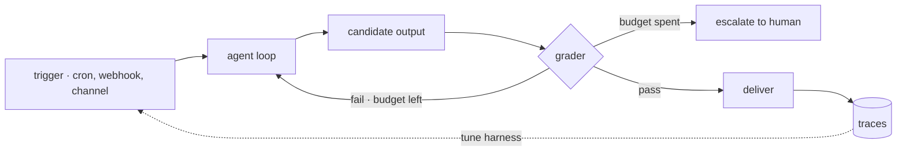

# 21 · Loop engineering

[English](README.md) · [繁體中文](README.zh-TW.md) · **简体中文**

> 别再想下一句 prompt 要写什么。去设计那个不需要你也能把 agent 跑起来的 loop。

前面每一章都是在一次 model 调用的周围加上一个机制。这一章把它们组合起来。

Loop engineering 说的是工程重心的转移。
与其一个 turn 一个 turn 地下 prompt，不如打造外层系统：由它找出要做的工作、把 agent 跑起来、检查输出，再决定下一步。
人从操作者变成设计者。

外层 loop 必须：

1. 由 trigger 启动执行，而不是只靠 user（第 14 章）。
2. 输出要先通过检查，才算完成。
3. 靠 budget（预先设好的花费上限）停下来，而不是靠运气。
4. 把状态存下来，让下一次执行接着做，而不是从头来过（第 9、12 章）。
5. 就算没人在看，也要报告发生了什么（第 20 章）。

少了这一层，外层 loop 就是人本身：下 prompt、读输出、判断、重试都靠手动。人一停下来，agent 也跟着停。

---

## 机制

最简单的说法：agent loop 外面再包三层 loop。一层包着一层，每一层回答一个不同的问题。

1. **Agent loop**（第 1 章）：调用 tool 直到任务看起来完成。回答的是：这一步怎么做完。
2. **验证 loop（verification loop）**：拿 rubric（评分准则）为输出评分。没过就带着 feedback 重试，最多试到 budget 用完。回答的是：是不是真的完成了。
3. **事件 loop（event loop）**：cron 调度、webhook 和 channel 负责启动执行（第 14、19 章）。回答的是：工作什么时候开始。
4. **改进 loop（improvement loop）**：trace 和 eval（第 20 章）回头改 harness 配置、skill 或 model。回答的是：整个系统有没有变好。
   这个 loop 成熟到极致时，改的是 harness 本身：从 trace 里挖出弱点、提出一个范围受限的修改、再用 regression 测试验证。
   loop 的结构本身变成一个可以搜索的空间，而不是手工设计的模板。



数据由内往外流。trigger fire 之后把一个 prompt 放进 queue。agent loop 产出一个候选输出，评分者为它打分。
没过而且 budget 还有剩，就带着 feedback 重试；过了就通过该 task 的 channel 投递出去。
这次执行做了什么，会记录成 trace 留在 telemetry（第 20 章）。改进 loop 之后就是读这些记录，来决定 harness 哪里该改。

### New：验证 loop

这是前面章节唯一没做过的 loop。内层 loop 是 model 自己说完成就停。有了验证 loop，“完成”不再是 model 说了算，要通过检查才算数：

```python
def verified_run(task, worker, checker, budget=2):    # src/verify.py
    feedback = ""
    attempts = []
    for n in range(1, budget + 1):                    # the ceiling: harness-enforced
        out = worker(task + feedback)                 # the inner loop (section 1)
        verdict = checker(task, out)                  # a separate checker (section 6)
        attempts.append({"attempt": n, "passed": verdict["passed"], "reason": verdict["reason"]})
        if verdict["passed"]:
            return {"ok": True, "output": out, "attempts": attempts}
        feedback = f"\n\nA prior attempt was rejected... Why it failed: {verdict['reason']}"
    return {"ok": False, "output": None, "attempts": attempts}   # budget spent: escalate
```

- 评分者是另一个 agent，用全新的 context（第 6 章）。让 worker 评自己的输出，多半都会给过。
  `agent_checker` 做的就是这件事：每次评分都在新的 `messages[]` 上跑内层 loop，verdict 的第一个词是 PASS 或 FAIL。
- rubric 定在 loop 之外。model 只能想办法满足它，不能改写它。
- feedback 是数据。没过的 verdict 会并进重试的 prompt，所以第二次尝试知道第一次错在哪。
- `ok: False` 是要交给人接手的信号。尝试记录会一并交出去；loop 不会永远重试下去。

### Budget 与停止条件

每个 loop 都需要一个 model 说什么都绕不过去的上限：迭代次数、token budget、时间上限，或 dry counter（连续 K 轮都没有新发现就停）。

上限由 harness 强制执行。拜托 model 自己停下来只是提示，不是停止条件。
在 `verified_run` 里，上限就是 `range()` 的边界：第 `budget + 1` 次尝试不可能发生。

### 成熟度等级

Loop engineering 的几个出处都用“敢让它做多少事”来给 loop 分级：

- **L1 · 报告：**loop 只读取和报告。动手的是人。
- **L2 · 协作：**loop 起草修改。由人批准。
- **L3 · 无人看管：**loop 直接动手。人事后审计。

等级是一个权限决定（第 3 章）。只有在当前等级的输出已经稳定到让人觉得无聊时，才把 loop 升一级。

### 如何整合

这一章没有加任何新的基本组件。它是前面各章的组合：

- trigger 是第 14 章的 schedule 和第 19 章的 channel。
- worker 是第 1 章的 loop；maker 和 checker 的分工用第 6 章的 subagent。
- 并行的 loop 用第 15 章的 worktree 隔离。
- 执行之间的状态放在第 9 章的记忆和第 12 章的 task 记录。
- 报告和 trace 是第 20 章。改进 loop 把第 20 章测到的东西接回 harness 的修改。

可执行的 src 也是同样的组合方式。`run_turn` 完全没改，跟第 20 章一模一样；`verified_run` 只是在外面多包一层验证：

```python
def worker(prompt):                                # src/demo.py · the inner loop, unchanged
    return run_turn([{"role": "user", "content": prompt}], model, reg, Session(mode=DEFAULT))

checker = agent_checker(RUBRIC, model)             # a fresh grader agent, no tools
result = verified_run("What is 27 + 15? Use the add tool.", worker, checker, budget=2)
```

这一章新加的是纪律：说完成之前先评分、开始之前先设 budget、无论如何都要报告。

---

## 各系统做法

各个 agent 如何组合自己的外层 loop。

| System | 验证 | 事件 loop | 改进 loop |
| --- | --- | --- | --- |
| **Claude Code** | 以代码编排的 verify 阶段，含对抗式模式。 | Cron、自定节奏唤醒、remote trigger。 | workflow 可断点续跑；源码中没有闭环。 |
| **Hermes Agent** | 靠 delegation 分出 maker 和 checker；没有内置评分者。 | gateway cron 加受限 toolset。 | curator agent 从使用情况整合 skill。 |

### Claude Code

- `/loop <interval> <prompt>` 让一个 prompt 按节奏重复执行。不给 interval 时，model 用 `ScheduleWakeup` 自定节奏，`stop: true` 结束 loop。
- 哨兵 prompt（`<<autonomous-loop>>`、`<<autonomous-loop-dynamic>>`）在 fire 的时刻才解析 loop 指令，而不是在创建时就把内容冻结。
- `Workflow` tool 直接用代码描述组合方式：`agent()`、`pipeline()` 和 `parallel()` 把工作扇出。
  它文档里的质量模式本身就是各种验证 loop：adversarial verify、judge panel、loop-until-dry。
- `budget.remaining()` 把 token 目标变成硬上限。超过之后，`agent()` 会直接抛出错误。
- 每个 workflow 一生最多 1000 个 agent，为失控的 workflow 兜底。
- `resumeFromRunId` 会从缓存重放已完成的 `agent()` 调用，所以修好的 workflow 是接着跑，不是从头跑。
- 事件 loop 由 cron 条目和 remote trigger（第 14 章）提供。

### Hermes Agent

- `agent/iteration_budget.py` 限制内层 loop 的迭代次数。上限在 harness 这一侧。
- `cron/scheduler.py` 用受限的 toolset fire job；执行后没发现值得说的东西时，`[SILENT]` 会抑制投递（第 14 章）。
- `tools/process_registry.py` 的 watch pattern 在 process 输出匹配到时唤醒 agent，带 rate limit 和 circuit breaker。
- 没有内置的评分重试 loop。检查靠 `delegate_task()` 的 maker 和 checker 分工（第 6 章）和离线测试。
- 改进 loop 是 skill curator：`tools/skill_manager_tool.py` fork 一个后台审查 agent，从使用情况整合、修剪 skill。
  `hermes_cli/curator.py` 可以 pin、归档和回滚它改过的东西。
- `agent/trajectory.py` 和 `trajectory_compressor.py` 把执行过程变成训练数据，把这个 loop 一路闭合到 model 本身。

> **取舍：**无人看管的 loop 把产出放大几倍，也把错误放大几倍。
> 让 L3 可以放着跑的，正是验证和 budget。
> 没有评分者的 loop，自动化的是工作；没有 budget 的 loop，自动化的是账单。

---

## 失效模式

- **没有停止条件（No stop condition）：**没有上限的重试 loop 会一直烧 token，直到有人看到账单。缓解：由 harness 强制执行的迭代、token 和时间 budget。
- **自己评自己（Self-grading）：**worker 给自己的输出打分，验证 loop 等于什么都没验。缓解：独立的 checker agent，加上定在 loop 之外的 rubric。
- **评什么都过（Rubber-stamp rubric）：**永远给过的评分者比没有还糟，因为它给烂输出盖上“已验证”的章。
  缓解：对抗式验证（要求 checker 想办法推翻），加上定期的人工抽查。
- **太早放手（Unattended too early）：**L1 的报告从来没人核对过，loop 就拿到了 L3 的写入权限。
  缓解：成熟度阶梯一次只升一级，由第 3 章的权限把关。
- **无声劣化（Silent drift）：**无人看管的 loop 越跑越差，却没有人读它的输出。缓解：heartbeat、一律投递的报告，以及第 20 章对通过率和成本的度量。
- **状态失忆（State amnesia）：**每次执行都重新发现同样的工作、重做一遍。缓解：把发现存进记忆或 task 记录（第 9、12 章），并在执行开始时读取。
- **自我修改的 harness 绕过关卡（Self-editing harness escapes its gates）：**能改 harness 代码的改进 loop，也能改那些把关它的代码。
  缓解：权限和 budget 放在这个 loop 改不到的地方（第 3 章）。

---

## 可执行程序

[`src/`](src/) 把 20 带了过来，并加上：

- [`verify.py`](src/verify.py)：验证 loop（`verified_run`：评分、带 feedback 重试、budget、交回给人）和 `agent_checker`，每个 verdict 都由一个全新的评分者做出。
- [`test.py`](src/test.py)：离线检查第一次就通过、feedback 有进到重试、budget 上限，以及 PASS/FAIL 的 verdict 约定。
- [`demo.py`](src/demo.py)：实际跑一次 verified run：worker 带着 add tool，独立的 checker 按固定 rubric 评分，budget 用完就交回给人。

loop 本身完全没改，验证那一层是包在外面的。

```bash
python sections/21-loop-engineering/src/test.py         # offline checks, no key
uv run python sections/21-loop-engineering/src/demo.py  # live demo, needs a key
```

---

## 出处

- [cobusgreyling/loop-engineering](https://github.com/cobusgreyling/loop-engineering)：building block 与成熟度分级。
- [LangChain · The art of loop engineering](https://www.langchain.com/blog/the-art-of-loop-engineering)：四层堆叠的 loop。
- [Addy Osmani · Loop engineering](https://addyosmani.com/blog/loop-engineering/)：building block 的组合方式。
- [MindStudio · What is loop engineering](https://www.mindstudio.ai/blog/what-is-loop-engineering-autonomous-ai-agent-workflows)：目标条件。
- [Lilian Weng · Harness engineering for self-improvement](https://lilianweng.github.io/posts/2026-07-04-harness/)：深入讲改进 loop；关卡要放在 loop 之外。
- Claude Code：`/loop` skill、`ScheduleWakeup`、`Workflow` schema。依据 tool schema 与文档记载的行为描述，非 source backup。
- Hermes Agent 源码：`agent/iteration_budget.py`、`cron/scheduler.py`、`tools/skill_manager_tool.py`、`hermes_cli/curator.py`、`agent/trajectory.py`。
