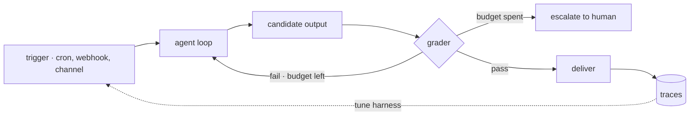

# 21 · Loop engineering

[English](README.md) · **繁體中文**

> 別再想下一句 prompt 要寫什麼。去設計那個不需要你也能把 agent 跑起來的 loop。

前面每一章都是在一次 model 呼叫的周圍加上一個機制。這一章把它們組合起來。

Loop engineering 說的是工程重心的轉移。
與其一個 turn 一個 turn 地下 prompt，不如打造外層系統：由它找出要做的工作、把 agent 跑起來、檢查輸出，再決定下一步。
人從操作者變成設計者。

外層 loop 必須：

1. 由 trigger 啟動執行，而不是只靠 user（第 14 章）。
2. 輸出要先通過檢查，才算完成。
3. 靠 budget（預先設好的花費上限）停下來，而不是靠運氣。
4. 把狀態存下來，讓下一次執行接著做，而不是從頭來過（第 9、12 章）。
5. 就算沒人在看，也要回報發生了什麼（第 20 章）。

少了這一層，外層 loop 就是人本身：下 prompt、讀輸出、判斷、重試都靠手動。人一停下來，agent 也跟著停。

---

## 機制

最簡單的說法：agent loop 外面再包三層 loop。一層包著一層，每一層回答一個不同的問題。

1. **Agent loop**（第 1 章）：呼叫 tool 直到任務看起來完成。回答的是：這一步怎麼做完。
2. **驗證 loop（verification loop）**：拿 rubric（評分準則）替輸出評分。沒過就帶著 feedback 重試，最多試到 budget 用完。回答的是：是不是真的完成了。
3. **事件 loop（event loop）**：cron 排程、webhook 和 channel 負責啟動執行（第 14、19 章）。回答的是：工作什麼時候開始。
4. **改進 loop（improvement loop）**：trace 和 eval（第 20 章）回頭改 harness 設定、skill 或 model。回答的是：整個系統有沒有變好。
   這個 loop 成熟到極致時，改的是 harness 本身：從 trace 裡挖出弱點、提出一個範圍受限的修改、再用 regression 測試驗證。
   loop 的結構本身變成一個可以搜尋的空間，而不是手工設計的模板。



資料由內往外流。trigger fire 之後把一個 prompt 放進 queue。agent loop 產出一個候選輸出，評分者替它打分數。
沒過而且 budget 還有剩，就帶著 feedback 重試；過了就透過該 task 的 channel 投遞出去。
這次執行的 trace 會進到 telemetry，改進 loop 再從那裡讀。

### New：驗證 loop

這是前面章節唯一沒做過的 loop。內層 loop 是 model 自己說完成就停。驗證 loop 把「完成」變成要通過檢查才算數的宣稱：

```python
def verified_run(task, worker, checker, budget=2):    # src/verify.py
    feedback = ""
    attempts = []
    for n in range(1, budget + 1):                    # the ceiling: harness-enforced
        out = worker(task + feedback)                 # the inner loop (section 1)
        verdict = checker(task, out)                  # a separate checker (section 6)
        attempts.append({"attempt": n, "passed": verdict["passed"], "reason": verdict["reason"]})
        if verdict["passed"]:
            return {"ok": True, "output": out, "attempts": attempts}
        feedback = f"\n\nA prior attempt was rejected... Why it failed: {verdict['reason']}"
    return {"ok": False, "output": None, "attempts": attempts}   # budget spent: escalate
```

- 評分者是另一個 agent，用全新的 context（第 6 章）。讓 worker 評自己的輸出，多半都會給過。
  `agent_checker` 做的就是這件事：每次評分都在新的 `messages[]` 上跑內層 loop，verdict 的第一個字是 PASS 或 FAIL。
- rubric 定在 loop 之外。model 只能想辦法滿足它，不能改寫它。
- feedback 是資料。沒過的 verdict 會併進重試的 prompt，所以第二次嘗試知道第一次錯在哪。
- `ok: False` 是要交給人接手的訊號。嘗試紀錄會一併交出去；loop 不會永遠重試下去。

### Budget 與停止條件

每個 loop 都需要一個 model 說什麼都繞不過去的上限：迭代次數、token budget、時間上限，或 dry counter（連續 K 輪都沒有新發現就停）。

上限由 harness 強制執行。拜託 model 自己停下來只是提示，不是停止條件。
在 `verified_run` 裡，上限就是 `range()` 的邊界：第 `budget + 1` 次嘗試不可能發生。

### 成熟度等級

Loop engineering 的幾個出處都用「敢讓它做多少事」來替 loop 分級：

- **L1 · 回報：**loop 只讀取和回報。動手的是人。
- **L2 · 協作：**loop 起草修改。由人核准。
- **L3 · 無人看管：**loop 直接動手。人事後稽核。

等級是一個權限決定（第 3 章）。只有在目前等級的輸出已經穩定到讓人覺得無聊時，才把 loop 升一級。

### 如何整合

這一章沒有加任何新的基本元件。它是前面各章的組合：

- trigger 是第 14 章的 schedule 和第 19 章的 channel。
- worker 是第 1 章的 loop；maker 和 checker 的分工用第 6 章的 subagent。
- 平行的 loop 用第 15 章的 worktree 隔離。
- 執行之間的狀態放在第 9 章的記憶和第 12 章的 task 紀錄。
- 回報和 trace 是第 20 章。改進 loop 把第 20 章量到的東西接回 harness 的修改。

可執行程式也是這樣接的。`run_turn` 和第 20 章一模一樣；驗證從外面把它包起來：

```python
def worker(prompt):                                # src/demo.py · the inner loop, unchanged
    return run_turn([{"role": "user", "content": prompt}], model, reg, Session(mode=DEFAULT))

checker = agent_checker(RUBRIC, model)             # a fresh grader agent, no tools
result = verified_run("What is 27 + 15? Use the add tool.", worker, checker, budget=2)
```

這一章新加的是紀律：說完成之前先評分、開始之前先設 budget、無論如何都要回報。

---

## 各系統做法

各個 agent 如何組合自己的外層 loop。

| System | 驗證 | 事件 loop | 改進 loop |
| --- | --- | --- | --- |
| **Claude Code** | 以程式編排的 verify 階段，含對抗式模式。 | Cron、自訂節奏喚醒、remote trigger。 | workflow 可斷點續跑；原始碼中沒有閉環。 |
| **Hermes Agent** | 靠 delegation 分出 maker 和 checker；沒有內建評分者。 | gateway cron 加受限 toolset。 | curator agent 從使用情況整併 skill。 |

### Claude Code

- `/loop <interval> <prompt>` 讓一個 prompt 按節奏重複執行。不給 interval 時，model 用 `ScheduleWakeup` 自訂節奏，`stop: true` 結束 loop。
- 哨兵 prompt（`<<autonomous-loop>>`、`<<autonomous-loop-dynamic>>`）在 fire 的時刻才解析 loop 指令，而不是在建立時就把內容凍結。
- `Workflow` tool 直接用程式描述組合方式：`agent()`、`pipeline()` 和 `parallel()` 把工作扇出。
  它文件裡的品質模式本身就是各種驗證 loop：adversarial verify、judge panel、loop-until-dry。
- `budget.remaining()` 把 token 目標變成硬上限。超過之後，`agent()` 會直接拋出錯誤。
- 每個 workflow 一生最多 1000 個 agent，替失控的 workflow 兜底。
- `resumeFromRunId` 會從快取重放已完成的 `agent()` 呼叫，所以修好的 workflow 是接著跑，不是從頭跑。
- 事件 loop 由 cron 項目和 remote trigger（第 14 章）提供。

### Hermes Agent

- `agent/iteration_budget.py` 限制內層 loop 的迭代次數。上限在 harness 這一側。
- `cron/scheduler.py` 用受限的 toolset fire job；執行後沒發現值得說的東西時，`[SILENT]` 會抑制投遞（第 14 章）。
- `tools/process_registry.py` 的 watch pattern 在 process 輸出比對到時喚醒 agent，帶 rate limit 和 circuit breaker。
- 沒有內建的評分重試 loop。檢查靠 `delegate_task()` 的 maker 和 checker 分工（第 6 章）和離線測試。
- 改進 loop 是 skill curator：`tools/skill_manager_tool.py` fork 一個背景審查 agent，從使用情況整併、修剪 skill。
  `hermes_cli/curator.py` 可以 pin、封存和回滾它改過的東西。
- `agent/trajectory.py` 和 `trajectory_compressor.py` 把執行過程變成訓練資料，把這個 loop 一路閉合到 model 本身。

> **取捨：**無人看管的 loop 把產出放大幾倍，也把錯誤放大幾倍。
> 讓 L3 可以放著跑的，正是驗證和 budget。
> 沒有評分者的 loop，自動化的是工作；沒有 budget 的 loop，自動化的是帳單。

---

## 失效模式

- **沒有停止條件（No stop condition）：**沒有上限的重試 loop 會一直燒 token，直到有人看到帳單。緩解：由 harness 強制執行的迭代、token 和時間 budget。
- **自己評自己（Self-grading）：**worker 給自己的輸出打分數，驗證 loop 等於什麼都沒驗。緩解：獨立的 checker agent，加上定在 loop 之外的 rubric。
- **評什麼都過（Rubber-stamp rubric）：**永遠給過的評分者比沒有還糟，因為它替爛輸出蓋上「已驗證」的章。
  緩解：對抗式驗證（要求 checker 想辦法推翻），加上定期的人工抽查。
- **太早放手（Unattended too early）：**L1 的回報從來沒人核對過，loop 就拿到了 L3 的寫入權限。
  緩解：成熟度階梯一次只升一級，由第 3 章的權限把關。
- **無聲劣化（Silent drift）：**無人看管的 loop 越跑越差，卻沒有人讀它的輸出。緩解：heartbeat、一律投遞的回報，以及第 20 章對通過率和成本的量測。
- **狀態失憶（State amnesia）：**每次執行都重新發現同樣的工作、重做一遍。緩解：把發現存進記憶或 task 紀錄（第 9、12 章），並在執行開始時讀取。
- **自我修改的 harness 繞過關卡（Self-editing harness escapes its gates）：**能改 harness 程式碼的改進 loop，也能改那些把關它的程式碼。
  緩解：權限和 budget 放在這個 loop 改不到的地方（第 3 章）。

---

## 可執行程式

[`src/`](src/) 把 20 帶了過來，並加上：

- [`verify.py`](src/verify.py)：驗證 loop（`verified_run`：評分、帶 feedback 重試、budget、交回給人）和 `agent_checker`，每個 verdict 都由一個全新的評分者做出。
- [`test.py`](src/test.py)：離線檢查第一次就通過、feedback 有進到重試、budget 上限，以及 PASS/FAIL 的 verdict 約定。
- [`demo.py`](src/demo.py)：實際跑一次 verified run：worker 帶著 add tool，獨立的 checker 按固定 rubric 評分，budget 用完就交回給人。

loop 沒有改變。驗證從外面把它包起來。

```bash
python sections/21-loop-engineering/src/test.py         # offline checks, no key
uv run python sections/21-loop-engineering/src/demo.py  # live demo, needs a key
```

---

## 出處

- [cobusgreyling/loop-engineering](https://github.com/cobusgreyling/loop-engineering)：building block 與成熟度分級。
- [LangChain · The art of loop engineering](https://www.langchain.com/blog/the-art-of-loop-engineering)：四層堆疊的 loop。
- [Addy Osmani · Loop engineering](https://addyosmani.com/blog/loop-engineering/)：building block 的組合方式。
- [MindStudio · What is loop engineering](https://www.mindstudio.ai/blog/what-is-loop-engineering-autonomous-ai-agent-workflows)：目標條件。
- [Lilian Weng · Harness engineering for self-improvement](https://lilianweng.github.io/posts/2026-07-04-harness/)：深入談改進 loop；關卡要放在 loop 之外。
- Claude Code：`/loop` skill、`ScheduleWakeup`、`Workflow` schema。依據 tool schema 與文件記載的行為描述，非 source backup。
- Hermes Agent 原始碼：`agent/iteration_budget.py`、`cron/scheduler.py`、`tools/skill_manager_tool.py`、`hermes_cli/curator.py`、`agent/trajectory.py`。
