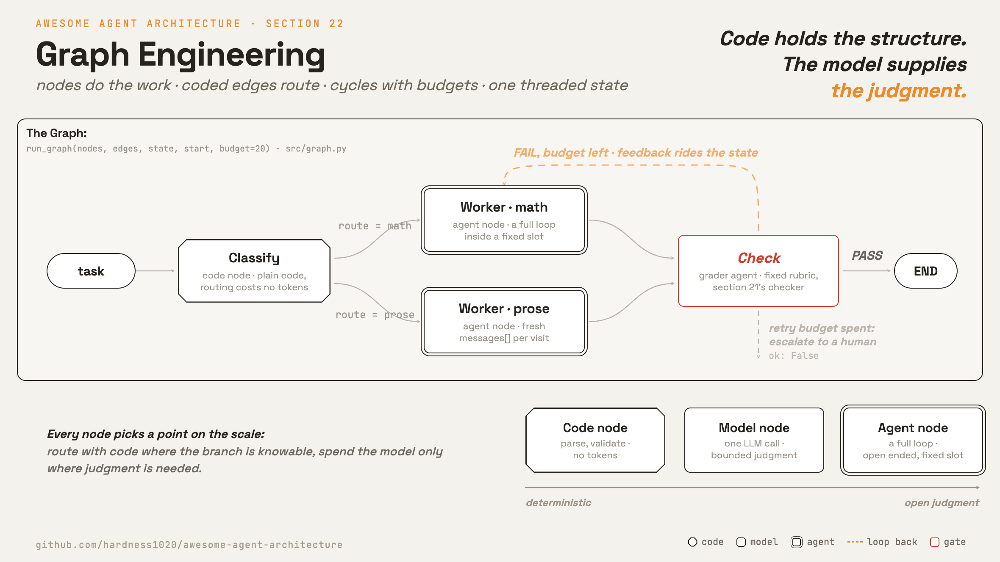

# 22 · Graph engineering

[English](README.md) · **繁體中文** · [简体中文](README.zh-CN.md)

> 別再問 model 下一步跑什麼。把你已經知道的流程寫進程式碼，model 只用在需要判斷的地方。

第 21 章在一個 agent 外面堆疊 loop。這一章整理的是 model 呼叫和呼叫之間的流程。

很多任務的流程，還沒呼叫 model 你就知道了：先分類工單再處理、先 review diff 再 commit、先拿到核准再做對外的動作。
普通的 agent loop 每次執行都靠問 model 下一步做什麼，把整個流程重新摸索一遍。把 routing 交給 model 很慢、燒 token，而且每次跑都不一樣。

Graph engineering 就是把你已經知道的流程，用程式碼寫成一張有向圖（directed graph）：

1. Node 負責做事。一個 node 可以是純程式碼、一次 model 呼叫，或一整趟 agent 執行。
2. Edge 決定下一個 node。由 harness 用程式碼判斷，不用 model 呼叫。
3. 允許 cycle。重試、review 後修改、人工暫停，都需要一條往回走的路。
4. State 是一筆在圖上流動的紀錄。每個 node 讀它，再把自己的更新寫回去。

流程寫在程式碼裡，要判斷的地方才交給 model。loop（第 21 章）就是這種圖的最小版本：兩個 node 加一條往回的 edge。這一章把它擴展成 node 更多、接法更自由的圖。

---

## 機制



最簡單的版本只有三樣東西。一個 dict 把 node 名稱對到要跑的函式，另一個 dict 記著每個 node 跑完接誰。
再加一個 state dict，每個 node 都從裡面讀資料、把自己的改動寫回去，一路帶到結束。

```python
def run_graph(nodes, edges, state, start, budget=20):  # src/graph.py
    state = dict(state)
    trace = []
    node = start
    for _ in range(budget):                        # the ceiling: harness-enforced
        state.update(nodes[node](state) or {})     # a node returns only its updates
        trace.append(node)
        step = edges.get(node, END)
        node = step(state) if callable(step) else step   # a coded edge: no model call
        if node == END:
            return {"ok": True, "state": state, "trace": trace}
    return {"ok": False, "state": state, "trace": trace}   # budget spent: escalate
```

- `nodes` 是一張 dispatch map（第 2 章）。node 讀 state，只回傳自己改動的 key。
- edge 可以是固定的名字（決定性的），也可以是吃 state 的函式（條件式的）。兩種都由 harness 用程式碼判斷，routing 不花任何 token。
- 沒有 edge 的 node 就是圖的終點。budget 是第 21 章的上限：cycle 撞到上限就停，回傳 `ok: False` 交給人。
- `trace` 依序記下跑過哪些 node，就是這次執行留給第 20 章的紀錄。

### Node：從純程式碼到完整 agent

每個 node 都在純程式碼和完整 agent 之間選一個位置：

- **Code node**：解析、驗證、固定的 API 呼叫。決定性的，不花 token。
- **Model node**：一次 LLM 呼叫，例如分類器。有限度的判斷。
- **Agent node**：一整個第 1 章的 loop，帶著 tool。開放式的判斷，但被固定在一個位置上。

`agent_node` 把內層 loop 掛成一個 node。每次經過都用 state 組出 prompt，在全新的 `messages[]` 上跑 `run_turn`，
所以這個 node 只看得到 prompt builder 給它的部分，不是整趟執行。

怎麼選？原則就是省 token：分支條件寫得出來的，就交給程式碼；model 呼叫只留給真的需要判斷的 node。

### Phase node

Agent node 每次經過都從全新的 `messages[]` 開始。分支彼此無關的時候這樣最好；但幾個 node 其實是同一件事的不同階段，這樣就不對了。

Phase node 就是把 trajectory 留下來的那個變體。整條路只有一份 `messages[]`。進到某個 phase 的時候，harness 換掉外面那層框：換一份 system prompt，換一套 tool。
Explore 掛讀取和搜尋，implement 掛編輯和執行，review 掛讀取和一個下結論的 tool。這個 phase 要的東西 history 裡都有，不用再打包一次。

Model 要離開一個 phase，就呼叫一個 gate tool，例如 `finish_exploring`。harness 把這個呼叫當成 edge，直接進下一個 phase。
gate 是唯一的出口，所以一個 phase 什麼時候結束由 harness 決定，不是看 model 自己怎麼講。
形狀是一條路加一條往回的 edge：explore、implement、review，而 review 可以把執行送回 implement，筆記本來就留在 history 裡。

要掛哪一種，是 context 的取捨（第 8 章）。每個 node 都用全新的 `messages[]`，window 就小，分支之間也彼此獨立。
只留一條 trajectory 則是前後比較連貫，但路愈長，吃掉的 window 也愈多。
記載這個做法的書把它算成 multi-agent，理由是每個 phase 的 prompt 和 tool 都不一樣；這個 repo 則把它算成同一個 agent 換了外框。
機制是同一個，所以引用的時候要先講清楚你用的是哪個定義。這個做法的證據來自書裡自己做的實驗，只有這一個來源。

### 常見的圖形

出處裡叫得出名字的 workflow pattern，其實都是圖形：

- **Prompt chaining**：一串 node 排成一條路，中間用程式碼把關。
- **Routing**：一條條件式 edge，分流到各個專門的 node。
- **Parallelization**：幾條同時跑的分支在一個 node 會合。可以是拆工作（sectioning），也可以是同一件事跑多次投票（voting）。
- **Orchestrator-workers**：一個 node 在執行時決定要派出多少工作，再由一個 node 收攏。edge 是動態的，但形狀仍然是圖。
- **Evaluator-optimizer**：一個 worker node、一個 checker node，加一條往回的 edge。這就是第 21 章的驗證 loop，放進圖裡變成一個子圖。

名字還沒有統一。`ai-agent-book` 主要用的詞是「collaboration topology」和「orchestration」，「graph engineering」只被它放在一則術語註記裡。
這一章沿用這個名字，因為它講的東西就是一張寫在程式碼裡的圖。看不同來源的時候，對得上的是機制，不是那個詞。

### 什麼時候不要畫圖

開放式的工作沒辦法預先定好流程。深度研究和難查的 bug 需要邊跑邊規劃；事先畫死的圖，反而擋住解法需要走的那條路。
出處給的原則：只把你本來就要強制執行的結構寫進圖裡（先分類再處理、先 review 再 commit、先核准再送出），
而且只在確實改善結果時才加結構。其他的都交給普通的 loop，讓 model 自己規劃。

最常見的其實是混合式：把 agent 當成固定圖裡的一個 node。圖保證 review 一定會發生，agent 決定在自己的位置裡怎麼把事做完。

### 如何整合

這一章只加了一個小元件（edge map），其他都沿用前面的：

- node 做的事就是第 1 章的 loop；`agent_node` 原封不動包住 `run_turn`。
- 程式碼判斷的 edge 沿用第 2 章的 dispatch 紀律：查表，不是 model 的輸出。
- worker 和 checker 分屬不同 node 是第 6 章；並行的分支用第 15 章的 worktree 隔離。
- step budget 和交回給人的約定是第 21 章。
- trace 交給第 20 章的 telemetry：看哪些 edge 有 fire，就知道哪些分支是死的。

可執行程式接的就是上面那張圖：

```python
nodes = {                                          # src/demo.py
    "classify": lambda s: {"route": "math" if any(c.isdigit() for c in s["task"]) else "prose"},
    "math": agent_node(prompt, model, math_reg),   # a full agent run as one node
    "prose": agent_node(prompt, model, Registry()),
    "check": check_node,                           # section 21's checker, now a node
}
edges = {
    "classify": lambda s: s["route"],              # a coded edge: routing costs no tokens
    "math": "check",
    "prose": "check",
    "check": lambda s: END if s["verdict"]["passed"] else s["route"],   # the cycle
}
```

---

## 各系統做法

各個 agent 怎麼決定下一步跑什麼。

| | Claude Code | Hermes Agent | mini-swe-agent |
| --- | --- | --- | --- |
| **Pros** | Routing 是程式碼：不花 token、不會變來變去。續跑時跑完的 node 從紀錄重放。 | 不用事先畫圖，任務長什麼樣，結構就長什麼樣。 | 整張圖一眼就能看完。 |
| **Cons** | 圖活在單次執行的 script 裡，不是可以重用的宣告式圖。 | Routing 花 model 的 token，每次跑可能不一樣。 | 所有任務共用同一個形狀，沒有分支可以特化。 |
| **Why** | 把編排當成程式：script 寫好一次，harness 每次都決定性地執行。 | 假設助理型工作太開放，結構沒辦法預先宣告。 | 一個 baseline：所有選擇都留在 model 裡，harness 只留一個 cycle。 |
| **How: nodes** | 一個 node 一個 subagent，回傳通過 schema 驗證的結構化輸出。 | 委派出去的 subagent，深度和並行數都有上限。 | 兩個：一個 model step、一個 environment step。 |
| **How: routing** | 階段之間用普通的 script 程式碼：條件、迴圈、pipeline、平行分派。 | model 用 tool call 選路，沒有寫在程式碼裡的 edge。 | 一個固定的 cycle，跑到 model 提交或 budget 用完為止。 |
| **How: state** | 階段的回傳值往下傳；journal 記下每個 node 的輸出供續跑。 | 結果經過 completion queue 回到呼叫端。 | message list 就是全部的 state。 |

---

## 哪裡會出錯

- **Model 當 router（Model as router）**：把選路交給 model，燒 token、增加延遲，而且每次跑不一樣。最上游選錯一次，後面全部跟著錯。
  緩解：轉移用程式碼判斷；model 呼叫留給需要判斷的 node。
- **過度畫圖（Over-graphing）**：需要探索的任務被固定的圖框住，解法要走的路被擋掉。
  緩解：只把本來就要強制執行的結構寫進圖裡；開放式的工作留給普通的 loop。
- **沒有失敗的路（No failure edge）**：負責檢查的 node 遇到 FAIL 卻無路可送，爛輸出就一路流到下游。
  緩解：每個檢查 node 都給一條帶 budget 的往回 edge（第 21 章）。
- **沒有上限的 cycle（Unbounded cycle）**：沒有上限的重試 edge 會永遠繞下去。緩解：harness 強制執行的 step budget；budget 用完就交給人。
- **State 膨脹（State bloat）**：每個 node 都把完整輸出倒進共用的 state，後面的 node 被淹沒。
  緩解：嚴格的 state 邊界；node 只讀需要的子集，只回傳自己的更新（第 8 章）。
- **跑到一半掛掉（Mid-run death）**：一張長圖在第七個 node 掛掉，重來卻從第一個 node 開始。
  緩解：記下每個 node 的輸出；續跑時跑完的 node 從紀錄重放（第 11、12 章）。
- **Phase 走不完（Phase that never ends）**：phase node 的 gate tool 一直沒被呼叫，它就用同一份 prompt、同一套 tool 一直做下去，直到 budget 用完。
  緩解：gate 是唯一的出口；每個 phase 各自有 step budget；budget 用完就往下一個 phase 走，或者交給人。
- **Trajectory 背著每個 phase（Trajectory that carries every phase）**：只有一條 trajectory，每過一個 phase 就長一截，裡面還留著現在這個 phase 沒掛的 tool 的呼叫紀錄。
  緩解：在 phase 的 prompt 裡講清楚現在是哪個 phase、有哪些 tool；呼叫沒掛的 tool 就回一個清楚的錯誤；跑完的 phase 拿去 compact（第 8 章）。

---

## 可執行程式

[`src/`](src/) 把 21 帶了過來，並加上：

- [`graph.py`](src/graph.py)：`run_graph`（node 的 dispatch map、固定和條件式的 edge、一路傳下去的 state、step budget）和 `agent_node`，把內層 loop 掛成一個 node。
- [`test.py`](src/test.py)：離線檢查串接順序和 state 合併、純程式碼的 routing、cycle 撞到 budget 就停，以及 agent node 每次經過都用全新的 `messages[]`。
- [`demo.py`](src/demo.py)：照著圖實際跑一趟：code node 分類、程式碼 edge 選路、agent node 作答、第 21 章的 checker 評分，沒過就帶著 feedback 繞回去。

loop 本身完全沒改。什麼時候輪到它跑，由圖決定。

```bash
python sections/22-graph-engineering/src/test.py         # offline checks, no key
uv run python sections/22-graph-engineering/src/demo.py  # live demo, needs a key
```

---

## 出處

- [LangChain · 3 years of graph engineering](https://www.langchain.com/blog/3-years-of-graph-engineering-with-langgraph)：node、edge、cycle、把 agent 當 node，以及什麼時候不要畫圖。
- [Anthropic · Building effective agents](https://www.anthropic.com/engineering/building-effective-agents)：workflow 與 agent 的分界，加上五種 workflow 圖形。
- [Google · Why we built ADK 2.0](https://developers.googleblog.com/en/why-we-built-adk-20/)：用程式碼選路、node 之間的 context 隔離、在 workflow 的 node 上掛 agent。
- [Claude Code](https://code.claude.com/docs)：`Workflow` script 的約定（pipeline、平行分派、結構化輸出、續跑）。內容依據 tool schema 和文件記載的行為，不是 source backup。
- [Hermes Agent 原始碼](https://github.com/NousResearch/hermes-agent)：`tools/delegate_tool.py`、`tools/async_delegation.py`、`batch_runner.py`。
- [mini-swe-agent source](https://github.com/swe-agent/mini-swe-agent)：`agents/default.py` 的 run loop 與 budget、`run/benchmarks/swebench.py`。
- [ai-agent-book · 第 10 章](https://github.com/bojieli/ai-agent-book/blob/main/book/chapter10.md)（《深入理解 AI Agent》，李博杰，多 Agent 协作，以中文原版為準）：
  在同一條 trajectory 上做多階段角色轉換，每個 phase 一份 system prompt 和一套 tool，phase 之間用 tool call 當關卡，review 可以繞回實作。
  這個做法的依據是書裡自己做的實驗，只有這一個來源。同一章主要用的詞是「collaboration topology」和「orchestration」。
